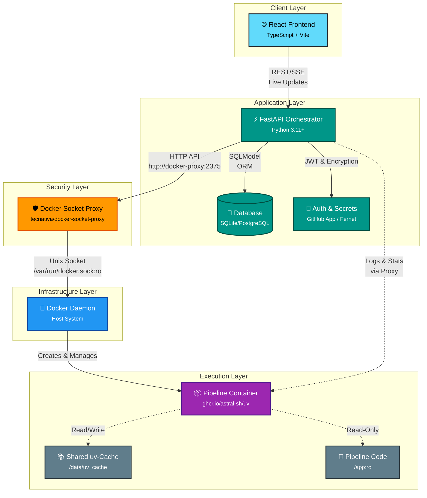

# Fast-Flow Orchestrator

**The lightweight, Docker-native, Python-centric task orchestrator for 2026.**


Fast-Flow ist die Antwort auf die Komplexität von Airflow und die Schwerfälligkeit traditioneller CI/CD-Tools. Er wurde für Entwickler gebaut, die echte Isolation wollen, ohne auf die Geschwindigkeit lokaler Skripte zu verzichten.
> [!NOTE]
>  Lies unser [Anti-Overhead Manifesto](docs/manifesto.md), um zu verstehen, warum Fast-Flow die bessere Alternative zu Airflow, Dagster & Co. ist.

> [!TIP]
> Verwenden Sie unser **[fastflow-pipeline-template](https://github.com/ttuhin03/fastflow-pipeline-template)** für einen schnellen Start und eine optimale Struktur Ihrer Pipelines.

## 📖 Inhaltsverzeichnis
- [🚀 Schnellstart](#-schnellstart)
- [📋 Zuletzt umgesetzt](#-zuletzt-umgesetzt)
- [🏗 Architektur: Das "Runner-Cache"-Prinzip](#-architektur-das-runner-cache-prinzip)
- [🛠 Der Container-Prozess & Lifecycle](#-der-container-prozess--lifecycle)
- [🔄 Git-Native Deployment](#-git-native-deployment)
- [🚀 Warum Fast-Flow? (Vergleich)](#-warum-fast-flow-vergleich)
- [🎯 Warum Fast-Flow gewinnt (The Python Advantage)](#-warum-fast-flow-gewinnt-the-python-advantage)
- [🛠 Technischer Stack](#-technischer-stack)
- [🔒 Sicherheit: Docker Socket Proxy](#-sicherheit-docker-socket-proxy)
- [📚 Dokumentation](#-dokumentation)
- [📦 Versioning & Releases](#-versioning--releases)
- [❓ Troubleshooting](#-troubleshooting)

## 🚀 Schnellstart

Starten Sie Fast-Flow in wenigen Minuten.

### Voraussetzungen

- **Docker** & Docker Compose
- **Python 3.11+** (nur für lokale Entwicklung)

### Option 1: Docker (Empfohlen für Produktion)

Der einfachste Weg, Fast-Flow zu starten.

```bash
# 1. .env Datei vorbereiten
cp .env.example .env

# 2. Encryption Key generieren (WICHTIG!)
# Generiert einen Key und gibt ihn aus. Füge ihn in .env unter ENCRYPTION_KEY ein.
# Für den Login: GITHUB_CLIENT_ID, GITHUB_CLIENT_SECRET, INITIAL_ADMIN_EMAIL in .env (siehe Abschnitt Login).
python3 -c "from cryptography.fernet import Fernet; print(Fernet.generate_key().decode())"

# 3. Starten
docker-compose up -d

# 4. Logs ansehen
docker-compose logs -f orchestrator
```

**UI öffnen:** [http://localhost:8000](http://localhost:8000)

### Option 2: Lokal (Für Entwicklung)

Nutzt ein lokales venv, startet aber Container via Docker.

```bash
# 1. Setup
python3 -m venv venv
source venv/bin/activate
pip install -r requirements.txt

# 2. Konfiguration
cp .env.example .env
# -> ENCRYPTION_KEY in .env setzen (siehe oben)

# 3. Starten
./start-dev.sh
# oder manuell: uvicorn app.main:app --reload (Backend); Frontend: cd frontend && npm run dev
```

### 🔐 Login (GitHub OAuth, Google OAuth)

Die Anmeldung erfolgt **über GitHub oder Google**:

1. **GitHub:** OAuth-App (Settings → Developer settings → OAuth Apps), Callback `{BASE_URL}/api/auth/github/callback`.  
   **Google:** OAuth-Client (Google Cloud Console), Callback `{BASE_URL}/api/auth/google/callback`.
2. In **`.env`**: `GITHUB_CLIENT_ID`, `GITHUB_CLIENT_SECRET` und/oder `GOOGLE_CLIENT_ID`, `GOOGLE_CLIENT_SECRET`; `INITIAL_ADMIN_EMAIL` (E-Mail für ersten Admin).
3. **Docker** (Alles :8000): `FRONTEND_URL` weglassen oder `=http://localhost:8000`, `BASE_URL=http://localhost:8000`.  
   **Dev** (Frontend :3000, Backend :8000): `FRONTEND_URL=http://localhost:3000`, `BASE_URL=http://localhost:8000`.

> [!TIP]
> Ausführliche Schritte, Einladung, Konto verknüpfen: [OAuth (GitHub & Google)](docs/oauth/README.md).

### 📋 Zuletzt umgesetzt

- **Google OAuth** – Zweiter Login-Provider neben GitHub (Login, Einladung, Konto verknüpfen). User-Model um `google_id` und `avatar_url` erweitert.
- **Konto verknüpfen** – In **Einstellungen → Verknüpfte Konten** können eingeloggte Nutzer GitHub und/oder Google an ihr Profil anbinden; Login dann mit beiden möglich (z.B. wenn E-Mails je Provider unterschiedlich sind).
- **Einladungen** – Einladungslinks lassen sich mit **GitHub oder Google** einlösen; die OAuth-E-Mail muss der Einladungs-E-Mail entsprechen.
- **Migrationen automatisch** – Beim Container-Start führt `entrypoint.sh` zuerst `alembic upgrade head` aus, danach startet die App. Manuelles Migrieren entfällt bei `./start-docker.sh` / `docker-compose up`.
- **OAuth-Logging** – Erfolgreiche Matches werden geloggt (`match=direct|email|link|initial_admin|invitation`, inkl. Provider und User), ebenso abgelehnte Logins und fehlgeschlagene Link-Flows. Hilfreich für Debugging: `docker-compose logs -f orchestrator | grep -E "OAuth:|initial_admin"`.
- **Dokumentation** – OAuth-Doku in `docs/oauth/` (README, GITHUB.md, GOOGLE.md); `docs/GITHUB_OAUTH.md` entfernt.

---

## 🏗 Architektur: Das "Runner-Cache"-Prinzip

Im Gegensatz zu klassischen Orchestratoren, die oft "Dependency Hell" in ihren Worker-Umgebungen erleben, nutzt Fast-Flow eine moderne JIT-Environment-Architektur.

- **The Singleton Brain**: Ein einzelner FastAPI-Prozess verwaltet den Zustand, den Scheduler und den Git-Sync.
- **Ephemeral Workers**: Jede Pipeline startet in einem isolierten Docker-Container. Keine Seiteneffekte, keine Rückstände.
- **uv-Acceleration**: Durch das Mounten eines globalen uv-Caches vom Host in den Container werden Dependencies in Millisekunden bereitgestellt. Es fühlt sich an wie ein lokales venv, ist aber ein sauberer Container.
- **Live-Streaming**: Logs und Ressourcen-Metriken (CPU/RAM) werden per SSE (Server-Sent Events) in Echtzeit direkt aus dem Docker-Socket an das React-Frontend gestreamt.

## 🛠 Der Container-Prozess & Lifecycle

Fast-Flow nutzt ein "Disposable Worker"-Modell. Anstatt langlebige Instanzen zu pflegen, wird für jede Ausführung ein frischer, isolierter Container erzeugt. Der gesamte Prozess folgt diesem Ablauf:

### 1. Trigger & Initialisierung

Sobald ein Run über das React-Frontend (manuell) oder den APScheduler (geplant) ausgelöst wird:

- Die API validiert die Pipeline-Struktur und lädt die verschlüsselten Secrets.
- Ein neuer Eintrag in der SQLite-Datenbank wird mit dem Status `PENDING` erstellt.

### 2. Die "Zero-Build" Execution

Hier liegt der Kern der Fast-Flow Performance. Statt ein Docker-Image zu bauen, wird ein generisches Basis-Image gestartet:

- **Mounting**: Das spezifische Pipeline-Verzeichnis (read-only) und der globale uv-Cache des Hosts werden in den Container gemountet.
- **Just-In-Time Environment**: Innerhalb des Containers führt `uv` den Befehl `uv run` aus.
  - **Existieren die Abhängigkeiten im Cache?** Sie werden in Millisekunden per Hardlink verknüpft.
  - **Neue Abhängigkeiten?** Sie werden einmalig geladen und sofort im Host-Cache für zukünftige Runs gesichert.

### 3. Monitoring & Kommunikation (Headless Architecture)

Während der Container läuft, fungiert die FastAPI als Vermittler:

- **Logs**: Die API liest den stdout/stderr-Stream des Docker-Containers asynchron und stellt ihn über einen SSE-Endpunkt (Server-Sent Events) bereit.
- **Metrics**: Die Docker-Stats-API wird abgegriffen, um CPU- und RAM-Werte in Echtzeit an das React-Dashboard zu senden.
- **Security**: Die API kommuniziert nicht direkt mit dem Docker-Socket, sondern über einen sicheren Docker-Socket-Proxy (`tecnativa/docker-socket-proxy`), der nur konfigurierte Operationen erlaubt und den direkten Root-Zugriff auf den Docker-Socket verhindert.

### 4. Terminierung & Cleanup

Nach Abschluss des Python-Skripts:

- Der Exit-Code wird erfasst (z.B. 137 für OOM-Fehler).
- Der Container wird automatisch entfernt (`--rm`), was das System absolut sauber hält.
- Die Logs werden finalisiert und für die Langzeitarchivierung auf der Festplatte gespeichert.

### 🏗 Architektur-Diagramm (Datenfluss)



### Warum dieser Ansatz?

- **Geschwindigkeit**: Durch den Entfall von `docker build` Schritten startet eine Pipeline so schnell wie ein lokaler Prozess.
- **Isolation**: Ein Fehler in `pipeline_a` kann niemals die Umgebung von `pipeline_b` beeinflussen.
- **Skalierbarkeit**: Da der Controller (API) und die Worker (Container) entkoppelt sind, kann das System durch das Hinzufügen von Message-Queues (wie Redis) leicht auf mehrere Server verteilt werden.

## 🔄 Git-Native Deployment

**Push to Deploy, No Build Needed**

Traditionelle Orchestratoren verwandeln Deployment oft in ein logistisches Problem. Fast-Flow verwandelt es in einen `git push`.

### Die alte Welt (Airflow, Dagster, Mage)

*   **Image-Hell**: Jede Code-Änderung erfordert oft einen neuen Docker-Build (5-10 Minuten warten).
*   **Sidecar-Chaos**: Man braucht komplexe Git-Sync-Sidecars oder S3-Buckets, um DAGs zu verteilen.
*   **Version-Gap**: Was im UI steht, entspricht oft nicht dem, was im Git-Repository ist.

### Der Fast-Flow Weg: "Source of Truth"

In Fast-Flow ist dein Git-Repository die einzige Wahrheit. Es gibt keinen "Upload"-Button und keinen manuellen Build-Schritt.

*   **Zero-Build Deployment**: Wenn du deinen Code änderst, zieht der Orchestrator die Änderungen per Webhook oder manuellem Sync. Dank der uv-JIT Architektur ist die neue Version sofort startbereit.
*   **Vollständige Rückverfolgbarkeit**: Da jede Pipeline-Konfiguration (`pipeline.json`) und jede Library (`requirements.txt`) im Git liegt, hast du eine lückenlose Historie. Wer hat wann das Memory-Limit erhöht? Wer hat die prophet-Version geändert? Dein Git-Log sagt es dir.
*   **Atomic Sync**: Unser Sync-Mechanismus stellt sicher, dass Pipelines niemals "halbe" Dateien lesen. Änderungen werden atomar eingespielt – sicher und konsistent.

| Feature | Traditionelle Tools | Fast-Flow |
| :--- | :--- | :--- |
| **Deployment-Speed** | Minuten (Build & Push) | Sekunden (Git Pull) |
| **Versionierung** | Oft nur für den Code | Code, Deps & Ressourcen-Limits |
| **Rollback** | Image-Rollback (komplex) | Git Revert (einfach) |
| **Wahrheit** | UI vs. Git vs. Image | Git ist Gesetz |

### 🛠 So funktioniert der Flow:

1.  **Entwickeln**: Du schreibst dein Python-Skript lokal.
2.  **Pushen**: `git push origin main`.
3.  **Syncen**: Der Orchestrator merkt die Änderung (via Webhook oder Auto-Sync).
4.  **Laufen**: Die Pipeline startet sofort mit dem neuen Code. Keine Docker-Builds, kein Warten.

> "Wir haben das Deployment so langweilig wie möglich gemacht, damit du dich auf das Spannende konzentrieren kannst: Deinen Code."

## 🚀 Warum Fast-Flow? (Vergleich)

| Feature | Fast-Flow | Airflow | Dagster |
|---------|-----------|---------|---------|
| Setup | 🟢 1 Docker-Container | 🔴 Komplexes Cluster | 🟡 Mittel |
| Isolation | 🟢 Strikt (Docker pro Task) | 🔴 Schwach (Shared Worker) | 🟡 Mittel |
| Dependency-Speed | 🟢 Instant (uv JIT) | 🔴 Langsam (Image Builds) | 🟡 Mittel |
| UI-Vibe | 🟢 Modern & Realtime (React) | 🔴 Altbacken / Statisch | 🟡 Modern |
| Deployment | 🟢 Git Push + Auto-Sync | 🔴 Komplexe CI/CD Pipelines | 🟡 Code-Deployment |
| **Onboarding-Zeit** | 🟢 **Minuten statt Tage** | 🔴 **Wochen** | 🟡 **Tage** |
| **Pipeline-Struktur lernen** | 🟢 **Einfach: main.py + requirements.txt** | 🔴 **Komplex: DAGs, Operators, XComs** | 🟡 **Mittel: Assets, Ops, Resources** |

## 🎯 Warum Fast-Flow gewinnt (The Python Advantage)

### 1. 🐍 Simple Python Pipelines – No Context Switching

In anderen Orchestratoren musst du oft YAML-Dateien schreiben oder dich mit komplexen DSLs herumschlagen.

- **Die Pipelines**: Eine Pipeline ist ein simples Python-Skript. Wenn es lokal läuft, läuft es auch im Orchestrator. Keine speziellen Decorators, keine Operator-Klassen, keine komplexe Konfiguration.
- **Das Frontend**: Modernes React-Dashboard mit Echtzeit-Monitoring. Das Backend bleibt 100% Python (FastAPI).

### 2. ⚡️ Instant Onboarding (Developer Experience)

**Keine proprietäre Logik**: Du musst keine speziellen Decorators (wie `@dag`) oder Operatoren (`PythonOperator`) lernen.

- **"Write & Run"**: Neue Entwickler können innerhalb von 5 Minuten ihre erste Pipeline pushen. Wer Python versteht, versteht Fast-Flow.
- **Lokales Debugging**: Da wir uv nutzen, können Entwickler exakt die gleiche Umgebung lokal mit einem Befehl nachbauen, die auch im Container läuft.

**Onboarding bei Airflow**: Oft eine Sache von Tagen oder Wochen (wegen der DSL, Provider, Cluster-Logik) – bei Fast-Flow ist es eine Sache von Minuten.

### 3. 🛠 Minimalistischer Footprint

Während Airflow eine Postgres-DB, einen Redis-Broker, einen Scheduler, einen Webserver und mehrere Worker braucht, kommt Fast-Flow als Single-Container-Lösung aus.

- **Wartungsarm**: Ein Update bedeutet `docker-compose pull`. Fertig.
- **Ressourcenschonend**: Ideal für Edge-Server oder kleinere VM-Instanzen.

### Die Fast-Flow Vorteile:

- **Zero-Build Pipelines**: Du musst keine Docker-Images für deine Pipelines bauen. Ändere die requirements.txt im Git, und Fast-Flow wärmt den Cache automatisch im Hintergrund auf.
- **Kein "Database is locked"**: Optimiert für SQLite mit WAL-Mode und asynchronem I/O.
- **Ressourcen-Kontrolle**: Setze CPU- und RAM-Limits pro Pipeline direkt via JSON-Metadaten.
- **Sicherheits-Fokus**: Verschlüsselte Secrets (Fernet) und nativer GitHub App Support.

## 🛠 Technischer Stack

- **Backend**: FastAPI (Python 3.11+)
- **Frontend**: React + TypeScript (Vite)
- **Database**: SQLModel (SQLite/PostgreSQL)
- **Execution**: Docker Engine API + uv
- **Security**: Docker Socket Proxy (tecnativa/docker-socket-proxy) für sichere Docker-API-Zugriffe
- **Scheduling**: APScheduler (Persistent)
- **Auth**: GitHub OAuth, JWT & Fernet Encryption

## Hauptfunktionen

- **Automatische Pipeline-Erkennung**: Pipelines werden automatisch aus einem Git-Repository erkannt
- **Isolierte Ausführung**: Jede Pipeline läuft in einem eigenen Docker-Container
- **Resource-Management**: Konfigurierbare CPU- und Memory-Limits pro Pipeline
- **Scheduling**: Unterstützung für CRON- und Interval-basierte Jobs
- **Webhooks**: Pipeline-Trigger via HTTP-Webhooks
- **Live-Monitoring**: Echtzeit-Logs und Metriken während der Ausführung
- **Git-Sync**: Automatische Synchronisation mit Git-Repositories
- **Secrets-Management**: Sichere Verwaltung von Secrets und Parametern

## 🔒 Sicherheit: Docker Socket Proxy

Fast-Flow nutzt einen **Docker Socket Proxy** (`tecnativa/docker-socket-proxy`) als Sicherheitsschicht zwischen dem Orchestrator und dem Docker-Daemon. Dies verhindert direkten Root-Zugriff auf den Docker-Socket und schränkt die verfügbaren Docker-API-Operationen ein.

### Warum ein Proxy?

- **Sicherheit**: Der Docker-Socket (`/var/run/docker.sock`) gibt effektiv Root-Zugriff auf das gesamte Host-System. Ein Proxy filtert und erlaubt nur konfigurierte Operationen.
- **Kontrollierte Zugriffe**: Nur Container-Erstellung, Logs, Stats und Image-Pulls sind erlaubt. Netzwerk- und Volume-Management sind deaktiviert.
- **Isolation**: Selbst bei einem kompromittierten Orchestrator ist der Schaden begrenzt.

### Konfiguration

Der Proxy wird automatisch in `docker-compose.yaml` konfiguriert:

```yaml
docker-proxy:
  image: tecnativa/docker-socket-proxy:latest
  environment:
    - CONTAINERS=1    # Container-Operationen erlauben
    - IMAGES=1        # Image-Pulls erlauben
    - VOLUMES=1       # Volume-Mounts erlauben
    - POST=1          # HTTP POST (Container-Erstellung) erlauben
    - DELETE=1        # Container-Entfernung erlauben
    - STATS=1         # Resource-Monitoring erlauben
    - NETWORKS=0       # Netzwerk-Management deaktiviert
    - SYSTEM=0        # System-Operationen deaktiviert
```

Der Orchestrator kommuniziert mit dem Proxy über `http://docker-proxy:2375` statt direkt mit dem Docker-Socket.

## Dokumentation

- **[Philosophie: Das Anti-Overhead Manifesto](docs/manifesto.md)** - Warum Fast-Flow entstanden ist und was es anders macht
- **[OAuth (GitHub & Google)](docs/oauth/README.md)** - Login, Einladungen, Konto verknüpfen
- **[Konfiguration](docs/deployment/CONFIGURATION.md)** - Detaillierte Erklärung aller Environment-Variablen
- **[Deployment](docs/deployment/PRODUCTION.md)** - Produktions-Setup Guide
- **[Versioning & Releases](docs/deployment/VERSIONING.md)** - Version-Management und Release-Prozess
- **[Database](docs/database/SCHEMA.md)** - Schema und [Migrationen](docs/database/MIGRATIONS.md)
- **[Docker Socket Proxy](docs/deployment/DOCKER_PROXY.md)** - Sicherheitsarchitektur und Proxy-Konfiguration
- **[API-Dokumentation](docs/api/API.md)** - Vollständige API-Referenz
- **[Frontend-Dokumentation](docs/frontend/FRONTEND.md)** - Frontend-Komponenten und Seiten

## 📦 Versioning & Releases

Fast-Flow verwendet einen automatisierten Versions-Check, der täglich prüft, ob neue Releases verfügbar sind.

### Version-Format

Die Version wird in der `VERSION`-Datei im Projekt-Root gespeichert:

```
v0.1.0
```

### GitHub Releases erstellen

Um eine neue Version zu veröffentlichen:

1. **VERSION-Datei aktualisieren:**
   ```bash
   echo "v0.2.0" > VERSION
   git add VERSION
   git commit -m "Bump version to v0.2.0"
   ```

2. **Tag erstellen (muss VERSION-Datei exakt entsprechen):**
   ```bash
   git tag v0.2.0
   git push origin v0.2.0
   ```

3. **GitHub Release erstellen:**
   - Gehe zu: https://github.com/ttuhin03/fastflow/releases/new
   - Wähle Tag: `v0.2.0`
   - Füge Release Notes hinzu
   - Veröffentliche das Release

> **Wichtig:** Das Tag-Format muss exakt der VERSION-Datei entsprechen (beide mit "v" Präfix)

Die Version-Check läuft automatisch:
- ✅ Beim API-Start
- ✅ Täglich um 2:00 Uhr (zusammen mit Log-Cleanup)
- ✅ On-Demand via API: `GET /api/system/version?force_check=true`

Weitere Details: [docs/deployment/VERSIONING.md](docs/deployment/VERSIONING.md)

## Pipeline-Repository-Struktur

Das Pipeline-Repository wird als Volume in den Orchestrator-Container gemountet. Pipelines werden automatisch erkannt und ausgeführt.

> [!TIP]
> Verwenden Sie unser **[fastflow-pipeline-template](https://github.com/ttuhin03/fastflow-pipeline-template)** für einen schnellen Start und eine optimale Struktur Ihrer Pipelines.

### Verzeichnisstruktur

```
pipelines/
├── pipeline_a/
│   ├── main.py              # Haupt-Pipeline-Skript (erforderlich)
│   ├── requirements.txt     # Python-Dependencies (optional)
│   └── pipeline.json        # Metadaten (optional)
├── pipeline_b/
│   ├── main.py
│   ├── requirements.txt
│   └── data_processor.json  # Alternative: {pipeline_name}.json
└── pipeline_c/
    └── main.py              # Minimal: Nur main.py
```

### Pipeline-Dateien

#### 1. `main.py` (erforderlich)

Das Haupt-Pipeline-Skript. Jede Pipeline muss eine `main.py` Datei im eigenen Verzeichnis haben.

**Ausführungsweise:**
- Pipelines werden mit `uv run --with-requirements {requirements.txt} {main.py}` ausgeführt
- Code kann von oben nach unten ausgeführt werden (keine `main()`-Funktion erforderlich)
- Optional: `main()`-Funktion mit `if __name__ == "__main__"` Block

**Beispiel 1: Einfaches Skript (von oben nach unten)**
```python
# main.py
import os
print("Pipeline gestartet")
data = os.getenv("MY_SECRET")
print(f"Verarbeite Daten: {data}")
# ... weiterer Code ...
```

**Beispiel 2: Mit main() Funktion (optional)**
```python
# main.py
def main():
    print("Pipeline gestartet")
    # ... Logik ...

if __name__ == "__main__":
    main()
```

**Error-Handling:**
- Bei uncaught Exceptions gibt Python automatisch Exit-Code != 0 zurück
- Pipeline wird als `FAILED` markiert

#### 2. `requirements.txt` (optional)

Python-Dependencies für die Pipeline. Werden von `uv` dynamisch installiert.

**Format:** Standard Python requirements.txt Format
```
requests==2.31.0
pandas==2.1.0
numpy==1.24.3
```

**Hinweise:**
- Dependencies werden beim Pipeline-Start automatisch installiert (via `uv`)
- Shared Cache ermöglicht schnelle Installation (< 1 Sekunde bei Cached-Dependencies)
- Pre-Heating: Dependencies können beim Git-Sync vorgeladen werden (UV_PRE_HEAT)

#### 3. `pipeline.json` oder `{pipeline_name}.json` (optional)

Metadaten-Datei für Resource-Limits und Konfiguration.

**Dateinamen:**
- `pipeline.json` (Standard, wird bevorzugt)
- `{pipeline_name}.json` (Alternative, z.B. `data_processor.json`)

**JSON-Format:**
```json
{
  "cpu_hard_limit": 1.0,
  "mem_hard_limit": "1g",
  "cpu_soft_limit": 0.8,
  "mem_soft_limit": "800m",
  "timeout": 3600,
  "retry_attempts": 3,
  "description": "Prozessiert täglich eingehende Daten",
  "tags": ["data-processing", "daily"],
  "enabled": true,
  "default_env": {
    "LOG_LEVEL": "INFO",
    "DEBUG": "false"
  }
}
```

**Felder:**

**Resource-Limits:**
- `cpu_hard_limit` (Float, optional): CPU-Limit in Kernen (z.B. 1.0 = 1 Kern, 0.5 = halber Kern)
- `mem_hard_limit` (String, optional): Memory-Limit (z.B. "512m", "1g", "2g")
- `cpu_soft_limit` (Float, optional): CPU-Soft-Limit für Monitoring (wird überwacht, keine Limitierung)
- `mem_soft_limit` (String, optional): Memory-Soft-Limit für Monitoring (wird überwacht, keine Limitierung)

**Pipeline-Konfiguration:**
- `timeout` (Integer, optional): Timeout in Sekunden (pipeline-spezifisch, überschreibt globales CONTAINER_TIMEOUT)
- `retry_attempts` (Integer, optional): Anzahl Retry-Versuche bei Fehlern (pipeline-spezifisch, überschreibt globales RETRY_ATTEMPTS)
- `enabled` (Boolean, optional): Pipeline aktiviert/deaktiviert (Standard: true)

**Dokumentation:**
- `description` (String, optional): Beschreibung der Pipeline (wird in UI angezeigt)
- `tags` (Array[String], optional): Tags für Kategorisierung/Filterung in der UI

**Environment-Variablen:**
- `default_env` (Object, optional): Pipeline-spezifische Default-Environment-Variablen
  - Diese werden bei jedem Pipeline-Start gesetzt
  - Können in der UI durch zusätzliche Env-Vars ergänzt werden (werden zusammengeführt)
  - Nützlich für Pipeline-spezifische Konfiguration (z.B. LOG_LEVEL, API_ENDPOINT, etc.)
  - Secrets sollten NICHT hier gespeichert werden (verwende stattdessen Secrets-Management in der UI)

**Verhalten:**
- **Hard Limits**: Werden beim Container-Start gesetzt (Docker-Limits)
  - Überschreitung führt zu OOM-Kill (Exit-Code 137) bei Memory
  - CPU wird gedrosselt (Throttling) bei Überschreitung
- **Soft Limits**: Werden nur überwacht, keine Limitierung
  - Überschreitung wird im Frontend angezeigt (Warnung)
  - Nützlich für frühe Erkennung von Resource-Problemen
- **Fehlende Metadaten**: Standard-Limits werden verwendet (falls konfiguriert)
- **Timeout & Retry**: Pipeline-spezifische Werte überschreiben globale Konfiguration
- **Environment-Variablen**: `default_env` wird mit UI-spezifischen Env-Vars zusammengeführt (UI-Werte haben Vorrang)

**Beispiel:**
```json
{
  "cpu_hard_limit": 2.0,
  "mem_hard_limit": "2g",
  "cpu_soft_limit": 1.5,
  "mem_soft_limit": "1.5g"
}
```

### Pipeline-Erkennung

- **Automatische Discovery**: Pipelines werden automatisch beim Git-Sync erkannt
- **Pipeline-Name**: Entspricht dem Verzeichnisnamen (z.B. `pipeline_a/` → Pipeline-Name: `pipeline_a`)
- **Validierung**: Pipeline muss `main.py` Datei enthalten, sonst wird sie ignoriert
- **Keine manuelle Registrierung**: Pipelines werden automatisch verfügbar

### Beispiel-Pipeline-Struktur

**Vollständiges Beispiel:**
```
pipelines/
└── data_processor/
    ├── main.py
    ├── requirements.txt
    └── data_processor.json
```

**`main.py`:**
```python
import os
import requests
import json

def process_data():
    api_key = os.getenv("API_KEY")
    data = fetch_data(api_key)
    result = transform_data(data)
    save_result(result)

def fetch_data(api_key):
    response = requests.get("https://api.example.com/data", headers={"Authorization": f"Bearer {api_key}"})
    return response.json()

def transform_data(data):
    # ... Transformationslogik ...
    return data

def save_result(result):
    with open("/tmp/result.json", "w") as f:
        json.dump(result, f)

if __name__ == "__main__":
    process_data()
```

**`requirements.txt`:**
```
requests==2.31.0
```

**`data_processor.json`:**
```json
{
  "cpu_hard_limit": 1.0,
  "mem_hard_limit": "512m",
  "cpu_soft_limit": 0.8,
  "mem_soft_limit": "400m",
  "timeout": 1800,
  "retry_attempts": 2,
  "description": "Prozessiert eingehende Daten und erstellt Reports",
  "tags": ["data-processing", "reports"],
  "enabled": true,
  "default_env": {
    "LOG_LEVEL": "INFO",
    "API_ENDPOINT": "https://api.example.com"
  }
}
```

---

*Weitere Dokumentation siehe `docs/deployment/CONFIGURATION.md`*

## ❓ Troubleshooting

### "Docker läuft nicht" / "Connection refused"
Stellen Sie sicher, dass Docker Desktop läuft. 
Prüfen Sie: `docker ps`

### "Docker-Proxy / 403 Forbidden"
Der Orchestrator darf nur bestimmte Befehle ausführen. Prüfen Sie die Proxy-Logs:
`docker-compose logs docker-proxy`
Stellen Sie sicher, dass `POST=1` (für Container-Start) gesetzt ist.

### "Port 8000 belegt"
Ändern Sie den `PORT` in der `.env` Datei.

### "ENCRYPTION_KEY fehlt"
Die Anwendung startet nicht ohne Key. Generieren Sie einen (siehe Schnellstart) und setzen Sie ihn in der `.env`.

---

## ⚖️ Disclaimer & Haftungsausschluss

**Wichtiger Hinweis zur Sicherheit und Haftung:**

Dieses Projekt befindet sich in einem **Frühen Stadium / Beta-Status**. Da der Orchestrator Zugriff auf den Docker-Socket benötigt, um Pipelines auszuführen, besteht bei unsachgemäßer Konfiguration ein Sicherheitsrisiko für das Host-System.

- **Nutzung auf eigene Gefahr:** Die Software wird „wie besehen“ (as is) zur Verfügung gestellt. Der Autor übernimmt keinerlei Haftung für Schäden an Hardware, Datenverlust, Sicherheitslücken oder Betriebsunterbrechungen, die durch die Nutzung dieser Software entstehen könnten.
- **Keine Gewährleistung:** Es gibt keine Garantie für die Richtigkeit, Funktionsfähigkeit oder ständige Verfügbarkeit der Software.
- **Sicherheitsempfehlung:** Betreiben Sie diesen Orchestrator niemals ungeschützt im öffentlichen Internet. Nutzen Sie immer den empfohlenen Docker-Socket-Proxy und eine starke Authentifizierung.
- 
