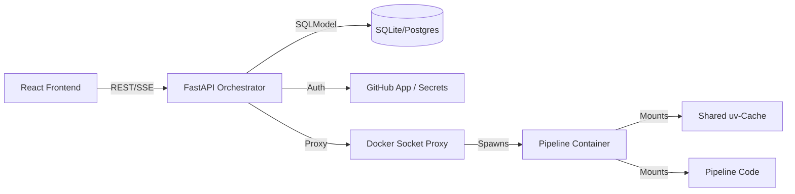

# Fast-Flow Orchestrator

**The lightweight, Docker-native, Python-centric task orchestrator for 2026.**


Fast-Flow ist die Antwort auf die Komplexität von Airflow und die Schwerfälligkeit traditioneller CI/CD-Tools. Er wurde für Entwickler gebaut, die echte Isolation wollen, ohne auf die Geschwindigkeit lokaler Skripte zu verzichten.

## 🏗 Architektur: Das "Runner-Cache"-Prinzip

Im Gegensatz zu klassischen Orchestratoren, die oft "Dependency Hell" in ihren Worker-Umgebungen erleben, nutzt Fast-Flow eine moderne JIT-Environment-Architektur.

- **The Singleton Brain**: Ein einzelner FastAPI-Prozess verwaltet den Zustand, den Scheduler und den Git-Sync.
- **Ephemeral Workers**: Jede Pipeline startet in einem isolierten Docker-Container. Keine Seiteneffekte, keine Rückstände.
- **uv-Acceleration**: Durch das Mounten eines globalen uv-Caches vom Host in den Container werden Dependencies in Millisekunden bereitgestellt. Es fühlt sich an wie ein lokales venv, ist aber ein sauberer Container.
- **Live-Streaming**: Logs und Ressourcen-Metriken (CPU/RAM) werden per SSE (Server-Sent Events) in Echtzeit direkt aus dem Docker-Socket an das React-Frontend gestreamt.

## 🛠 Der Container-Prozess & Lifecycle

Fast-Flow nutzt ein "Disposable Worker"-Modell. Anstatt langlebige Instanzen zu pflegen, wird für jede Ausführung ein frischer, isolierter Container erzeugt. Der gesamte Prozess folgt diesem Ablauf:

### 1. Trigger & Initialisierung

Sobald ein Run über das React-Frontend (manuell) oder den APScheduler (geplant) ausgelöst wird:

- Die API validiert die Pipeline-Struktur und lädt die verschlüsselten Secrets.
- Ein neuer Eintrag in der SQLite-Datenbank wird mit dem Status `PENDING` erstellt.

### 2. Die "Zero-Build" Execution

Hier liegt der Kern der Fast-Flow Performance. Statt ein Docker-Image zu bauen, wird ein generisches Basis-Image gestartet:

- **Mounting**: Das spezifische Pipeline-Verzeichnis (read-only) und der globale uv-Cache des Hosts werden in den Container gemountet.
- **Just-In-Time Environment**: Innerhalb des Containers führt `uv` den Befehl `uv run` aus.
  - **Existieren die Abhängigkeiten im Cache?** Sie werden in Millisekunden per Hardlink verknüpft.
  - **Neue Abhängigkeiten?** Sie werden einmalig geladen und sofort im Host-Cache für zukünftige Runs gesichert.

### 3. Monitoring & Kommunikation (Headless Architecture)

Während der Container läuft, fungiert die FastAPI als Vermittler:

- **Logs**: Die API liest den stdout/stderr-Stream des Docker-Containers asynchron und stellt ihn über einen SSE-Endpunkt (Server-Sent Events) bereit.
- **Metrics**: Die Docker-Stats-API wird abgegriffen, um CPU- und RAM-Werte in Echtzeit an das React-Dashboard zu senden.
- **Security**: Die API kommuniziert nicht direkt mit dem Docker-Socket, sondern über einen Socket-Proxy, der nur lesende Zugriffe und begrenzte Start-Befehle erlaubt.

### 4. Terminierung & Cleanup

Nach Abschluss des Python-Skripts:

- Der Exit-Code wird erfasst (z.B. 137 für OOM-Fehler).
- Der Container wird automatisch entfernt (`--rm`), was das System absolut sauber hält.
- Die Logs werden finalisiert und für die Langzeitarchivierung auf der Festplatte gespeichert.

### 🏗 Architektur-Diagramm (Datenfluss)



### Warum dieser Ansatz?

- **Geschwindigkeit**: Durch den Entfall von `docker build` Schritten startet eine Pipeline so schnell wie ein lokaler Prozess.
- **Isolation**: Ein Fehler in `pipeline_a` kann niemals die Umgebung von `pipeline_b` beeinflussen.
- **Skalierbarkeit**: Da der Controller (API) und die Worker (Container) entkoppelt sind, kann das System durch das Hinzufügen von Message-Queues (wie Redis) leicht auf mehrere Server verteilt werden.

## 🚀 Warum Fast-Flow? (Vergleich)

| Feature | Fast-Flow | Airflow | Dagster |
|---------|-----------|---------|---------|
| Setup | 🟢 1 Docker-Container | 🔴 Komplexes Cluster | 🟡 Mittel |
| Isolation | 🟢 Strikt (Docker pro Task) | 🔴 Schwach (Shared Worker) | 🟡 Mittel |
| Dependency-Speed | 🟢 Instant (uv JIT) | 🔴 Langsam (Image Builds) | 🟡 Mittel |
| UI-Vibe | 🟢 Modern & Realtime (React) | 🔴 Altbacken / Statisch | 🟡 Modern |
| Deployment | 🟢 Git Push + Auto-Sync | 🔴 Komplexe CI/CD Pipelines | 🟡 Code-Deployment |
| **Onboarding-Zeit** | 🟢 **Minuten statt Tage** | 🔴 **Wochen** | 🟡 **Tage** |
| **Pipeline-Struktur lernen** | 🟢 **Einfach: main.py + requirements.txt** | 🔴 **Komplex: DAGs, Operators, XComs** | 🟡 **Mittel: Assets, Ops, Resources** |

## 🎯 Warum Fast-Flow gewinnt (The Python Advantage)

### 1. 🐍 Simple Python Pipelines – No Context Switching

In anderen Orchestratoren musst du oft YAML-Dateien schreiben oder dich mit komplexen DSLs herumschlagen.

- **Die Pipelines**: Eine Pipeline ist ein simples Python-Skript. Wenn es lokal läuft, läuft es auch im Orchestrator. Keine speziellen Decorators, keine Operator-Klassen, keine komplexe Konfiguration.
- **Das Frontend**: Modernes React-Dashboard mit Echtzeit-Monitoring. Das Backend bleibt 100% Python (FastAPI).

### 2. ⚡️ Instant Onboarding (Developer Experience)

**Keine proprietäre Logik**: Du musst keine speziellen Decorators (wie `@dag`) oder Operatoren (`PythonOperator`) lernen.

- **"Write & Run"**: Neue Entwickler können innerhalb von 5 Minuten ihre erste Pipeline pushen. Wer Python versteht, versteht Fast-Flow.
- **Lokales Debugging**: Da wir uv nutzen, können Entwickler exakt die gleiche Umgebung lokal mit einem Befehl nachbauen, die auch im Container läuft.

**Onboarding bei Airflow**: Oft eine Sache von Tagen oder Wochen (wegen der DSL, Provider, Cluster-Logik) – bei Fast-Flow ist es eine Sache von Minuten.

### 3. 🛠 Minimalistischer Footprint

Während Airflow eine Postgres-DB, einen Redis-Broker, einen Scheduler, einen Webserver und mehrere Worker braucht, kommt Fast-Flow als Single-Container-Lösung aus.

- **Wartungsarm**: Ein Update bedeutet `docker-compose pull`. Fertig.
- **Ressourcenschonend**: Ideal für Edge-Server oder kleinere VM-Instanzen.

### Die Fast-Flow Vorteile:

- **Zero-Build Pipelines**: Du musst keine Docker-Images für deine Pipelines bauen. Ändere die requirements.txt im Git, und Fast-Flow wärmt den Cache automatisch im Hintergrund auf.
- **Kein "Database is locked"**: Optimiert für SQLite mit WAL-Mode und asynchronem I/O.
- **Ressourcen-Kontrolle**: Setze CPU- und RAM-Limits pro Pipeline direkt via JSON-Metadaten.
- **Sicherheits-Fokus**: Verschlüsselte Secrets (Fernet) und nativer GitHub App Support.

## 🛠 Technischer Stack

- **Backend**: FastAPI (Python 3.11+)
- **Frontend**: React + TypeScript (Vite)
- **Database**: SQLModel (SQLite/PostgreSQL)
- **Execution**: Docker Engine API + uv
- **Scheduling**: APScheduler (Persistent)
- **Auth**: JWT & Fernet Encryption

## Hauptfunktionen

- **Automatische Pipeline-Erkennung**: Pipelines werden automatisch aus einem Git-Repository erkannt
- **Isolierte Ausführung**: Jede Pipeline läuft in einem eigenen Docker-Container
- **Resource-Management**: Konfigurierbare CPU- und Memory-Limits pro Pipeline
- **Scheduling**: Unterstützung für CRON- und Interval-basierte Jobs
- **Webhooks**: Pipeline-Trigger via HTTP-Webhooks
- **Live-Monitoring**: Echtzeit-Logs und Metriken während der Ausführung
- **Git-Sync**: Automatische Synchronisation mit Git-Repositories
- **Secrets-Management**: Sichere Verwaltung von Secrets und Parametern

## Dokumentation

- **[Quick Start Guide](docs/QUICKSTART.md)** - Schnellstart-Anleitung
- **[API-Dokumentation](docs/api/API.md)** - Vollständige API-Referenz
- **[Frontend-Dokumentation](docs/frontend/FRONTEND.md)** - Frontend-Komponenten und Seiten
- **[Pipeline-Repository](docs/pipelines/PIPELINE_REPOSITORY.md)** - Detaillierte Anleitung für Pipeline-Repositories

## Pipeline-Repository-Struktur

Das Pipeline-Repository wird als Volume in den Orchestrator-Container gemountet. Pipelines werden automatisch erkannt und ausgeführt.

### Verzeichnisstruktur

```
pipelines/
├── pipeline_a/
│   ├── main.py              # Haupt-Pipeline-Skript (erforderlich)
│   ├── requirements.txt     # Python-Dependencies (optional)
│   └── pipeline.json        # Metadaten (optional)
├── pipeline_b/
│   ├── main.py
│   ├── requirements.txt
│   └── data_processor.json  # Alternative: {pipeline_name}.json
└── pipeline_c/
    └── main.py              # Minimal: Nur main.py
```

### Pipeline-Dateien

#### 1. `main.py` (erforderlich)

Das Haupt-Pipeline-Skript. Jede Pipeline muss eine `main.py` Datei im eigenen Verzeichnis haben.

**Ausführungsweise:**
- Pipelines werden mit `uv run --with-requirements {requirements.txt} {main.py}` ausgeführt
- Code kann von oben nach unten ausgeführt werden (keine `main()`-Funktion erforderlich)
- Optional: `main()`-Funktion mit `if __name__ == "__main__"` Block

**Beispiel 1: Einfaches Skript (von oben nach unten)**
```python
# main.py
import os
print("Pipeline gestartet")
data = os.getenv("MY_SECRET")
print(f"Verarbeite Daten: {data}")
# ... weiterer Code ...
```

**Beispiel 2: Mit main() Funktion (optional)**
```python
# main.py
def main():
    print("Pipeline gestartet")
    # ... Logik ...

if __name__ == "__main__":
    main()
```

**Error-Handling:**
- Bei uncaught Exceptions gibt Python automatisch Exit-Code != 0 zurück
- Pipeline wird als `FAILED` markiert

#### 2. `requirements.txt` (optional)

Python-Dependencies für die Pipeline. Werden von `uv` dynamisch installiert.

**Format:** Standard Python requirements.txt Format
```
requests==2.31.0
pandas==2.1.0
numpy==1.24.3
```

**Hinweise:**
- Dependencies werden beim Pipeline-Start automatisch installiert (via `uv`)
- Shared Cache ermöglicht schnelle Installation (< 1 Sekunde bei Cached-Dependencies)
- Pre-Heating: Dependencies können beim Git-Sync vorgeladen werden (UV_PRE_HEAT)

#### 3. `pipeline.json` oder `{pipeline_name}.json` (optional)

Metadaten-Datei für Resource-Limits und Konfiguration.

**Dateinamen:**
- `pipeline.json` (Standard, wird bevorzugt)
- `{pipeline_name}.json` (Alternative, z.B. `data_processor.json`)

**JSON-Format:**
```json
{
  "cpu_hard_limit": 1.0,
  "mem_hard_limit": "1g",
  "cpu_soft_limit": 0.8,
  "mem_soft_limit": "800m",
  "timeout": 3600,
  "retry_attempts": 3,
  "description": "Prozessiert täglich eingehende Daten",
  "tags": ["data-processing", "daily"],
  "enabled": true,
  "default_env": {
    "LOG_LEVEL": "INFO",
    "DEBUG": "false"
  }
}
```

**Felder:**

**Resource-Limits:**
- `cpu_hard_limit` (Float, optional): CPU-Limit in Kernen (z.B. 1.0 = 1 Kern, 0.5 = halber Kern)
- `mem_hard_limit` (String, optional): Memory-Limit (z.B. "512m", "1g", "2g")
- `cpu_soft_limit` (Float, optional): CPU-Soft-Limit für Monitoring (wird überwacht, keine Limitierung)
- `mem_soft_limit` (String, optional): Memory-Soft-Limit für Monitoring (wird überwacht, keine Limitierung)

**Pipeline-Konfiguration:**
- `timeout` (Integer, optional): Timeout in Sekunden (pipeline-spezifisch, überschreibt globales CONTAINER_TIMEOUT)
- `retry_attempts` (Integer, optional): Anzahl Retry-Versuche bei Fehlern (pipeline-spezifisch, überschreibt globales RETRY_ATTEMPTS)
- `enabled` (Boolean, optional): Pipeline aktiviert/deaktiviert (Standard: true)

**Dokumentation:**
- `description` (String, optional): Beschreibung der Pipeline (wird in UI angezeigt)
- `tags` (Array[String], optional): Tags für Kategorisierung/Filterung in der UI

**Environment-Variablen:**
- `default_env` (Object, optional): Pipeline-spezifische Default-Environment-Variablen
  - Diese werden bei jedem Pipeline-Start gesetzt
  - Können in der UI durch zusätzliche Env-Vars ergänzt werden (werden zusammengeführt)
  - Nützlich für Pipeline-spezifische Konfiguration (z.B. LOG_LEVEL, API_ENDPOINT, etc.)
  - Secrets sollten NICHT hier gespeichert werden (verwende stattdessen Secrets-Management in der UI)

**Verhalten:**
- **Hard Limits**: Werden beim Container-Start gesetzt (Docker-Limits)
  - Überschreitung führt zu OOM-Kill (Exit-Code 137) bei Memory
  - CPU wird gedrosselt (Throttling) bei Überschreitung
- **Soft Limits**: Werden nur überwacht, keine Limitierung
  - Überschreitung wird im Frontend angezeigt (Warnung)
  - Nützlich für frühe Erkennung von Resource-Problemen
- **Fehlende Metadaten**: Standard-Limits werden verwendet (falls konfiguriert)
- **Timeout & Retry**: Pipeline-spezifische Werte überschreiben globale Konfiguration
- **Environment-Variablen**: `default_env` wird mit UI-spezifischen Env-Vars zusammengeführt (UI-Werte haben Vorrang)

**Beispiel:**
```json
{
  "cpu_hard_limit": 2.0,
  "mem_hard_limit": "2g",
  "cpu_soft_limit": 1.5,
  "mem_soft_limit": "1.5g"
}
```

### Pipeline-Erkennung

- **Automatische Discovery**: Pipelines werden automatisch beim Git-Sync erkannt
- **Pipeline-Name**: Entspricht dem Verzeichnisnamen (z.B. `pipeline_a/` → Pipeline-Name: `pipeline_a`)
- **Validierung**: Pipeline muss `main.py` Datei enthalten, sonst wird sie ignoriert
- **Keine manuelle Registrierung**: Pipelines werden automatisch verfügbar

### Beispiel-Pipeline-Struktur

**Vollständiges Beispiel:**
```
pipelines/
└── data_processor/
    ├── main.py
    ├── requirements.txt
    └── data_processor.json
```

**`main.py`:**
```python
import os
import requests
import json

def process_data():
    api_key = os.getenv("API_KEY")
    data = fetch_data(api_key)
    result = transform_data(data)
    save_result(result)

def fetch_data(api_key):
    response = requests.get("https://api.example.com/data", headers={"Authorization": f"Bearer {api_key}"})
    return response.json()

def transform_data(data):
    # ... Transformationslogik ...
    return data

def save_result(result):
    with open("/tmp/result.json", "w") as f:
        json.dump(result, f)

if __name__ == "__main__":
    process_data()
```

**`requirements.txt`:**
```
requests==2.31.0
```

**`data_processor.json`:**
```json
{
  "cpu_hard_limit": 1.0,
  "mem_hard_limit": "512m",
  "cpu_soft_limit": 0.8,
  "mem_soft_limit": "400m",
  "timeout": 1800,
  "retry_attempts": 2,
  "description": "Prozessiert eingehende Daten und erstellt Reports",
  "tags": ["data-processing", "reports"],
  "enabled": true,
  "default_env": {
    "LOG_LEVEL": "INFO",
    "API_ENDPOINT": "https://api.example.com"
  }
}
```

---

*Weitere Dokumentation siehe `plan.md` und `IMPLEMENTATION_PLAN.md`*
