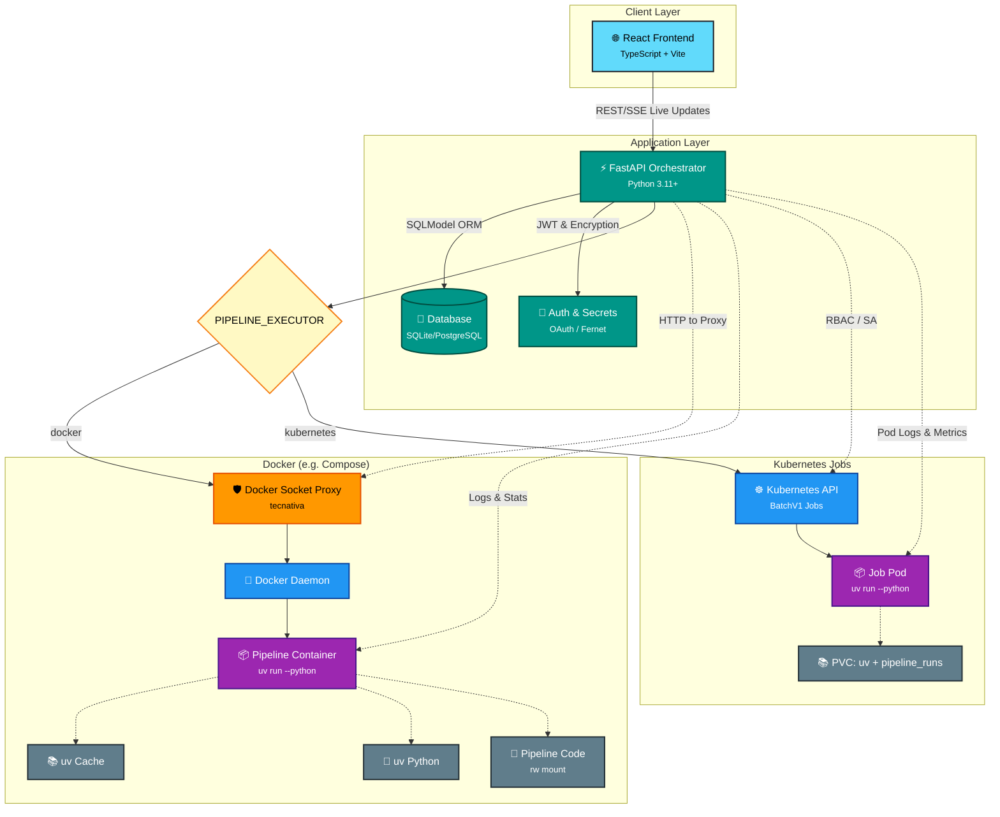

# Fast-Flow Orchestrator

[](LICENSE) [](https://www.python.org/downloads/) [](docker-compose.yaml) [](k8s/README.md) [](https://fastapi.tiangolo.com/) [](https://reactjs.org/) [](https://www.typescriptlang.org/) [](README.md#-technical-stack)

[](https://github.com/ttuhin03/fastflow/releases)

> **Kubernetes-ready:** Fast-Flow runs with **Docker** (Compose or Socket Proxy) or natively on **Kubernetes** – pipeline runs as K8s Jobs, without a Docker socket. See [k8s/README.md](k8s/README.md) and [Kubernetes Deployment](docs/docs/deployment/K8S.md).

**The lightweight, container-native, Python-centric task orchestrator for 2026.** (Docker Compose **or** Kubernetes Jobs – configurable via `PIPELINE_EXECUTOR`.)

Fast-Flow is the answer to the complexity of Airflow and the heaviness of traditional CI/CD tools. It was built for developers who want real isolation without sacrificing the speed of local scripts.

<!-- 60-second overview -->
**In 60 seconds:** One Python script per pipeline, no DAG, no image build. `git push` → sync → run. Each pipeline runs in isolation with **uv** (JIT dependencies): under Docker as an ephemeral container (optionally via [Socket Proxy](#-security-docker-socket-proxy)), under Kubernetes as a **Job pod** without Docker on the nodes. One FastAPI orchestrator, ready to go.

> [!NOTE]
> Read our [Anti-Overhead Manifesto](docs/docs/manifesto.md) to understand why Fast-Flow is a better alternative to Airflow, Dagster & co.

> [!TIP]
> Use our **[fastflow-pipeline-template](https://github.com/ttuhin03/fastflow-pipeline-template)** for a quick start and optimal pipeline structure.

### App Overview

| [Dashboard](docs/static/img/dashboard.png) | [Pipelines](docs/static/img/pipelines-pipelines.png) | [Dependencies](docs/static/img/pipelines-abhaengigkeiten.png) | [Settings](docs/static/img/einstellungen-pipelines.png) | [Notifications](docs/static/img/einstellungen-benachrichtigungen.png) |
|:---:|:---:|:---:|:---:|:---:|
| **Dashboard** – Overview, metrics, heatmap | **Pipelines** – List, run, filter | **Dependencies** – Packages & CVE check | **Settings** – Pipelines, log retention | **Notifications** – Email, Teams |

<details>
<summary>📸 Show screenshots</summary>

**Dashboard**


**Pipelines & Dependencies**

  


**Settings**

  


</details>

## 📖 Table of Contents
- [App Overview (Screenshots)](#app-overview)
- [🚀 Quick Start (Docker · Local · Kubernetes)](#-quick-start)
- [🏗 Architecture: The "Runner-Cache" Principle](#-architecture-the-runner-cache-principle)
- [🛠 Worker Process & Lifecycle](#-worker-process--lifecycle)
- [🔄 Git-Native Deployment](#-git-native-deployment)
- [🚀 Why Fast-Flow? (Comparison)](#-why-fast-flow-comparison)
- [🎯 Why Fast-Flow Wins (The Python Advantage)](#-why-fast-flow-wins-the-python-advantage)
- [🛠 Technical Stack](#-technical-stack)
- [🔒 Security: Docker Socket Proxy](#-security-docker-socket-proxy)
- [📚 Documentation](#-documentation)
- [📦 Versioning & Releases](#-versioning--releases)
- [❓ Troubleshooting](#-troubleshooting)

## 🚀 Quick Start

Get Fast-Flow running in minutes.

### Prerequisites

- **Docker** & Docker Compose (for Option 1 and local pipeline runs in Docker mode)
- **Python 3.11+** (for local development / key generation only)
- **Kubernetes** + **kubectl** (for Option 3; Docker on the workstation is often still needed to build images)

### Option 1: Docker (Recommended for Production)

The easiest way to start Fast-Flow.

```bash
# 1. Prepare .env file
cp .env.example .env

# 2. Generate encryption key (IMPORTANT!)
# Generates a key and prints it. Add it to .env under ENCRYPTION_KEY.
# For login: GITHUB_CLIENT_ID, GITHUB_CLIENT_SECRET, INITIAL_ADMIN_EMAIL in .env (see Login section).
python3 -c "from cryptography.fernet import Fernet; print(Fernet.generate_key().decode())"

# 3. Start
docker compose up -d

# 4. View logs
docker compose logs -f orchestrator
```

> Note: If your system still uses the legacy CLI, the same commands work with `docker-compose`.

**Open UI:** [http://localhost:8000](http://localhost:8000)

#### Note on `entrypoint.sh`

The orchestrator image starts by default via `./entrypoint.sh` (see `Dockerfile` `CMD`). The script:
- initializes DB/migrations via `python scripts/init_db_for_migrations.py`
- in `ENVIRONMENT=development`, optionally copies seed pipelines to `/app/pipelines`
- auto-detects `PIPELINES_HOST_DIR` (important for Docker worker mounts)
- then starts `uvicorn app.main:app --host 0.0.0.0 --port 8000`

If you override `command` or `args` in Compose/Kubernetes, this init logic should be preserved explicitly (e.g. by calling `./entrypoint.sh`).

### Option 2: Local (For Development)

Uses a local venv but starts containers via Docker.

```bash
# 1. Setup
python3 -m venv venv
source venv/bin/activate
pip install -r requirements.txt

# 2. Configuration
cp .env.example .env
# -> Set ENCRYPTION_KEY in .env (see above)

# 3. Start
# Backend (Terminal 1):
uvicorn app.main:app --reload
# Frontend (Terminal 2): cd frontend && npm run dev
```

### Option 3: Kubernetes (K8s-ready)

Fast-Flow can run on any Kubernetes cluster. **Pipeline runs execute as Kubernetes Jobs** (no Docker socket required), ideal for production or local K8s setups.

```bash
# Apply manifests (adjust Secrets/ConfigMap, see k8s/README.md)
kubectl apply -f k8s/pvc.yaml
kubectl apply -f k8s/postgres.yaml   # optional
kubectl apply -f k8s/secrets.yaml
kubectl apply -f k8s/configmap.yaml
kubectl apply -f k8s/rbac-kubernetes-executor.yaml
kubectl apply -f k8s/deployment.yaml
kubectl apply -f k8s/service.yaml
# Access: kubectl port-forward svc/fastflow-orchestrator 8000:80 → http://localhost:8000
```

**Test locally (Minikube in VM):** `./scripts/minikube-vm.sh` – see [k8s/README.md](k8s/README.md).

Full guide (images, OAuth, production): [k8s/README.md](k8s/README.md) · [Kubernetes Deployment (docs)](docs/docs/deployment/K8S.md).

### 🔐 Login (GitHub, Google, Microsoft, Custom OAuth)

Authentication is via **GitHub, Google, Microsoft (Entra ID), or Custom OAuth (e.g. Keycloak/Auth0)**:

1. **GitHub:** OAuth app (Settings → Developer settings → OAuth Apps), callback `{BASE_URL}/api/auth/github/callback`.  
   **Google:** OAuth client (Google Cloud Console), callback `{BASE_URL}/api/auth/google/callback`.  
   **Microsoft:** App registration (Azure/Entra), callback `{BASE_URL}/api/auth/microsoft/callback`.  
   **Custom OAuth:** Callback `{BASE_URL}/api/auth/custom/callback` plus provider endpoints (`AUTHORIZE_URL`, `TOKEN_URL`, `USERINFO_URL`).
2. In **`.env`**: Set credentials for at least one provider (`GITHUB_*`, `GOOGLE_*`, `MICROSOFT_*`, or `CUSTOM_OAUTH_*`) and `INITIAL_ADMIN_EMAIL` (email for the first admin).
3. **Docker** (everything on :8000): omit `FRONTEND_URL` or set `=http://localhost:8000`, `BASE_URL=http://localhost:8000`.  
   **Dev** (frontend :3000, backend :8000): `FRONTEND_URL=http://localhost:3000`, `BASE_URL=http://localhost:8000`.

> [!TIP]
> Detailed steps, invitations, account linking, **join requests**: [OAuth (GitHub, Google, Microsoft, Custom)](docs/docs/oauth/README.md).

**Join requests (knock-to-join):** Unknown users (without an invitation) can submit a request via OAuth. They receive **no session**, are redirected to `/request-sent`, and appear under **Users → Join Requests**. After approval by an admin, they can log in normally. Rejected or still-pending users land on `/request-sent` or `/request-rejected` on subsequent OAuth login (also without a session).

## 🏗 Architecture: The "Runner-Cache" Principle

Unlike classic orchestrators that often suffer from "dependency hell" in their worker environments, Fast-Flow uses a modern JIT environment architecture.

Via **`PIPELINE_EXECUTOR`** you choose the backend: **`docker`** (Compose / Docker API) or **`kubernetes`** (Batch API → Jobs). Detailed overview: [Architecture (docs)](docs/docs/architektur.md).

- **The Singleton Brain**: A single FastAPI process manages state, the scheduler, and Git sync.
- **Ephemeral Workers**: Each pipeline starts in an isolated sandbox – Docker container or Kubernetes Job pod. No side effects between runs.
- **uv-Acceleration**: The global uv cache and uv Python installations (e.g. 3.11, 3.12) are persistent (host volumes or PVCs) and mounted into the worker. Dependencies and the **per-pipeline selectable** Python version (from `pipeline.json` or `DEFAULT_PYTHON_VERSION`) are available in milliseconds – without a fixed Python in the base image.
- **Live-Streaming**: Logs and metrics (CPU/RAM) via SSE: under Docker via container logs and Docker stats (through socket proxy); under Kubernetes via pod logs and optionally the Metrics API (metrics-server).

## 🛠 Worker Process & Lifecycle

Fast-Flow uses a "Disposable Worker" model. For each execution, a fresh, isolated **container** (Docker) or **pod** (Kubernetes Job) is created. The flow:

### 1. Trigger & Initialization

When a run is triggered via the React frontend (manually) or APScheduler (scheduled):

- The API validates the pipeline structure and loads encrypted secrets.
- A new entry is created in the SQLite database with status `PENDING`.

### 2. The "Zero-Build" Execution

This is the core of Fast-Flow performance. Instead of building a pipeline-specific image, a generic worker image starts (uv, optionally pre-installed Python):

- **Docker**: Pipeline directory mounted from the host (read-write, so pipelines can write output files), uv cache and uv Python mounted.
- **Kubernetes**: The orchestrator copies the pipeline into a **shared volume** before the Job (`pipeline_runs/<Run-ID>` on the cache PVC); Jobs mount uv cache and uv Python the same way as in the [K8s docs](docs/docs/deployment/K8S.md).
- **Just-In-Time (both)**: `uv run --python {version}` – version **per pipeline** (`python_version` in pipeline.json) or `DEFAULT_PYTHON_VERSION`. Python from `uv python install` (preheating).
  - **Dependencies in cache?** → Linked in milliseconds via hardlink.
  - **New dependencies?** → Loaded once, stored in the shared cache for future runs.
- **Preheating**: On startup and after Git sync: `uv python install` / `uv pip compile` – low latency on first run.

### 3. Monitoring & Communication (Headless Architecture)

While the worker runs, FastAPI handles:

- **Logs**: stdout/stderr asynchronously → SSE (Docker: container logs; Kubernetes: pod logs).
- **Metrics**: Docker stats through the proxy **or** Kubernetes Metrics API for the run pod (when available).
- **Security**: With **Docker**, no direct socket access – only via [Docker Socket Proxy](#-security-docker-socket-proxy). With **Kubernetes**, the orchestrator talks to the **Kubernetes API** (RBAC/ServiceAccount), no host Docker socket for runs.

### 4. Termination & Cleanup

After the Python script completes:

- The exit code is captured (e.g. 137 for OOM errors).
- **Docker**: Container is removed (`--rm`). **Kubernetes**: Job ends; TTL/cluster policy cleans up resources; pipeline copy in the volume is cleaned up.
- Logs are finalized and stored for long-term archival.

### 🏗 Architecture Diagram (Data Flow)


```mermaid
flowchart TB
    subgraph ClientLayer["Client Layer"]
        A["🌐 React Frontend<br/><small>TypeScript + Vite</small>"]
    end

    subgraph AppLayer["Application Layer"]
        B["⚡ FastAPI Orchestrator<br/><small>Python 3.11+</small>"]
        C[("💾 Database<br/><small>SQLite/PostgreSQL</small>")]
        D["🔐 Auth & Secrets<br/><small>OAuth / Fernet</small>"]
    end

    A -->|"REST/SSE Live Updates"| B
    B -->|"SQLModel ORM"| C
    B -->|"JWT & Encryption"| D

    PE{"PIPELINE_EXECUTOR"}
    B --> PE

    subgraph DockerPfad["Docker (e.g. Compose)"]
        E["🛡️ Docker Socket Proxy<br/><small>tecnativa</small>"]
        F["🐳 Docker Daemon"]
        G["📦 Pipeline Container<br/><small>uv run --python</small>"]
        H["📚 uv Cache"]
        J["🐍 uv Python"]
        I["📝 Pipeline Code<br/><small>rw mount</small>"]
    end

    subgraph K8sPfad["Kubernetes Jobs"]
        K["☸️ Kubernetes API<br/><small>BatchV1 Jobs</small>"]
        L["📦 Job Pod<br/><small>uv run --python</small>"]
        M["📚 PVC: uv + pipeline_runs"]
    end

    PE -->|docker| E
    E --> F
    F --> G
    G -.-> H
    G -.-> J
    G -.-> I
    B -.->|"HTTP to Proxy"| E
    B -.->|"Logs & Stats"| G

    PE -->|kubernetes| K
    K --> L
    L -.-> M
    B -.->|"RBAC / SA"| K
    B -.->|"Pod Logs & Metrics"| L

    classDef frontend fill:#61dafb,stroke:#20232a,stroke-width:2px,color:#000
    classDef backend fill:#009688,stroke:#004d40,stroke-width:2px,color:#fff
    classDef security fill:#ff9800,stroke:#e65100,stroke-width:2px,color:#000
    classDef infra fill:#2196f3,stroke:#0d47a1,stroke-width:2px,color:#fff
    classDef execution fill:#9c27b0,stroke:#4a148c,stroke-width:2px,color:#fff
    classDef storage fill:#607d8b,stroke:#263238,stroke-width:2px,color:#fff
    classDef decision fill:#fff9c4,stroke:#f57f17,stroke-width:2px,color:#000

    class A frontend
    class B,C,D backend
    class E security
    class F,K infra
    class G,L execution
    class H,I,J,M storage
    class PE decision
```

### Why This Approach?

- **Speed**: Without `docker build` steps, a pipeline starts as fast as a local process.
- **Isolation**: A failure in `pipeline_a` can never affect the environment of `pipeline_b`.
- **Scalability**: Controller (API) and workers (containers or Jobs) are decoupled; future extensions e.g. with message queues (Redis) are possible.

## 🔄 Git-Native Deployment

**Push to Deploy, No Build Needed**

Traditional orchestrators often turn deployment into a logistics problem. Fast-Flow turns it into a `git push`.

### The Old World (Airflow, Dagster, Mage)

*   **Image Hell**: Every code change often requires a new Docker build (wait 5–10 minutes).
*   **Sidecar Chaos**: You need complex Git-sync sidecars or S3 buckets to distribute DAGs.
*   **Version Gap**: What you see in the UI often doesn't match what's in the Git repository.

### The Fast-Flow Way: "Source of Truth"

In Fast-Flow, your Git repository is the single source of truth. There is no "Upload" button and no manual build step.

*   **Zero-Build Deployment**: When you change your code, the orchestrator pulls changes via auto-sync or manual sync. Thanks to the uv JIT architecture, the new version is ready to run immediately.
*   **Full Traceability**: Since every pipeline configuration (`pipeline.json`) and every library (`requirements.txt`) lives in Git, you have a complete history. Who increased the memory limit when? Who changed the prophet version? Your Git log tells you.
*   **Atomic Sync**: Our sync mechanism ensures pipelines never read "half" files. Changes are applied atomically – safe and consistent.

| Feature | Traditional Tools | Fast-Flow |
| :--- | :--- | :--- |
| **Deployment Speed** | Minutes (build & push) | Seconds (git pull) |
| **Versioning** | Often code only | Code, deps & resource limits |
| **Rollback** | Image rollback (complex) | Git revert (simple) |
| **Source of Truth** | UI vs. Git vs. image | Git is law |

### 🛠 How the Flow Works:

1.  **Develop**: Write your Python script locally.
2.  **Push**: `git push origin main`.
3.  **Sync**: The orchestrator detects the change (via auto-sync or manual sync).
4.  **Run**: The pipeline starts immediately with the new code. No Docker builds, no waiting.

> "We made deployment as boring as possible so you can focus on the exciting part: your code."

## 🚀 Why Fast-Flow? (Comparison)

| Feature | Fast-Flow | Airflow | Dagster | Prefect | Kestra |
|---------|-----------|---------|---------|---------|--------|
| Pipeline definition | 🟢 Plain Python script (`main.py`) | 🔴 DAGs, operators, XComs | 🟡 Assets, ops, resources | 🟡 Python + `@flow`/`@task` decorators | 🟡 Declarative YAML |
| Setup | 🟢 Compose or K8s manifests | 🔴 Complex cluster | 🟡 Medium | 🟡 Server + workers (or Cloud) | 🟡 Single JVM service |
| Isolation | 🟢 Strict (container/job per run) | 🔴 Weak (shared worker) | 🟡 Medium | 🟡 Depends on worker type | 🟢 Per-task containers |
| Dependency Speed | 🟢 Instant (uv JIT, no image build) | 🔴 Slow (image builds) | 🟡 Medium | 🟡 Env-dependent | 🟡 Plugin/image based |
| Deployment | 🟢 Git push + auto-sync | 🔴 Complex CI/CD | 🟡 Code deployment | 🟡 Code deployment | 🟡 Push / API |
| UI | 🟢 Modern & realtime (React) | 🔴 Dated / static | 🟢 Modern | 🟢 Modern | 🟢 Modern |
| **Onboarding** | 🟢 **Minutes — if it runs locally, it runs here** | 🔴 **Weeks** | 🟡 **Days** | 🟡 **Days** | 🟡 **Days** |

### Where Fast-Flow fits (and where it doesn't)

Fast-Flow is deliberately narrow: **"I have a handful of Python scripts and Airflow is overkill."** If that's you, the whole point is that there's no DAG, no decorators, no image build — you push a `main.py` and it runs in an isolated container. That's the sweet spot.

It's **not** trying to be everything. If you need a large catalog of pre-built connectors/triggers, event-driven workflows across many systems, or a data-asset lineage graph, mature tools like **Prefect**, **Kestra**, or **Dagster** are built for that and worth a look. Fast-Flow trades that breadth for a radically simpler mental model and near-zero operational overhead.

## 🎯 Why Fast-Flow Wins (The Python Advantage)

### 1. 🐍 Simple Python Pipelines – No Context Switching

In other orchestrators you often have to write YAML files or wrestle with complex DSLs.

- **The pipelines**: A pipeline is a simple Python script. If it runs locally, it runs in the orchestrator. No special decorators, no operator classes, no complex configuration.
- **The frontend**: Modern React dashboard with real-time monitoring. The backend stays 100% Python (FastAPI).

### 2. ⚡️ Instant Onboarding (Developer Experience)

**No proprietary logic**: You don't need to learn special decorators (like `@dag`) or operators (`PythonOperator`).

- **"Write & Run"**: New developers can push their first pipeline within 5 minutes. If you understand Python, you understand Fast-Flow.
- **Local debugging**: Since we use uv, developers can reproduce the exact same environment locally with one command that also runs in the container.

**Onboarding with Airflow**: Often a matter of days or weeks (due to DSL, providers, cluster logic) – with Fast-Flow it's a matter of minutes.

### 3. 🛠 Minimal Footprint

While Airflow needs a Postgres DB, a Redis broker, a scheduler, a webserver, and multiple workers, Fast-Flow stays deliberately lean: typically **one orchestrator deployment** plus ephemeral workers (Docker containers or K8s Jobs).

- **Low maintenance**: Update e.g. `docker compose pull` or deploy a new orchestrator image in the cluster.
- **Resource-efficient**: Ideal for edge servers or smaller VM instances.

### Fast-Flow Advantages:

- **Zero-Build Pipelines**: You don't need to build Docker images for your pipelines. Change requirements.txt in Git, and Fast-Flow warms the cache automatically in the background.
- **No "Database is locked"**: Optimized for SQLite with WAL mode and async I/O.
- **Resource Control**: Set CPU and RAM limits per pipeline directly via JSON metadata.
- **Security Focus**: Encrypted secrets (Fernet) and native GitHub App support.

## 🛠 Technical Stack

- **Backend**: FastAPI (Python 3.11+)
- **Frontend**: React + TypeScript (Vite)
- **Database**: SQLModel (SQLite/PostgreSQL) – *Production: [PostgreSQL recommended](docs/docs/deployment/PRODUCTION.md#datenbank-postgresql-für-produktion)*
- **Execution**: Docker Engine API + uv **or** Kubernetes Jobs (K8s-ready, see [k8s/README.md](k8s/README.md))
- **Security**: Docker Socket Proxy (tecnativa/docker-socket-proxy) in Docker mode; no socket exposure needed on K8s
- **Scheduling**: APScheduler (persistent)
- **Auth**: OAuth (GitHub, Google, Microsoft, Custom), JWT & Fernet encryption

## Key Features

- **Automatic Pipeline Discovery**: Pipelines are automatically discovered from a Git repository
- **Isolated Execution**: Each pipeline in its own Docker container or Kubernetes Job (`PIPELINE_EXECUTOR`)
- **Resource Management**: Configurable CPU and memory limits per pipeline
- **Scheduling**: Support for CRON- and interval-based jobs
- **Webhooks**: Trigger pipelines via HTTP webhooks
- **Live Monitoring**: Real-time logs and metrics during execution
- **Git Sync**: Automatic synchronization with Git repositories
- **Secrets Management**: Secure management of secrets and parameters
- **S3 Log Backup** (optional): Pipeline logs are backed up to S3/MinIO before local deletion (cleanup); deletion only happens after successful upload. On failure: UI notice and email to `EMAIL_RECIPIENTS`. See [Log Backup (S3/MinIO)](docs/docs/deployment/S3_LOG_BACKUP.md).

## 🔒 Security: Docker Socket Proxy

With **`PIPELINE_EXECUTOR=docker`** (default with Docker Compose), Fast-Flow uses a **Docker Socket Proxy** (`tecnativa/docker-socket-proxy`) between the orchestrator and the Docker daemon. This eliminates direct root access to the socket; only selected Docker API operations are allowed. With **`PIPELINE_EXECUTOR=kubernetes`**, the orchestrator talks to the **Kubernetes API** (Jobs/Pods); the proxy is not needed.

### Why a Proxy?

- **Security**: The Docker socket (`/var/run/docker.sock`) effectively grants root access to the entire host system. A proxy filters and allows only configured operations.
- **Controlled Access**: Only container creation, logs, stats, and image pulls are allowed. Network and volume management are disabled.
- **Isolation**: Even if the orchestrator is compromised, damage is limited.

### Configuration

The proxy is configured automatically in `docker-compose.yaml`:

```yaml
docker-proxy:
  image: tecnativa/docker-socket-proxy:latest
  environment:
    - CONTAINERS=1    # Allow container operations
    - IMAGES=1        # Allow image pulls
    - BUILD=1         # Allow build operations
    - VOLUMES=1       # Allow volume mounts
    - EXEC=1          # Allow exec (used to read the uv version from the container)
    - POST=1          # Allow HTTP POST (container creation)
    - DELETE=1        # Allow container removal
    - STATS=1         # Allow resource monitoring
    - NETWORKS=0      # Disable network management
    - SYSTEM=0        # Disable system operations
```

The orchestrator communicates with the proxy via `http://docker-proxy:2375` instead of directly with the Docker socket.

## Documentation

Documentation lives under `docs/docs/` and is served with **Docusaurus**. Start locally: `cd docs && npm run start` → [http://localhost:3000/docs](http://localhost:3000/docs).

| Area | Links |
|--------|--------|
| **Getting Started** | [Quick Start](docs/docs/schnellstart.md) · [Setup Guide](docs/docs/setup.md) · [Manifesto](docs/docs/manifesto.md) · [Architecture](docs/docs/architektur.md) |
| **Pipelines** | [Overview](docs/docs/pipelines/uebersicht.md) · [First Pipeline](docs/docs/pipelines/erste-pipeline.md) · [Advanced Pipelines](docs/docs/pipelines/erweiterte-pipelines.md) · [pipeline.json Reference](docs/docs/pipelines/referenz.md) |
| **Operations** | [Configuration](docs/docs/deployment/CONFIGURATION.md) · [Production](docs/docs/deployment/PRODUCTION.md) · [Git Deployment](docs/docs/deployment/GIT_DEPLOYMENT.md) · [Kubernetes](docs/docs/deployment/K8S.md) · [Docker Socket Proxy](docs/docs/deployment/DOCKER_PROXY.md) |
| **Security & Ops** | [OAuth (GitHub, Google, Microsoft, Custom)](docs/docs/oauth/README.md) · [S3 Log Backup](docs/docs/deployment/S3_LOG_BACKUP.md) · [Compliance](docs/docs/compliance-security.md) |
| **Reference** | [API](docs/docs/api/API.md) · [Database/Schema](docs/docs/database/SCHEMA.md) · [Versioning](docs/docs/deployment/VERSIONING.md) |
| **Help** | [Troubleshooting](docs/docs/troubleshooting.md) · [Disclaimer](docs/docs/disclaimer.md) |

## 📦 Versioning & Releases

Fast-Flow uses an automated version check that runs daily to see if new releases are available.

### Version Format

The version is stored in the `VERSION` file in the project root (currently e.g. `v1.0.4`):

```
v1.0.4
```

### Creating GitHub Releases

To publish a new version:

1. **Update VERSION file:**
   ```bash
   export NEW_VERSION=v1.0.5
   echo "$NEW_VERSION" > VERSION
   git add VERSION
   git commit -m "Bump version to $NEW_VERSION"
   ```

2. **Create tag (must match VERSION file exactly):**
   ```bash
   git tag "$NEW_VERSION"
   git push origin "$NEW_VERSION"
   ```

3. **Create GitHub release:**
   - Go to: https://github.com/ttuhin03/fastflow/releases/new
   - Select tag: `$NEW_VERSION` (e.g. `v1.0.5`)
   - Add release notes
   - Publish the release

> **Important:** The tag format must exactly match the VERSION file (both with "v" prefix)

The version check runs automatically:
- ✅ On API startup
- ✅ Daily at 2:00 AM (together with log cleanup)
- ✅ On demand via API: `GET /api/system/version?force_check=true`

More details: [Versioning & Releases](docs/docs/deployment/VERSIONING.md)

## Pipeline Repository Structure

The pipeline repository lives under `PIPELINES_DIR` – locally, via volume in the orchestrator (Docker Compose), or on a **PVC** (Kubernetes). Pipelines are discovered automatically; in K8s Jobs mode, the orchestrator copies the snapshot per run to the cache volume.

> [!TIP]
> Use our **[fastflow-pipeline-template](https://github.com/ttuhin03/fastflow-pipeline-template)** for a quick start and optimal pipeline structure.

### Directory Structure

```
pipelines/
├── pipeline_a/
│   ├── main.py              # Main pipeline script (required)
│   ├── requirements.txt     # Python dependencies (optional)
│   └── pipeline.json        # Metadata (optional)
├── pipeline_b/
│   ├── main.py
│   ├── requirements.txt
│   └── data_processor.json  # Alternative: {pipeline_name}.json
└── pipeline_c/
    └── main.py              # Minimal: main.py only
```

### Pipeline Files

#### 1. `main.py` (required)

The main pipeline script. Every pipeline must have a `main.py` file in its own directory.

**Execution:**
- Pipelines are run with `uv run --with-requirements {requirements.txt} {main.py}`
- Code can run top to bottom (no `main()` function required)
- Optional: `main()` function with `if __name__ == "__main__"` block

**Example 1: Simple script (top to bottom)**
```python
# main.py
import os
print("Pipeline started")
data = os.getenv("MY_SECRET")
print(f"Processing data: {data}")
# ... more code ...
```

**Example 2: With main() function (optional)**
```python
# main.py
def main():
    print("Pipeline started")
    # ... logic ...

if __name__ == "__main__":
    main()
```

**Error handling:**
- Uncaught exceptions cause Python to return exit code != 0 automatically
- Pipeline is marked as `FAILED`

#### 2. `requirements.txt` (optional)

Python dependencies for the pipeline. Installed dynamically by `uv`.

**Format:** Standard Python requirements.txt format
```
requests==2.31.0
pandas==2.1.0
numpy==1.24.3
```

**Notes:**
- Dependencies are installed automatically on pipeline start (via `uv`)
- Shared cache enables fast installation (< 1 second with cached dependencies)
- Pre-heating: Dependencies can be preloaded on Git sync (UV_PRE_HEAT)

#### 3. `pipeline.json` or `{pipeline_name}.json` (optional)

Metadata file for resource limits and configuration.

**Filenames:**
- `pipeline.json` (default, preferred)
- `{pipeline_name}.json` (alternative, e.g. `data_processor.json`)

**JSON format:**
```json
{
  "cpu_hard_limit": 1.0,
  "mem_hard_limit": "1g",
  "cpu_soft_limit": 0.8,
  "mem_soft_limit": "800m",
  "timeout": 3600,
  "retry_attempts": 3,
  "description": "Processes incoming data daily",
  "tags": ["data-processing", "daily"],
  "enabled": true,
  "default_env": {
    "LOG_LEVEL": "INFO",
    "DEBUG": "false"
  }
}
```

**Fields:**

**Resource limits:**
- `cpu_hard_limit` (Float, optional): CPU limit in cores (e.g. 1.0 = 1 core, 0.5 = half core)
- `mem_hard_limit` (String, optional): Memory limit (e.g. "512m", "1g", "2g")
- `cpu_soft_limit` (Float, optional): CPU soft limit for monitoring (monitored only, not enforced)
- `mem_soft_limit` (String, optional): Memory soft limit for monitoring (monitored only, not enforced)

**Pipeline configuration:**
- `timeout` (Integer, optional): Timeout in seconds (pipeline-specific, overrides global CONTAINER_TIMEOUT)
- `retry_attempts` (Integer, optional): Number of retry attempts on failure (pipeline-specific, overrides global RETRY_ATTEMPTS)
- `enabled` (Boolean, optional): Pipeline enabled/disabled (default: true)

**Documentation:**
- `description` (String, optional): Pipeline description (shown in UI)
- `tags` (Array[String], optional): Tags for categorization/filtering in the UI

**Environment variables:**
- `default_env` (Object, optional): Pipeline-specific default environment variables
  - Set on every pipeline start
  - Can be supplemented with additional env vars in the UI (merged)
  - Useful for pipeline-specific configuration (e.g. LOG_LEVEL, API_ENDPOINT, etc.)
  - Secrets should NOT be stored here (use secrets management in the UI instead)

**Behavior:**
- **Hard limits**: Set when the worker starts (Docker cgroups or Kubernetes `resources.limits`)
  - Exceeding memory leads to OOM kill (exit code 137)
  - CPU is throttled when exceeded
- **Soft limits**: Monitored only, not enforced
  - Exceeding is shown in the frontend (warning)
  - Useful for early detection of resource issues
- **Missing metadata**: Default limits are used (if configured)
- **Timeout & retry**: Pipeline-specific values override global configuration
- **Environment variables**: `default_env` is merged with UI-specific env vars (UI values take precedence)

**Example:**
```json
{
  "cpu_hard_limit": 2.0,
  "mem_hard_limit": "2g",
  "cpu_soft_limit": 1.5,
  "mem_soft_limit": "1.5g"
}
```

### Pipeline Discovery

- **Automatic discovery**: Pipelines are discovered automatically on Git sync
- **Pipeline name**: Matches the directory name (e.g. `pipeline_a/` → pipeline name: `pipeline_a`)
- **Validation**: Pipeline must contain a `main.py` file, otherwise it is ignored
- **No manual registration**: Pipelines become available automatically

### Example Pipeline Structure

**Complete example:**
```
pipelines/
└── data_processor/
    ├── main.py
    ├── requirements.txt
    └── data_processor.json
```

**`main.py`:**
```python
import os
import requests
import json

def process_data():
    api_key = os.getenv("API_KEY")
    data = fetch_data(api_key)
    result = transform_data(data)
    save_result(result)

def fetch_data(api_key):
    response = requests.get("https://api.example.com/data", headers={"Authorization": f"Bearer {api_key}"})
    return response.json()

def transform_data(data):
    # ... transformation logic ...
    return data

def save_result(result):
    with open("/tmp/result.json", "w") as f:
        json.dump(result, f)

if __name__ == "__main__":
    process_data()
```

**`requirements.txt`:**
```
requests==2.31.0
```

**`data_processor.json`:**
```json
{
  "cpu_hard_limit": 1.0,
  "mem_hard_limit": "512m",
  "cpu_soft_limit": 0.8,
  "mem_soft_limit": "400m",
  "timeout": 1800,
  "retry_attempts": 2,
  "description": "Processes incoming data and creates reports",
  "tags": ["data-processing", "reports"],
  "enabled": true,
  "default_env": {
    "LOG_LEVEL": "INFO",
    "API_ENDPOINT": "https://api.example.com"
  }
}
```

---

*More docs: [Pipelines – Overview](docs/docs/pipelines/uebersicht.md), [Configuration](docs/docs/deployment/CONFIGURATION.md)*

## ❓ Troubleshooting

### "Docker is not running" / "Connection refused"
Make sure Docker Desktop is running.
Check: `docker ps`

### "Docker proxy / 403 Forbidden"
The orchestrator may only execute certain commands. Check proxy logs:
`docker compose logs docker-proxy`
Make sure `POST=1` (for container start) is set.

### "Port 8000 in use"
Change `PORT` in the `.env` file.

### "ENCRYPTION_KEY missing"
The application won't start without a key. Generate one (see Quick Start) and set it in `.env`.

---

## ⚖️ Disclaimer

**Important notice on security and liability:**

This project is in an **early stage / beta**. In **`PIPELINE_EXECUTOR=docker`** mode, the orchestrator has indirect access to the Docker daemon (via the recommended proxy) – misconfiguration poses a relevant risk to the host system. Under **`kubernetes`**, runs are decoupled from host Docker; typical K8s concerns apply instead (RBAC, networking, secrets).

- **Use at your own risk:** The software is provided "as is". The author assumes no liability for damage to hardware, data loss, security vulnerabilities, or service interruptions that may result from use of this software.
- **No warranty:** There is no guarantee of correctness, functionality, or continuous availability of the software.
- **Security recommendation:** Never run unprotected on the public internet. In Docker mode, use the socket proxy and strong authentication; in Kubernetes, grant minimal RBAC rights to the orchestrator ServiceAccount.

Full details in the docs: [Disclaimer](docs/docs/disclaimer.md).
