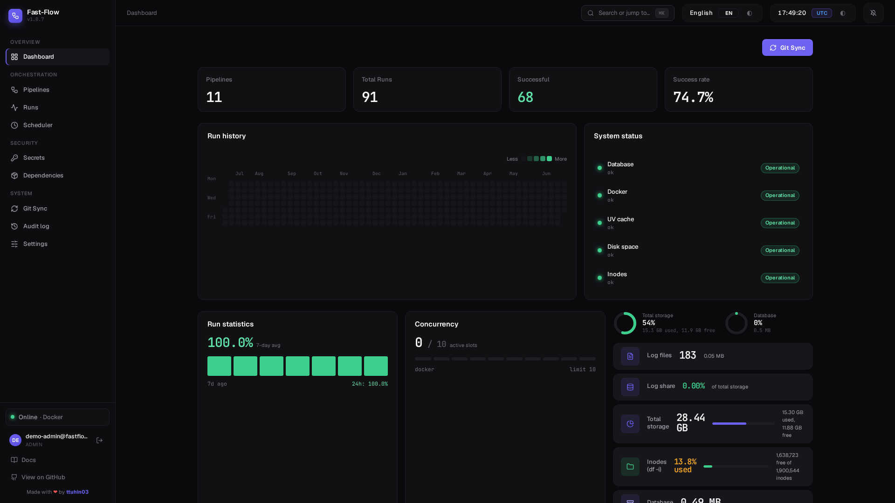
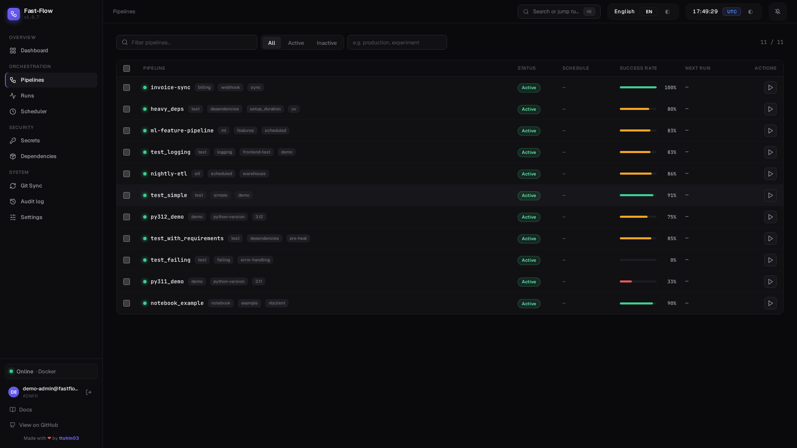
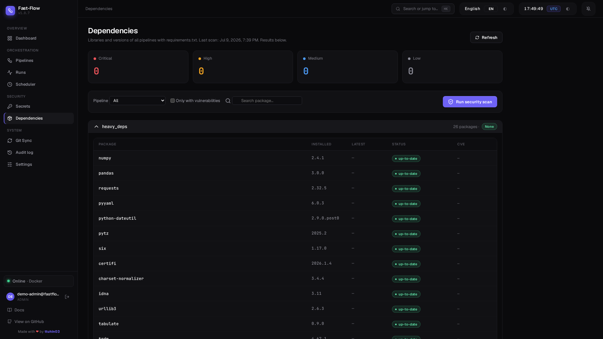
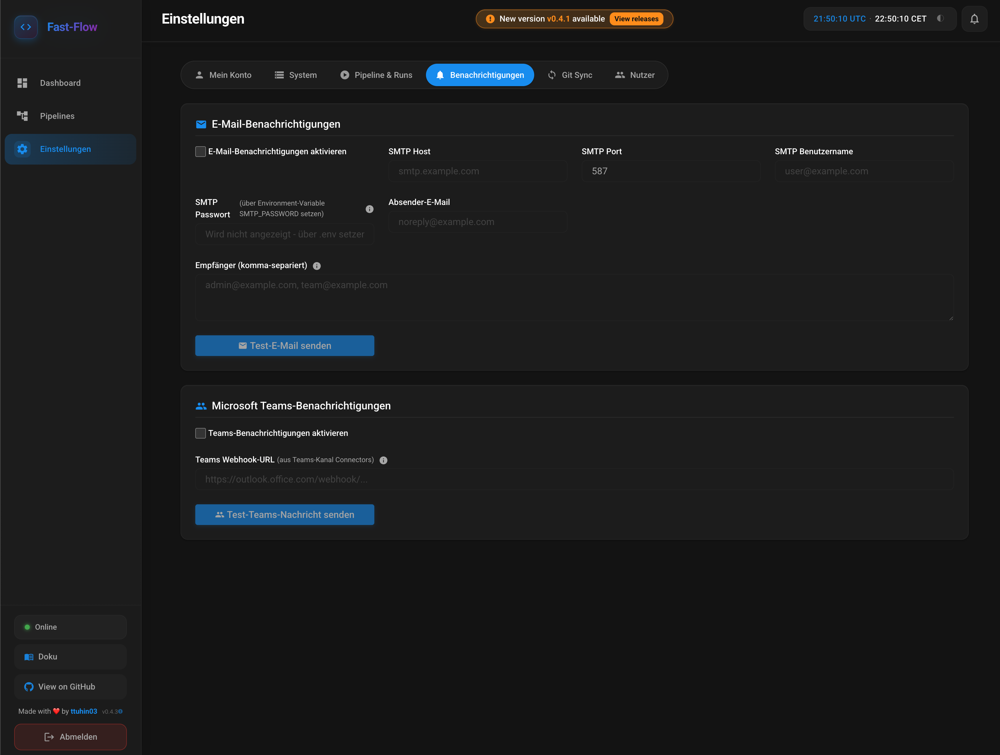
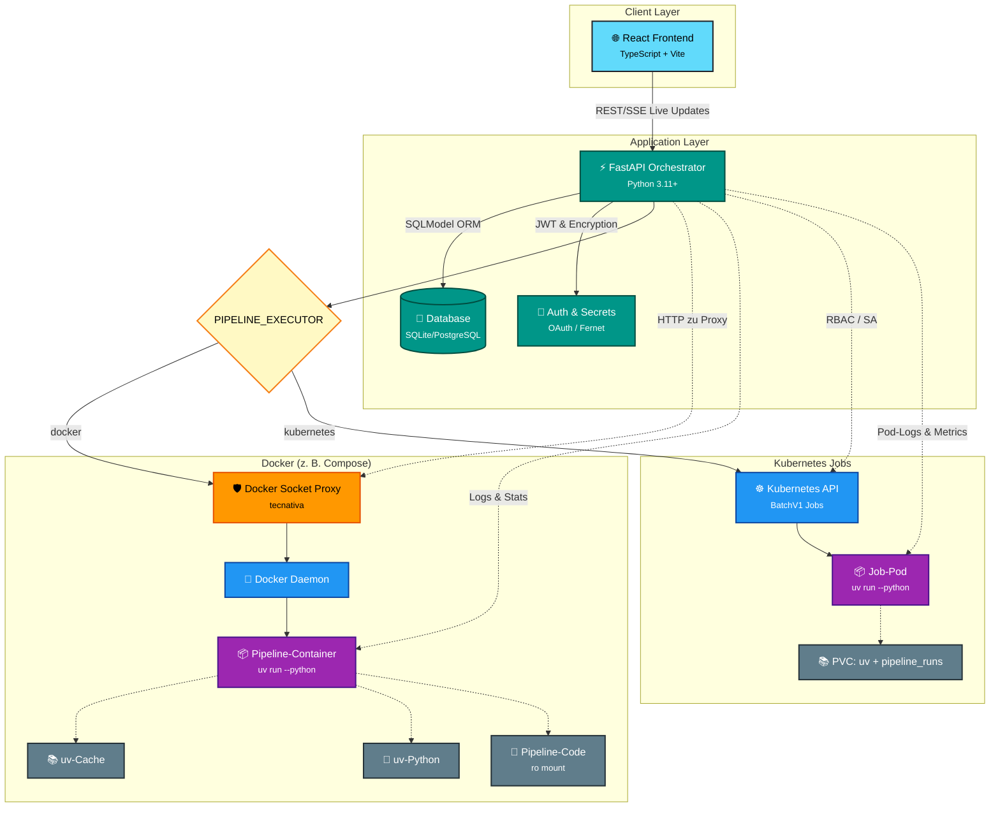

# Fast-Flow Orchestrator

[](LICENSE) [](https://www.python.org/downloads/) [](docker-compose.yaml) [](k8s/README.md) [](https://fastapi.tiangolo.com/) [](https://reactjs.org/) [](https://www.typescriptlang.org/) [](README.md#-technischer-stack)

[](https://github.com/ttuhin03/fastflow/releases)

> **Kubernetes-ready:** Fast-Flow läuft mit **Docker** (Compose oder Socket-Proxy) oder nativ auf **Kubernetes** – Pipeline-Runs als K8s-Jobs, ohne Docker-Socket. Siehe [k8s/README.md](k8s/README.md) und [Kubernetes Deployment](docs/docs/deployment/K8S.md).

**The lightweight, container-native, Python-centric task orchestrator for 2026.** (Docker Compose **oder** Kubernetes Jobs – wählbar über `PIPELINE_EXECUTOR`.)

Fast-Flow ist die Antwort auf die Komplexität von Airflow und die Schwerfälligkeit traditioneller CI/CD-Tools. Er wurde für Entwickler gebaut, die echte Isolation wollen, ohne auf die Geschwindigkeit lokaler Skripte zu verzichten.

<!-- 60-Sekunden-Überblick -->
**In 60 Sekunden:** Ein Python-Skript pro Pipeline, kein DAG, kein Image-Build. `git push` → Sync → Run. Jede Pipeline läuft isoliert mit **uv** (JIT-Dependencies): unter Docker als ephemerer Container (optional [Socket-Proxy](#-sicherheit-docker-socket-proxy)), unter Kubernetes als **Job-Pod** ohne Docker auf den Nodes. Ein FastAPI-Orchestrator, fertig.

> [!NOTE]
>  Lies unser [Anti-Overhead Manifesto](docs/docs/manifesto.md), um zu verstehen, warum Fast-Flow die bessere Alternative zu Airflow, Dagster & Co. ist.

> [!TIP]
> Verwenden Sie unser **[fastflow-pipeline-template](https://github.com/ttuhin03/fastflow-pipeline-template)** für einen schnellen Start und eine optimale Struktur Ihrer Pipelines.

### App-Überblick

| [Dashboard](docs/static/img/dashboard.png) | [Pipelines](docs/static/img/pipelines-pipelines.png) | [Abhängigkeiten](docs/static/img/pipelines-abhaengigkeiten.png) | [Einstellungen](docs/static/img/einstellungen-pipelines.png) | [Benachrichtigungen](docs/static/img/einstellungen-benachrichtigungen.png) |
|:---:|:---:|:---:|:---:|:---:|
| **Dashboard** – Übersicht, Metriken, Heatmap | **Pipelines** – Liste, Run, Filter | **Abhängigkeiten** – Pakete & CVE-Check | **Einstellungen** – Pipelines, Log-Retention | **Benachrichtigungen** – E-Mail, Teams |

<details>
<summary>📸 Screenshots anzeigen</summary>

**Dashboard**



**Pipelines & Abhängigkeiten**

  


**Einstellungen**

  


</details>

## 📖 Inhaltsverzeichnis
- [App-Überblick (Screenshots)](#app-überblick)
- [🚀 Schnellstart (Docker · Lokal · Kubernetes)](#-schnellstart)
- [🏗 Architektur: Das "Runner-Cache"-Prinzip](#-architektur-das-runner-cache-prinzip)
- [🛠 Worker-Prozess & Lifecycle](#-worker-prozess--lifecycle)
- [🔄 Git-Native Deployment](#-git-native-deployment)
- [🚀 Warum Fast-Flow? (Vergleich)](#-warum-fast-flow-vergleich)
- [🎯 Warum Fast-Flow gewinnt (The Python Advantage)](#-warum-fast-flow-gewinnt-the-python-advantage)
- [🛠 Technischer Stack](#-technischer-stack)
- [🔒 Sicherheit: Docker Socket Proxy](#-sicherheit-docker-socket-proxy)
- [📚 Dokumentation](#-dokumentation)
- [📦 Versioning & Releases](#-versioning--releases)
- [❓ Troubleshooting](#-troubleshooting)

## 🚀 Schnellstart

Starten Sie Fast-Flow in wenigen Minuten.

### Voraussetzungen

- **Docker** & Docker Compose (für Option 1 und lokale Pipeline-Runs im Docker-Modus)
- **Python 3.11+** (nur für lokale Entwicklung / Key-Generierung)
- **Kubernetes** + **kubectl** (für Option 3; zum Bauen des Images oft weiterhin Docker auf der Workstation)

### Option 1: Docker (Empfohlen für Produktion)

Der einfachste Weg, Fast-Flow zu starten.

```bash
# 1. .env Datei vorbereiten
cp .env.example .env

# 2. Encryption Key generieren (WICHTIG!)
# Generiert einen Key und gibt ihn aus. Füge ihn in .env unter ENCRYPTION_KEY ein.
# Für den Login: GITHUB_CLIENT_ID, GITHUB_CLIENT_SECRET, INITIAL_ADMIN_EMAIL in .env (siehe Abschnitt Login).
python3 -c "from cryptography.fernet import Fernet; print(Fernet.generate_key().decode())"

# 3. Starten
docker compose up -d

# 4. Logs ansehen
docker compose logs -f orchestrator
```

> Hinweis: Falls dein System noch die Legacy-CLI nutzt, funktionieren die gleichen Befehle auch mit `docker-compose`.

**UI öffnen:** [http://localhost:8000](http://localhost:8000)

#### Hinweis zu `entrypoint.sh`

Das Orchestrator-Image startet standardmäßig über `./entrypoint.sh` (siehe `Dockerfile` `CMD`). Das Skript:
- initialisiert DB/Migrationen via `python scripts/init_db_for_migrations.py`
- kopiert in `ENVIRONMENT=development` optional Seed-Pipelines nach `/app/pipelines`
- erkennt `PIPELINES_HOST_DIR` automatisch (wichtig für Docker-Worker-Mounts)
- startet danach `uvicorn app.main:app --host 0.0.0.0 --port 8000`

Wenn du in Compose/Kubernetes `command` oder `args` überschreibst, sollte diese Init-Logik explizit erhalten bleiben (z. B. durch Aufruf von `./entrypoint.sh`).

### Option 2: Lokal (Für Entwicklung)

Nutzt ein lokales venv, startet aber Container via Docker.

```bash
# 1. Setup
python3 -m venv venv
source venv/bin/activate
pip install -r requirements.txt

# 2. Konfiguration
cp .env.example .env
# -> ENCRYPTION_KEY in .env setzen (siehe oben)

# 3. Starten
# Backend (Terminal 1):
uvicorn app.main:app --reload
# Frontend (Terminal 2): cd frontend && npm run dev
```

### Option 3: Kubernetes (K8s-ready)

Fast-Flow kann auf einem beliebigen Kubernetes-Cluster laufen. **Pipeline-Runs laufen als Kubernetes-Jobs** (kein Docker-Socket nötig), ideal für produktive oder lokale K8s-Setups.

```bash
# Manifests anwenden (Secrets/ConfigMap anpassen, siehe k8s/README.md)
kubectl apply -f k8s/pvc.yaml
kubectl apply -f k8s/postgres.yaml   # optional
kubectl apply -f k8s/secrets.yaml
kubectl apply -f k8s/configmap.yaml
kubectl apply -f k8s/rbac-kubernetes-executor.yaml
kubectl apply -f k8s/deployment.yaml
kubectl apply -f k8s/service.yaml
# Zugriff: kubectl port-forward svc/fastflow-orchestrator 8000:80 → http://localhost:8000
```

**Lokal testen (Minikube in VM):** `./scripts/minikube-vm.sh` – siehe [k8s/README.md](k8s/README.md).

Vollständige Anleitung (Images, OAuth, Produktion): [k8s/README.md](k8s/README.md) · [Kubernetes Deployment (Doku)](docs/docs/deployment/K8S.md).

### 🔐 Login (GitHub, Google, Microsoft, Custom OAuth)

Die Anmeldung erfolgt **über GitHub, Google, Microsoft (Entra ID) oder Custom OAuth (z. B. Keycloak/Auth0)**:

1. **GitHub:** OAuth-App (Settings → Developer settings → OAuth Apps), Callback `{BASE_URL}/api/auth/github/callback`.  
   **Google:** OAuth-Client (Google Cloud Console), Callback `{BASE_URL}/api/auth/google/callback`.  
   **Microsoft:** App-Registrierung (Azure/Entra), Callback `{BASE_URL}/api/auth/microsoft/callback`.  
   **Custom OAuth:** Callback `{BASE_URL}/api/auth/custom/callback` plus Provider-Endpoints (`AUTHORIZE_URL`, `TOKEN_URL`, `USERINFO_URL`).
2. In **`.env`**: Credentials für mindestens einen Provider setzen (`GITHUB_*`, `GOOGLE_*`, `MICROSOFT_*` oder `CUSTOM_OAUTH_*`) sowie `INITIAL_ADMIN_EMAIL` (E-Mail für ersten Admin).
3. **Docker** (Alles :8000): `FRONTEND_URL` weglassen oder `=http://localhost:8000`, `BASE_URL=http://localhost:8000`.  
   **Dev** (Frontend :3000, Backend :8000): `FRONTEND_URL=http://localhost:3000`, `BASE_URL=http://localhost:8000`.

> [!TIP]
> Ausführliche Schritte, Einladung, Konto verknüpfen, **Beitrittsanfragen**: [OAuth (GitHub, Google, Microsoft, Custom)](docs/docs/oauth/README.md).

**Beitrittsanfragen (Anklopfen):** Unbekannte Nutzer (ohne Einladung) können per OAuth eine Anfrage stellen. Sie erhalten **keine Session**, werden auf `/request-sent` umgeleitet und erscheinen unter **Users → Beitrittsanfragen**. Nach Freigabe durch einen Admin können sie sich normal anmelden. Abgelehnte bzw. noch wartende Nutzer landen bei erneutem OAuth-Login auf `/request-sent` bzw. `/request-rejected` (ebenfalls ohne Session).

## 🏗 Architektur: Das "Runner-Cache"-Prinzip

Im Gegensatz zu klassischen Orchestratoren, die oft "Dependency Hell" in ihren Worker-Umgebungen erleben, nutzt Fast-Flow eine moderne JIT-Environment-Architektur.

Über **`PIPELINE_EXECUTOR`** wählst du das Backend: **`docker`** (Compose / Docker-API) oder **`kubernetes`** (Batch API → Jobs). Detaillierte Übersicht: [Architektur (Doku)](docs/docs/architektur.md).

- **The Singleton Brain**: Ein einzelner FastAPI-Prozess verwaltet den Zustand, den Scheduler und den Git-Sync.
- **Ephemeral Workers**: Jede Pipeline startet in einer isolierten Sandbox – Docker-Container oder Kubernetes-Job-Pod. Keine Seiteneffekte zwischen Runs.
- **uv-Acceleration**: Der globale uv-Cache und die uv-Python-Installationen (z.B. 3.11, 3.12) sind persistent (Host-Volumes bzw. PVCs) und werden in den Worker gemountet. Dependencies und die **pro Pipeline wählbare** Python-Version (aus `pipeline.json` oder `DEFAULT_PYTHON_VERSION`) sind so in Millisekunden verfügbar – ohne festes Python im Basis-Image.
- **Live-Streaming**: Logs und Metriken (CPU/RAM) per SSE: bei Docker über Container-Logs und Docker-Stats (über Socket-Proxy); bei Kubernetes über Pod-Logs und optional die Metrics-API (metrics-server).

## 🛠 Worker-Prozess & Lifecycle

Fast-Flow nutzt ein "Disposable Worker"-Modell. Für jede Ausführung entsteht ein frischer, isolierter **Container** (Docker) bzw. **Pod** (Kubernetes Job). Der Ablauf:

### 1. Trigger & Initialisierung

Sobald ein Run über das React-Frontend (manuell) oder den APScheduler (geplant) ausgelöst wird:

- Die API validiert die Pipeline-Struktur und lädt die verschlüsselten Secrets.
- Ein neuer Eintrag in der SQLite-Datenbank wird mit dem Status `PENDING` erstellt.

### 2. Die "Zero-Build" Execution

Hier liegt der Kern der Fast-Flow Performance. Statt ein Pipeline-spezifisches Image zu bauen, startet ein generisches Worker-Image (uv, optional vorinstalliertes Python):

- **Docker**: Pipeline-Verzeichnis read-only vom Host, uv-Cache und uv-Python gemountet.
- **Kubernetes**: Der Orchestrator kopiert die Pipeline vor dem Job in ein **gemeinsames Volume** (`pipeline_runs/<Run-ID>` auf dem Cache-PVC); Jobs mounten uv-Cache und uv-Python dieselben wie in der [K8s-Doku](docs/docs/deployment/K8S.md).
- **Just-In-Time (beide)**: `uv run --python {version}` – Version **pro Pipeline** (`python_version` in pipeline.json) oder `DEFAULT_PYTHON_VERSION`. Python aus `uv python install` (Preheating).
  - **Abhängigkeiten im Cache?** → In Millisekunden per Hardlink verknüpft.
  - **Neue Abhängigkeiten?** → Einmalig geladen, im gemeinsamen Cache für spätere Runs.
- **Preheating**: Beim Start und nach Git-Sync: `uv python install` / `uv pip compile` – geringe Latenz beim ersten Run.

### 3. Monitoring & Kommunikation (Headless Architecture)

Während der Worker läuft, vermittelt die FastAPI:

- **Logs**: stdout/stderr asynchron → SSE (Docker: Container-Logs; Kubernetes: Pod-Logs).
- **Metrics**: Docker-Stats über den Proxy **oder** Kubernetes Metrics-API für den Run-Pod (wenn verfügbar).
- **Security**: Bei **Docker** kein direkter Socket-Zugriff, nur über [Docker-Socket-Proxy](#-sicherheit-docker-socket-proxy). Bei **Kubernetes** spricht der Orchestrator mit der **Kubernetes-API** (RBAC/ServiceAccount), kein Host-Docker-Socket für Runs.

### 4. Terminierung & Cleanup

Nach Abschluss des Python-Skripts:

- Der Exit-Code wird erfasst (z.B. 137 für OOM-Fehler).
- **Docker**: Container wird entfernt (`--rm`). **Kubernetes**: Job endet; TTL/Cluster-Policy räumt Ressourcen auf; Pipeline-Kopie im Volume wird bereinigt.
- Die Logs werden finalisiert und für die Langzeitarchivierung gespeichert.

### 🏗 Architektur-Diagramm (Datenfluss)


```mermaid
flowchart TB
    subgraph ClientLayer["Client Layer"]
        A["🌐 React Frontend<br/><small>TypeScript + Vite</small>"]
    end

    subgraph AppLayer["Application Layer"]
        B["⚡ FastAPI Orchestrator<br/><small>Python 3.11+</small>"]
        C[("💾 Database<br/><small>SQLite/PostgreSQL</small>")]
        D["🔐 Auth & Secrets<br/><small>OAuth / Fernet</small>"]
    end

    A -->|"REST/SSE Live Updates"| B
    B -->|"SQLModel ORM"| C
    B -->|"JWT & Encryption"| D

    PE{"PIPELINE_EXECUTOR"}
    B --> PE

    subgraph DockerPfad["Docker (z. B. Compose)"]
        E["🛡️ Docker Socket Proxy<br/><small>tecnativa</small>"]
        F["🐳 Docker Daemon"]
        G["📦 Pipeline-Container<br/><small>uv run --python</small>"]
        H["📚 uv-Cache"]
        J["🐍 uv-Python"]
        I["📝 Pipeline-Code<br/><small>ro mount</small>"]
    end

    subgraph K8sPfad["Kubernetes Jobs"]
        K["☸️ Kubernetes API<br/><small>BatchV1 Jobs</small>"]
        L["📦 Job-Pod<br/><small>uv run --python</small>"]
        M["📚 PVC: uv + pipeline_runs"]
    end

    PE -->|docker| E
    E --> F
    F --> G
    G -.-> H
    G -.-> J
    G -.-> I
    B -.->|"HTTP zu Proxy"| E
    B -.->|"Logs & Stats"| G

    PE -->|kubernetes| K
    K --> L
    L -.-> M
    B -.->|"RBAC / SA"| K
    B -.->|"Pod-Logs & Metrics"| L

    classDef frontend fill:#61dafb,stroke:#20232a,stroke-width:2px,color:#000
    classDef backend fill:#009688,stroke:#004d40,stroke-width:2px,color:#fff
    classDef security fill:#ff9800,stroke:#e65100,stroke-width:2px,color:#000
    classDef infra fill:#2196f3,stroke:#0d47a1,stroke-width:2px,color:#fff
    classDef execution fill:#9c27b0,stroke:#4a148c,stroke-width:2px,color:#fff
    classDef storage fill:#607d8b,stroke:#263238,stroke-width:2px,color:#fff
    classDef decision fill:#fff9c4,stroke:#f57f17,stroke-width:2px,color:#000

    class A frontend
    class B,C,D backend
    class E security
    class F,K infra
    class G,L execution
    class H,I,J,M storage
    class PE decision
```

### Warum dieser Ansatz?

- **Geschwindigkeit**: Durch den Entfall von `docker build` Schritten startet eine Pipeline so schnell wie ein lokaler Prozess.
- **Isolation**: Ein Fehler in `pipeline_a` kann niemals die Umgebung von `pipeline_b` beeinflussen.
- **Skalierbarkeit**: Controller (API) und Worker (Container bzw. Jobs) sind entkoppelt; spätere Erweiterung z. B. mit Message-Queues (Redis) möglich.

## 🔄 Git-Native Deployment

**Push to Deploy, No Build Needed**

Traditionelle Orchestratoren verwandeln Deployment oft in ein logistisches Problem. Fast-Flow verwandelt es in einen `git push`.

### Die alte Welt (Airflow, Dagster, Mage)

*   **Image-Hell**: Jede Code-Änderung erfordert oft einen neuen Docker-Build (5-10 Minuten warten).
*   **Sidecar-Chaos**: Man braucht komplexe Git-Sync-Sidecars oder S3-Buckets, um DAGs zu verteilen.
*   **Version-Gap**: Was im UI steht, entspricht oft nicht dem, was im Git-Repository ist.

### Der Fast-Flow Weg: "Source of Truth"

In Fast-Flow ist dein Git-Repository die einzige Wahrheit. Es gibt keinen "Upload"-Button und keinen manuellen Build-Schritt.

*   **Zero-Build Deployment**: Wenn du deinen Code änderst, zieht der Orchestrator die Änderungen per Webhook oder manuellem Sync. Dank der uv-JIT Architektur ist die neue Version sofort startbereit.
*   **Vollständige Rückverfolgbarkeit**: Da jede Pipeline-Konfiguration (`pipeline.json`) und jede Library (`requirements.txt`) im Git liegt, hast du eine lückenlose Historie. Wer hat wann das Memory-Limit erhöht? Wer hat die prophet-Version geändert? Dein Git-Log sagt es dir.
*   **Atomic Sync**: Unser Sync-Mechanismus stellt sicher, dass Pipelines niemals "halbe" Dateien lesen. Änderungen werden atomar eingespielt – sicher und konsistent.

| Feature | Traditionelle Tools | Fast-Flow |
| :--- | :--- | :--- |
| **Deployment-Speed** | Minuten (Build & Push) | Sekunden (Git Pull) |
| **Versionierung** | Oft nur für den Code | Code, Deps & Ressourcen-Limits |
| **Rollback** | Image-Rollback (komplex) | Git Revert (einfach) |
| **Wahrheit** | UI vs. Git vs. Image | Git ist Gesetz |

### 🛠 So funktioniert der Flow:

1.  **Entwickeln**: Du schreibst dein Python-Skript lokal.
2.  **Pushen**: `git push origin main`.
3.  **Syncen**: Der Orchestrator merkt die Änderung (via Webhook oder Auto-Sync).
4.  **Laufen**: Die Pipeline startet sofort mit dem neuen Code. Keine Docker-Builds, kein Warten.

> "Wir haben das Deployment so langweilig wie möglich gemacht, damit du dich auf das Spannende konzentrieren kannst: Deinen Code."

## 🚀 Warum Fast-Flow? (Vergleich)

| Feature | Fast-Flow | Airflow | Dagster |
|---------|-----------|---------|---------|
| Setup | 🟢 Compose oder K8s-Manifeste | 🔴 Komplexes Cluster | 🟡 Mittel |
| Isolation | 🟢 Strikt (Container/Job pro Task) | 🔴 Schwach (Shared Worker) | 🟡 Mittel |
| Dependency-Speed | 🟢 Instant (uv JIT) | 🔴 Langsam (Image Builds) | 🟡 Mittel |
| UI-Vibe | 🟢 Modern & Realtime (React) | 🔴 Altbacken / Statisch | 🟡 Modern |
| Deployment | 🟢 Git Push + Auto-Sync | 🔴 Komplexe CI/CD Pipelines | 🟡 Code-Deployment |
| **Onboarding-Zeit** | 🟢 **Minuten statt Tage** | 🔴 **Wochen** | 🟡 **Tage** |
| **Pipeline-Struktur lernen** | 🟢 **Einfach: main.py + requirements.txt** | 🔴 **Komplex: DAGs, Operators, XComs** | 🟡 **Mittel: Assets, Ops, Resources** |

## 🎯 Warum Fast-Flow gewinnt (The Python Advantage)

### 1. 🐍 Simple Python Pipelines – No Context Switching

In anderen Orchestratoren musst du oft YAML-Dateien schreiben oder dich mit komplexen DSLs herumschlagen.

- **Die Pipelines**: Eine Pipeline ist ein simples Python-Skript. Wenn es lokal läuft, läuft es auch im Orchestrator. Keine speziellen Decorators, keine Operator-Klassen, keine komplexe Konfiguration.
- **Das Frontend**: Modernes React-Dashboard mit Echtzeit-Monitoring. Das Backend bleibt 100% Python (FastAPI).

### 2. ⚡️ Instant Onboarding (Developer Experience)

**Keine proprietäre Logik**: Du musst keine speziellen Decorators (wie `@dag`) oder Operatoren (`PythonOperator`) lernen.

- **"Write & Run"**: Neue Entwickler können innerhalb von 5 Minuten ihre erste Pipeline pushen. Wer Python versteht, versteht Fast-Flow.
- **Lokales Debugging**: Da wir uv nutzen, können Entwickler exakt die gleiche Umgebung lokal mit einem Befehl nachbauen, die auch im Container läuft.

**Onboarding bei Airflow**: Oft eine Sache von Tagen oder Wochen (wegen der DSL, Provider, Cluster-Logik) – bei Fast-Flow ist es eine Sache von Minuten.

### 3. 🛠 Minimalistischer Footprint

Während Airflow eine Postgres-DB, einen Redis-Broker, einen Scheduler, einen Webserver und mehrere Worker braucht, bleibt Fast-Flow bewusst schlank: typisch **ein Orchestrator-Deployment** plus ephemere Worker (Docker-Container oder K8s-Jobs).

- **Wartungsarm**: Update z. B. `docker compose pull` oder neues Orchestrator-Image im Cluster.
- **Ressourcenschonend**: Ideal für Edge-Server oder kleinere VM-Instanzen.

### Die Fast-Flow Vorteile:

- **Zero-Build Pipelines**: Du musst keine Docker-Images für deine Pipelines bauen. Ändere die requirements.txt im Git, und Fast-Flow wärmt den Cache automatisch im Hintergrund auf.
- **Kein "Database is locked"**: Optimiert für SQLite mit WAL-Mode und asynchronem I/O.
- **Ressourcen-Kontrolle**: Setze CPU- und RAM-Limits pro Pipeline direkt via JSON-Metadaten.
- **Sicherheits-Fokus**: Verschlüsselte Secrets (Fernet) und nativer GitHub App Support.

## 🛠 Technischer Stack

- **Backend**: FastAPI (Python 3.11+)
- **Frontend**: React + TypeScript (Vite)
- **Database**: SQLModel (SQLite/PostgreSQL) – *Produktion: [PostgreSQL empfohlen](docs/docs/deployment/PRODUCTION.md#datenbank-postgresql-für-produktion)*
- **Execution**: Docker Engine API + uv **oder** Kubernetes Jobs (K8s-ready, siehe [k8s/README.md](k8s/README.md))
- **Security**: Docker Socket Proxy (tecnativa/docker-socket-proxy) bei Docker-Betrieb; bei K8s keine Socket-Freigabe nötig
- **Scheduling**: APScheduler (Persistent)
- **Auth**: OAuth (GitHub, Google, Microsoft, Custom), JWT & Fernet Encryption

## Hauptfunktionen

- **Automatische Pipeline-Erkennung**: Pipelines werden automatisch aus einem Git-Repository erkannt
- **Isolierte Ausführung**: Jede Pipeline in eigenem Docker-Container oder Kubernetes-Job (`PIPELINE_EXECUTOR`)
- **Resource-Management**: Konfigurierbare CPU- und Memory-Limits pro Pipeline
- **Scheduling**: Unterstützung für CRON- und Interval-basierte Jobs
- **Webhooks**: Pipeline-Trigger via HTTP-Webhooks
- **Live-Monitoring**: Echtzeit-Logs und Metriken während der Ausführung
- **Git-Sync**: Automatische Synchronisation mit Git-Repositories
- **Secrets-Management**: Sichere Verwaltung von Secrets und Parametern
- **S3 Log-Backup** (optional): Pipeline-Logs werden vor der lokalen Löschung (Cleanup) nach S3/MinIO gesichert; gelöscht wird nur bei erfolgreichem Upload. Bei Fehlern: UI-Hinweis und E-Mail an `EMAIL_RECIPIENTS`. Siehe [Log-Backup (S3/MinIO)](docs/docs/deployment/S3_LOG_BACKUP.md).

## 🔒 Sicherheit: Docker Socket Proxy

Bei **`PIPELINE_EXECUTOR=docker`** (Standard mit Docker Compose) nutzt Fast-Flow einen **Docker Socket Proxy** (`tecnativa/docker-socket-proxy`) zwischen Orchestrator und Docker-Daemon. So entfällt direkter Root-Zugriff auf den Socket; nur ausgewählte Docker-API-Operationen sind erlaubt. Bei **`PIPELINE_EXECUTOR=kubernetes`** spricht der Orchestrator mit der **Kubernetes-API** (Jobs/Pods); der Proxy entfällt.

### Warum ein Proxy?

- **Sicherheit**: Der Docker-Socket (`/var/run/docker.sock`) gibt effektiv Root-Zugriff auf das gesamte Host-System. Ein Proxy filtert und erlaubt nur konfigurierte Operationen.
- **Kontrollierte Zugriffe**: Nur Container-Erstellung, Logs, Stats und Image-Pulls sind erlaubt. Netzwerk- und Volume-Management sind deaktiviert.
- **Isolation**: Selbst bei einem kompromittierten Orchestrator ist der Schaden begrenzt.

### Konfiguration

Der Proxy wird automatisch in `docker-compose.yaml` konfiguriert:

```yaml
docker-proxy:
  image: tecnativa/docker-socket-proxy:latest
  environment:
    - CONTAINERS=1    # Container-Operationen erlauben
    - IMAGES=1        # Image-Pulls erlauben
    - VOLUMES=1       # Volume-Mounts erlauben
    - POST=1          # HTTP POST (Container-Erstellung) erlauben
    - DELETE=1        # Container-Entfernung erlauben
    - STATS=1         # Resource-Monitoring erlauben
    - NETWORKS=0       # Netzwerk-Management deaktiviert
    - SYSTEM=0        # System-Operationen deaktiviert
```

Der Orchestrator kommuniziert mit dem Proxy über `http://docker-proxy:2375` statt direkt mit dem Docker-Socket.

## Dokumentation

Die Doku liegt unter `docs/docs/` und wird mit **Docusaurus** bereitgestellt. Lokal starten: `cd docs && npm run start` → [http://localhost:3000/docs](http://localhost:3000/docs).

| Bereich | Links |
|--------|--------|
| **Einstieg** | [Schnellstart](docs/docs/schnellstart.md) · [Setup-Anleitung](docs/docs/setup.md) · [Manifesto](docs/docs/manifesto.md) · [Architektur](docs/docs/architektur.md) |
| **Pipelines** | [Übersicht](docs/docs/pipelines/uebersicht.md) · [Erste Pipeline](docs/docs/pipelines/erste-pipeline.md) · [Erweiterte Pipelines](docs/docs/pipelines/erweiterte-pipelines.md) · [pipeline.json Referenz](docs/docs/pipelines/referenz.md) |
| **Betrieb** | [Konfiguration](docs/docs/deployment/CONFIGURATION.md) · [Produktion](docs/docs/deployment/PRODUCTION.md) · [Git-Deployment](docs/docs/deployment/GIT_DEPLOYMENT.md) · [Kubernetes](docs/docs/deployment/K8S.md) · [Docker Socket Proxy](docs/docs/deployment/DOCKER_PROXY.md) |
| **Sicherheit & Ops** | [OAuth (GitHub, Google, Microsoft, Custom)](docs/docs/oauth/README.md) · [S3 Log-Backup](docs/docs/deployment/S3_LOG_BACKUP.md) · [Compliance](docs/docs/compliance-security.md) |
| **Referenz** | [API](docs/docs/api/API.md) · [Datenbank/Schema](docs/docs/database/SCHEMA.md) · [Versioning](docs/docs/deployment/VERSIONING.md) · [Telemetrie](docs/docs/telemetry/README.md) |
| **Hilfe** | [Troubleshooting](docs/docs/troubleshooting.md) · [Disclaimer](docs/docs/disclaimer.md) |

## 📦 Versioning & Releases

Fast-Flow verwendet einen automatisierten Versions-Check, der täglich prüft, ob neue Releases verfügbar sind.

### Version-Format

Die Version wird in der `VERSION`-Datei im Projekt-Root gespeichert (aktuell z. B. `v1.0.4`):

```
v1.0.4
```

### GitHub Releases erstellen

Um eine neue Version zu veröffentlichen:

1. **VERSION-Datei aktualisieren:**
   ```bash
   export NEW_VERSION=v1.0.5
   echo "$NEW_VERSION" > VERSION
   git add VERSION
   git commit -m "Bump version to $NEW_VERSION"
   ```

2. **Tag erstellen (muss VERSION-Datei exakt entsprechen):**
   ```bash
   git tag "$NEW_VERSION"
   git push origin "$NEW_VERSION"
   ```

3. **GitHub Release erstellen:**
   - Gehe zu: https://github.com/ttuhin03/fastflow/releases/new
   - Wähle Tag: `$NEW_VERSION` (z. B. `v1.0.5`)
   - Füge Release Notes hinzu
   - Veröffentliche das Release

> **Wichtig:** Das Tag-Format muss exakt der VERSION-Datei entsprechen (beide mit "v" Präfix)

Die Version-Check läuft automatisch:
- ✅ Beim API-Start
- ✅ Täglich um 2:00 Uhr (zusammen mit Log-Cleanup)
- ✅ On-Demand via API: `GET /api/system/version?force_check=true`

Weitere Details: [Versioning & Releases](docs/docs/deployment/VERSIONING.md)

## Pipeline-Repository-Struktur

Das Pipeline-Repository liegt unter `PIPELINES_DIR` – lokal, per Volume im Orchestrator (Docker Compose) oder auf einem **PVC** (Kubernetes). Pipelines werden automatisch erkannt; im K8s-Jobs-Modus kopiert der Orchestrator den Snapshot pro Run auf das Cache-Volume.

> [!TIP]
> Verwenden Sie unser **[fastflow-pipeline-template](https://github.com/ttuhin03/fastflow-pipeline-template)** für einen schnellen Start und eine optimale Struktur Ihrer Pipelines.

### Verzeichnisstruktur

```
pipelines/
├── pipeline_a/
│   ├── main.py              # Haupt-Pipeline-Skript (erforderlich)
│   ├── requirements.txt     # Python-Dependencies (optional)
│   └── pipeline.json        # Metadaten (optional)
├── pipeline_b/
│   ├── main.py
│   ├── requirements.txt
│   └── data_processor.json  # Alternative: {pipeline_name}.json
└── pipeline_c/
    └── main.py              # Minimal: Nur main.py
```

### Pipeline-Dateien

#### 1. `main.py` (erforderlich)

Das Haupt-Pipeline-Skript. Jede Pipeline muss eine `main.py` Datei im eigenen Verzeichnis haben.

**Ausführungsweise:**
- Pipelines werden mit `uv run --with-requirements {requirements.txt} {main.py}` ausgeführt
- Code kann von oben nach unten ausgeführt werden (keine `main()`-Funktion erforderlich)
- Optional: `main()`-Funktion mit `if __name__ == "__main__"` Block

**Beispiel 1: Einfaches Skript (von oben nach unten)**
```python
# main.py
import os
print("Pipeline gestartet")
data = os.getenv("MY_SECRET")
print(f"Verarbeite Daten: {data}")
# ... weiterer Code ...
```

**Beispiel 2: Mit main() Funktion (optional)**
```python
# main.py
def main():
    print("Pipeline gestartet")
    # ... Logik ...

if __name__ == "__main__":
    main()
```

**Error-Handling:**
- Bei uncaught Exceptions gibt Python automatisch Exit-Code != 0 zurück
- Pipeline wird als `FAILED` markiert

#### 2. `requirements.txt` (optional)

Python-Dependencies für die Pipeline. Werden von `uv` dynamisch installiert.

**Format:** Standard Python requirements.txt Format
```
requests==2.31.0
pandas==2.1.0
numpy==1.24.3
```

**Hinweise:**
- Dependencies werden beim Pipeline-Start automatisch installiert (via `uv`)
- Shared Cache ermöglicht schnelle Installation (< 1 Sekunde bei Cached-Dependencies)
- Pre-Heating: Dependencies können beim Git-Sync vorgeladen werden (UV_PRE_HEAT)

#### 3. `pipeline.json` oder `{pipeline_name}.json` (optional)

Metadaten-Datei für Resource-Limits und Konfiguration.

**Dateinamen:**
- `pipeline.json` (Standard, wird bevorzugt)
- `{pipeline_name}.json` (Alternative, z.B. `data_processor.json`)

**JSON-Format:**
```json
{
  "cpu_hard_limit": 1.0,
  "mem_hard_limit": "1g",
  "cpu_soft_limit": 0.8,
  "mem_soft_limit": "800m",
  "timeout": 3600,
  "retry_attempts": 3,
  "description": "Prozessiert täglich eingehende Daten",
  "tags": ["data-processing", "daily"],
  "enabled": true,
  "default_env": {
    "LOG_LEVEL": "INFO",
    "DEBUG": "false"
  }
}
```

**Felder:**

**Resource-Limits:**
- `cpu_hard_limit` (Float, optional): CPU-Limit in Kernen (z.B. 1.0 = 1 Kern, 0.5 = halber Kern)
- `mem_hard_limit` (String, optional): Memory-Limit (z.B. "512m", "1g", "2g")
- `cpu_soft_limit` (Float, optional): CPU-Soft-Limit für Monitoring (wird überwacht, keine Limitierung)
- `mem_soft_limit` (String, optional): Memory-Soft-Limit für Monitoring (wird überwacht, keine Limitierung)

**Pipeline-Konfiguration:**
- `timeout` (Integer, optional): Timeout in Sekunden (pipeline-spezifisch, überschreibt globales CONTAINER_TIMEOUT)
- `retry_attempts` (Integer, optional): Anzahl Retry-Versuche bei Fehlern (pipeline-spezifisch, überschreibt globales RETRY_ATTEMPTS)
- `enabled` (Boolean, optional): Pipeline aktiviert/deaktiviert (Standard: true)

**Dokumentation:**
- `description` (String, optional): Beschreibung der Pipeline (wird in UI angezeigt)
- `tags` (Array[String], optional): Tags für Kategorisierung/Filterung in der UI

**Environment-Variablen:**
- `default_env` (Object, optional): Pipeline-spezifische Default-Environment-Variablen
  - Diese werden bei jedem Pipeline-Start gesetzt
  - Können in der UI durch zusätzliche Env-Vars ergänzt werden (werden zusammengeführt)
  - Nützlich für Pipeline-spezifische Konfiguration (z.B. LOG_LEVEL, API_ENDPOINT, etc.)
  - Secrets sollten NICHT hier gespeichert werden (verwende stattdessen Secrets-Management in der UI)

**Verhalten:**
- **Hard Limits**: Werden beim Worker-Start gesetzt (Docker cgroups bzw. Kubernetes `resources.limits`)
  - Überschreitung führt zu OOM-Kill (Exit-Code 137) bei Memory
  - CPU wird gedrosselt (Throttling) bei Überschreitung
- **Soft Limits**: Werden nur überwacht, keine Limitierung
  - Überschreitung wird im Frontend angezeigt (Warnung)
  - Nützlich für frühe Erkennung von Resource-Problemen
- **Fehlende Metadaten**: Standard-Limits werden verwendet (falls konfiguriert)
- **Timeout & Retry**: Pipeline-spezifische Werte überschreiben globale Konfiguration
- **Environment-Variablen**: `default_env` wird mit UI-spezifischen Env-Vars zusammengeführt (UI-Werte haben Vorrang)

**Beispiel:**
```json
{
  "cpu_hard_limit": 2.0,
  "mem_hard_limit": "2g",
  "cpu_soft_limit": 1.5,
  "mem_soft_limit": "1.5g"
}
```

### Pipeline-Erkennung

- **Automatische Discovery**: Pipelines werden automatisch beim Git-Sync erkannt
- **Pipeline-Name**: Entspricht dem Verzeichnisnamen (z.B. `pipeline_a/` → Pipeline-Name: `pipeline_a`)
- **Validierung**: Pipeline muss `main.py` Datei enthalten, sonst wird sie ignoriert
- **Keine manuelle Registrierung**: Pipelines werden automatisch verfügbar

### Beispiel-Pipeline-Struktur

**Vollständiges Beispiel:**
```
pipelines/
└── data_processor/
    ├── main.py
    ├── requirements.txt
    └── data_processor.json
```

**`main.py`:**
```python
import os
import requests
import json

def process_data():
    api_key = os.getenv("API_KEY")
    data = fetch_data(api_key)
    result = transform_data(data)
    save_result(result)

def fetch_data(api_key):
    response = requests.get("https://api.example.com/data", headers={"Authorization": f"Bearer {api_key}"})
    return response.json()

def transform_data(data):
    # ... Transformationslogik ...
    return data

def save_result(result):
    with open("/tmp/result.json", "w") as f:
        json.dump(result, f)

if __name__ == "__main__":
    process_data()
```

**`requirements.txt`:**
```
requests==2.31.0
```

**`data_processor.json`:**
```json
{
  "cpu_hard_limit": 1.0,
  "mem_hard_limit": "512m",
  "cpu_soft_limit": 0.8,
  "mem_soft_limit": "400m",
  "timeout": 1800,
  "retry_attempts": 2,
  "description": "Prozessiert eingehende Daten und erstellt Reports",
  "tags": ["data-processing", "reports"],
  "enabled": true,
  "default_env": {
    "LOG_LEVEL": "INFO",
    "API_ENDPOINT": "https://api.example.com"
  }
}
```

---

*Weitere Doku: [Pipelines – Übersicht](docs/docs/pipelines/uebersicht.md), [Konfiguration](docs/docs/deployment/CONFIGURATION.md)*

## ❓ Troubleshooting

### "Docker läuft nicht" / "Connection refused"
Stellen Sie sicher, dass Docker Desktop läuft. 
Prüfen Sie: `docker ps`

### "Docker-Proxy / 403 Forbidden"
Der Orchestrator darf nur bestimmte Befehle ausführen. Prüfen Sie die Proxy-Logs:
`docker compose logs docker-proxy`
Stellen Sie sicher, dass `POST=1` (für Container-Start) gesetzt ist.

### "Port 8000 belegt"
Ändern Sie den `PORT` in der `.env` Datei.

### "ENCRYPTION_KEY fehlt"
Die Anwendung startet nicht ohne Key. Generieren Sie einen (siehe Schnellstart) und setzen Sie ihn in der `.env`.

---

## ⚖️ Disclaimer & Haftungsausschluss

**Wichtiger Hinweis zur Sicherheit und Haftung:**

Dieses Projekt befindet sich in einem **Frühen Stadium / Beta-Status**. Im Modus **`PIPELINE_EXECUTOR=docker`** hat der Orchestrator indirekten Zugriff auf den Docker-Daemon (über den empfohlenen Proxy) – bei unsachgemäßer Konfiguration ein relevantes Risiko für das Host-System. Unter **`kubernetes`** sind die Runs vom Host-Docker entkoppelt; dort gelten stattdessen übliche K8s-Themen (RBAC, Netzwerk, Secrets).

- **Nutzung auf eigene Gefahr:** Die Software wird „wie besehen“ (as is) zur Verfügung gestellt. Der Autor übernimmt keinerlei Haftung für Schäden an Hardware, Datenverlust, Sicherheitslücken oder Betriebsunterbrechungen, die durch die Nutzung dieser Software entstehen könnten.
- **Keine Gewährleistung:** Es gibt keine Garantie für die Richtigkeit, Funktionsfähigkeit oder ständige Verfügbarkeit der Software.
- **Sicherheitsempfehlung:** Niemals ungeschützt im öffentlichen Internet betreiben. Bei Docker-Betrieb den Socket-Proxy verwenden und starke Authentifizierung; bei Kubernetes minimale RBAC-Rechte für den Orchestrator-ServiceAccount.

Ausführlich in der Doku: [Disclaimer & Haftungsausschluss](docs/docs/disclaimer.md).
 
