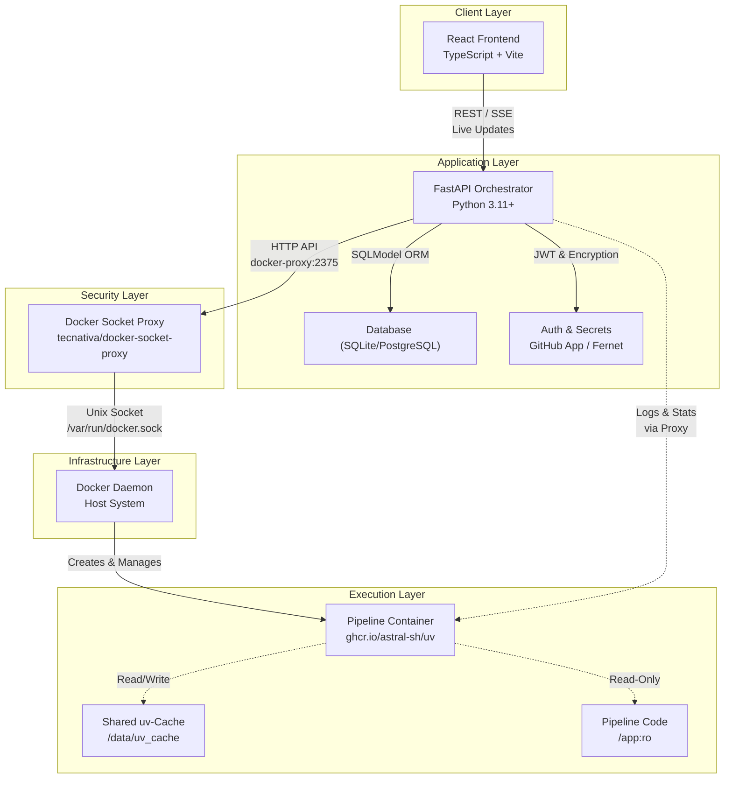

# Architektur: Runner-Cache & Container-Lifecycle

Im Gegensatz zu klassischen Orchestratoren, die oft "Dependency Hell" in ihren Worker-Umgebungen erleben, nutzt Fast-Flow eine moderne JIT-Environment-Architektur.

## Das "Runner-Cache"-Prinzip

- **The Singleton Brain**: Ein einzelner FastAPI-Prozess verwaltet den Zustand, den Scheduler und den Git-Sync.
- **Ephemeral Workers**: Jede Pipeline startet in einem isolierten Docker-Container. Keine Seiteneffekte, keine Rückstände.
- **uv-Acceleration**: Durch das Mounten eines globalen uv-Caches vom Host in den Container werden Dependencies in Millisekunden bereitgestellt. Es fühlt sich an wie ein lokales venv, ist aber ein sauberer Container.
- **Live-Streaming**: Logs und Ressourcen-Metriken (CPU/RAM) werden per SSE (Server-Sent Events) in Echtzeit direkt aus dem Docker-Socket an das React-Frontend gestreamt.

## Der Container-Prozess & Lifecycle

Fast-Flow nutzt ein **"Disposable Worker"**-Modell. Für jede Ausführung wird ein frischer, isolierter Container erzeugt.

### 1. Trigger & Initialisierung

Sobald ein Run über das React-Frontend (manuell) oder den APScheduler (geplant) ausgelöst wird:

- Die API validiert die Pipeline-Struktur und lädt die verschlüsselten Secrets.
- Ein neuer Eintrag in der Datenbank wird mit dem Status `PENDING` erstellt.

### 2. Die "Zero-Build" Execution

Statt ein Docker-Image zu bauen, wird ein generisches Basis-Image gestartet:

- **Mounting**: Das spezifische Pipeline-Verzeichnis (read-only) und der globale uv-Cache des Hosts werden in den Container gemountet.
- **Just-In-Time Environment**: Innerhalb des Containers führt `uv` den Befehl `uv run` aus.
  - **Abhängigkeiten im Cache?** → In Millisekunden per Hardlink verknüpft.
  - **Neue Abhängigkeiten?** → Einmalig geladen und im Host-Cache für zukünftige Runs gesichert.

### 3. Monitoring & Kommunikation (Headless Architecture)

Während der Container läuft:

- **Logs**: Die API liest stdout/stderr asynchron und stellt ihn über einen SSE-Endpunkt bereit.
- **Metrics**: Die Docker-Stats-API liefert CPU- und RAM-Werte in Echtzeit an das React-Dashboard.
- **Security**: Die API kommuniziert über einen [Docker-Socket-Proxy](/docs/deployment/DOCKER_PROXY) (`tecnativa/docker-socket-proxy`), nicht direkt mit dem Docker-Socket.

### 4. Terminierung & Cleanup

Nach Abschluss des Python-Skripts:

- Exit-Code wird erfasst (z.B. 137 für OOM-Fehler).
- Der Container wird automatisch entfernt (`--rm`).
- Die Logs werden für die Langzeitarchivierung persistiert.

## Architektur-Diagramm (Datenfluss)

## Warum dieser Ansatz?

- **Geschwindigkeit**: Kein `docker build` – eine Pipeline startet so schnell wie ein lokaler Prozess.
- **Isolation**: Ein Fehler in `pipeline_a` kann die Umgebung von `pipeline_b` nicht beeinflussen.
- **Skalierbarkeit**: Controller und Worker sind entkoppelt; das System kann mit Message-Queues (z.B. Redis) auf mehrere Server verteilt werden.

## Nächste Schritte

- [Pipelines – Übersicht](/docs/pipelines/uebersicht) – Wie du Pipelines strukturierst
- [Git-Deployment](/docs/deployment/GIT_DEPLOYMENT) – Push-to-Deploy
- [Docker Socket Proxy](/docs/deployment/DOCKER_PROXY) – Sicherheitslayer
