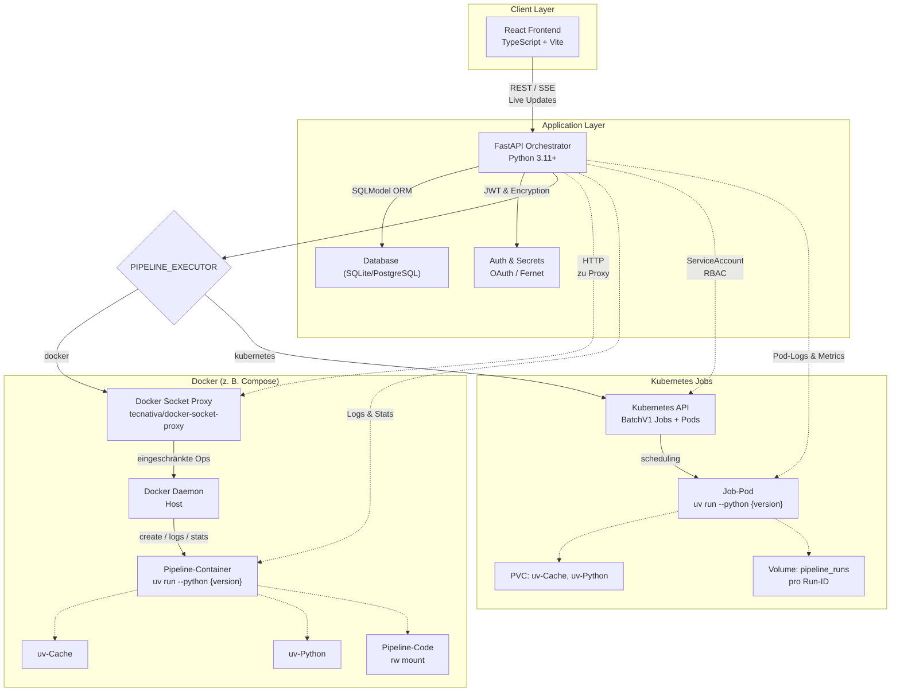

# Architecture: Runner Cache & Container Lifecycle

Unlike classic orchestrators that often suffer from "dependency hell" in their worker environments, Fast-Flow uses a modern JIT environment architecture.

## Two execution backends (`PIPELINE_EXECUTOR`)

The orchestrator starts pipeline runs via **`PIPELINE_EXECUTOR`**:

- **`docker`** (typical with Docker Compose): isolated **Docker containers** on the host daemon, optionally via the [Docker Socket Proxy](/docs/deployment/DOCKER_PROXY).
- **`kubernetes`**: isolated **Kubernetes Jobs** (Pods) in the cluster – without Docker on worker nodes; the default `k8s/` manifests use this mode.

In both cases, the same **Runner Cache** model applies (uv, shared package and Python cache, no image per pipeline).

## The "Runner Cache" principle

- **The Singleton Brain**: A single FastAPI process manages state, the scheduler, and Git sync.
- **Ephemeral Workers**: Each pipeline starts in an isolated **sandbox** – either as a Docker container or as a K8s Job Pod. No side effects between runs, no shared worker process.
- **uv Acceleration**: The global uv cache and uv Python installations (e.g. 3.11, 3.12) are **persistent** (host volumes or PVCs) and are mounted into the worker. Dependencies and the **freely configurable per-pipeline** Python version (from `pipeline.json` or `DEFAULT_PYTHON_VERSION`) are available in milliseconds – without fixed Python in the base image.
- **Live Streaming**: Logs and metrics (CPU/RAM) are sent to the React frontend via SSE: with **Docker** via container logs and the Docker Stats API (through the proxy); with **Kubernetes** via **Pod logs** and optionally the **Metrics API** (metrics-server), if available in the cluster.

## The worker process & lifecycle

Fast-Flow uses a **"Disposable Worker"** model. For each execution, a fresh, isolated **container** (Docker) or **Pod** (Kubernetes Job) is created.

### 1. Trigger & initialization

As soon as a run is triggered via the React frontend (manually) or APScheduler (scheduled):

- The API validates the pipeline structure and loads the encrypted secrets.
- A new database entry is created with status `PENDING`.

### 2. The "Zero-Build" execution

Instead of building a pipeline-specific image, a generic **worker base image** is started (uv, optionally pre-installed Python):

- **Docker (`PIPELINE_EXECUTOR=docker`)**: Pipeline directory is mounted from the host (**read-write**, so pipelines can write output files), uv cache and uv Python installations are mounted.
- **Kubernetes (`PIPELINE_EXECUTOR=kubernetes`)**: The orchestrator copies the pipeline into a **shared volume** (`pipeline_runs/<Run-ID>`) before the Job; uv cache and uv Python live on the **cache PVC** and are mounted into the Job Pod (details: [Kubernetes Deployment](/docs/deployment/K8S)).
- **Just-In-Time Environment (both modes)**: `uv run --python {version}` – the version is **freely configurable per pipeline** (`python_version` in pipeline.json, e.g. 3.10, 3.11, 3.12) or `DEFAULT_PYTHON_VERSION`. Python comes from `uv python install` (preheating), not from the pipeline image.
  - **Dependencies in cache?** → Linked in milliseconds via hardlink.
  - **New dependencies?** → Downloaded once and stored in the shared cache for future runs.
- **Preheating**: On startup and after Git sync, the orchestrator runs `uv python install {version}` and `uv pip compile --python {version}` so the first run does not have to wait for Python or package downloads.

### 3. Monitoring & communication (headless architecture)

While the worker is running:

- **Logs**: The API streams **stdout/stderr** asynchronously and serves them via an SSE endpoint (Docker: container logs; Kubernetes: Pod logs).
- **Metrics**: With **Docker**, the Docker Stats API provides CPU and RAM to the dashboard (access via the socket proxy). With **Kubernetes**, the orchestrator uses the **Metrics API** for the run Pod, if configured.
- **Security (Docker only)**: The API communicates via a [Docker Socket Proxy](/docs/deployment/DOCKER_PROXY) (`tecnativa/docker-socket-proxy`), not directly with the Docker socket. Under Kubernetes, this path is replaced by the **Kubernetes API** with a dedicated **ServiceAccount/RBAC** configuration.

### 4. Termination & cleanup

After the Python script completes:

- Exit code is captured (e.g. 137 for OOM errors).
- **Docker**: The container is removed (`--rm`). **Kubernetes**: The Job ends; completed Jobs/Pods may be cleaned up depending on TTL and cluster policy; the pipeline copy in the volume is cleaned up by the orchestrator.
- Logs are persisted for long-term archiving.

## Architecture diagram (data flow)

```mermaid
flowchart TB
    subgraph Client["Client Layer"]
        A["React Frontend\nTypeScript + Vite"]
    end

    subgraph App["Application Layer"]
        B["FastAPI Orchestrator\nPython 3.11+"]
        C["Database (SQLite/PostgreSQL)"]
        D["Auth & Secrets\nOAuth / Fernet"]
    end

    A -->|"REST / SSE\nLive Updates"| B
    B -->|"SQLModel ORM"| C
    B -->|"JWT & Encryption"| D

    PE{"PIPELINE_EXECUTOR"}

    B --> PE

    subgraph DockerPfad["Docker (z. B. Compose)"]
        E["Docker Socket Proxy\ntecnativa/docker-socket-proxy"]
        F["Docker Daemon\nHost"]
        G["Pipeline-Container\nuv run --python {version}"]
        H["uv-Cache"]
        J["uv-Python"]
        I["Pipeline-Code\nrw mount"]
    end

    subgraph K8sPfad["Kubernetes Jobs"]
        K["Kubernetes API\nBatchV1 Jobs + Pods"]
        L["Job-Pod\nuv run --python {version}"]
        M["PVC: uv-Cache, uv-Python"]
        N["Volume: pipeline_runs\npro Run-ID"]
    end

    PE -->|docker| E
    E -->|"eingeschränkte Ops"| F
    F -->|"create / logs / stats"| G
    G -.-> H
    G -.-> J
    G -.-> I
    B -.->|"HTTP\nzu Proxy"| E
    B -.->|"Logs & Stats"| G

    PE -->|kubernetes| K
    K -->|"scheduling"| L
    L -.-> M
    L -.-> N
    B -.->|"ServiceAccount\nRBAC"| K
    B -.->|"Pod-Logs & Metrics"| L
```

## Why this approach?

- **Speed**: No `docker build` – a pipeline starts as fast as a local process.
- **Isolation**: An error in `pipeline_a` cannot affect the environment of `pipeline_b`.
- **Scalability**: Controller and workers are decoupled; the system can be distributed across multiple servers with message queues (e.g. Redis).

## Startup & API structure

### App startup (lifecycle)

The FastAPI lifecycle is bundled in **`app/startup`**:

- **`run_startup_tasks()`**: Logging, security and OAuth validation, directories, database, Docker client, zombie reconciliation, scheduler, cleanup, dependency audit, version check, telemetry, UV pre-heat. Critical steps throw on error; optional ones are logged and skipped.
- **`run_shutdown_tasks()`**: Stop scheduler, graceful shutdown (terminate running runs), PostHog flush.

The actual **`lifespan`** function in `app.main` only calls these two functions.

### API routers

All REST endpoints live under the prefix **`/api`**. Routers are centrally maintained in **`app.api`** in the **`ROUTERS`** list and registered in `main.py` in a loop with `prefix="/api"`. New API modules are added to `ROUTERS` in `app.api.__init__.py`.

### Module overview

- **`app/executor`**: Execution (Docker or Kubernetes), log and metrics streaming, zombie reconciliation, graceful shutdown.
- **`app/executor/kubernetes_backend`**: Kubernetes Jobs (Batch API), Pod logs, Metrics API, run cleanup on the shared volume.
- **`app/git_sync`**: Git sync of the pipeline repo (HTTPS + PAT or SSH + deploy key), sync log, pre-heat.
- **`app/startup`**: Startup/shutdown logic, OAuth and security validation.
- **`app/core/logging_config`**: Log level and optional JSON log format.

## Next steps

- [**Concepts & Glossary**](/docs/konzepte) – Runner cache, uv, JIT, Disposable Worker explained briefly
- [Pipelines – Overview](/docs/pipelines/uebersicht) – How to structure pipelines
- [Git Deployment](/docs/deployment/GIT_DEPLOYMENT) – Push-to-deploy
- [Docker Socket Proxy](/docs/deployment/DOCKER_PROXY) – Security layer (Docker executor only)
- [Kubernetes Deployment](/docs/deployment/K8S) – Jobs executor in the cluster
