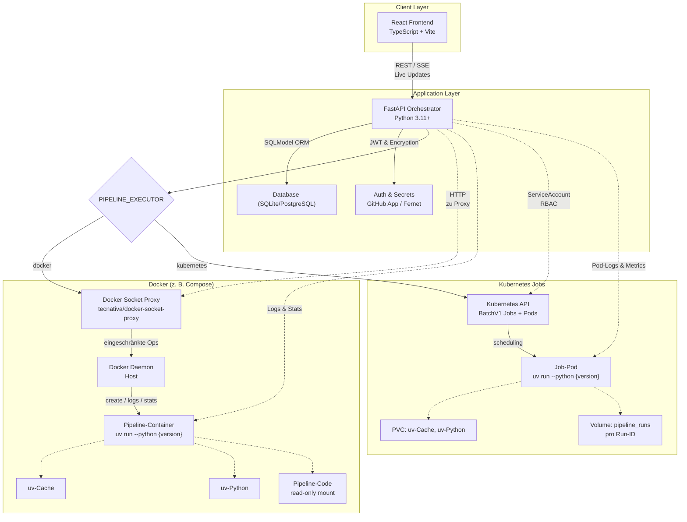

# Architektur: Runner-Cache & Container-Lifecycle

Im Gegensatz zu klassischen Orchestratoren, die oft "Dependency Hell" in ihren Worker-Umgebungen erleben, nutzt Fast-Flow eine moderne JIT-Environment-Architektur.

## Zwei Ausführungs-Backends (`PIPELINE_EXECUTOR`)

Der Orchestrator startet Pipeline-Runs über **`PIPELINE_EXECUTOR`**:

- **`docker`** (typisch mit Docker Compose): isolierte **Docker-Container** auf dem Host-Daemon, optional über den [Docker-Socket-Proxy](/docs/deployment/DOCKER_PROXY).
- **`kubernetes`**: isolierte **Kubernetes Jobs** (Pods) im Cluster – ohne Docker auf den Worker-Nodes; die Standard-`k8s/`-Manifeste setzen diesen Modus.

In beiden Fällen gilt dasselbe **Runner-Cache**-Modell (uv, gemeinsamer Paket- und Python-Cache, kein Image pro Pipeline).

## Das "Runner-Cache"-Prinzip

- **The Singleton Brain**: Ein einzelner FastAPI-Prozess verwaltet den Zustand, den Scheduler und den Git-Sync.
- **Ephemeral Workers**: Jede Pipeline startet in einer isolierten **Sandbox** – entweder als Docker-Container oder als K8s-Job-Pod. Keine Seiteneffekte zwischen Runs, kein geteilter Worker-Prozess.
- **uv-Acceleration**: Der globale uv-Cache und die uv-Python-Installationen (z.B. 3.11, 3.12) sind **persistent** (Host-Volumes bzw. PVCs) und werden in den Worker eingehängt. Dependencies und die **pro Pipeline wählbare** Python-Version (aus `pipeline.json` oder `DEFAULT_PYTHON_VERSION`) sind so in Millisekunden verfügbar – ohne festes Python im Basis-Image.
- **Live-Streaming**: Logs und Metriken (CPU/RAM) gehen per SSE an das React-Frontend: bei **Docker** über Container-Logs und die Docker-Stats-API (über den Proxy); bei **Kubernetes** über **Pod-Logs** und optional die **Metrics-API** (metrics-server), sofern im Cluster verfügbar.

## Der Worker-Prozess & Lifecycle

Fast-Flow nutzt ein **"Disposable Worker"**-Modell. Für jede Ausführung wird ein frischer, isolierter **Container** (Docker) bzw. **Pod** (Kubernetes Job) erzeugt.

### 1. Trigger & Initialisierung

Sobald ein Run über das React-Frontend (manuell) oder den APScheduler (geplant) ausgelöst wird:

- Die API validiert die Pipeline-Struktur und lädt die verschlüsselten Secrets.
- Ein neuer Eintrag in der Datenbank wird mit dem Status `PENDING` erstellt.

### 2. Die "Zero-Build" Execution

Statt ein Pipeline-spezifisches Image zu bauen, wird ein generisches **Worker-Basis-Image** gestartet (uv, optional vorinstalliertes Python):

- **Docker (`PIPELINE_EXECUTOR=docker`)**: Pipeline-Verzeichnis **read-only** vom Host, uv-Cache und uv-Python-Installationen werden gemountet.
- **Kubernetes (`PIPELINE_EXECUTOR=kubernetes`)**: Der Orchestrator kopiert die Pipeline vor dem Job in ein **gemeinsames Volume** (`pipeline_runs/<Run-ID>`); uv-Cache und uv-Python liegen auf dem **Cache-PVC** und werden in den Job-Pod gemountet (Details: [Kubernetes Deployment](/docs/deployment/K8S)).
- **Just-In-Time Environment (beide Modi)**: `uv run --python {version}` – die Version ist **beliebig pro Pipeline** konfigurierbar (`python_version` in pipeline.json, z.B. 3.10, 3.11, 3.12) oder `DEFAULT_PYTHON_VERSION`. Python stammt aus `uv python install` (Preheating), nicht aus dem Pipeline-Image.
  - **Abhängigkeiten im Cache?** → In Millisekunden per Hardlink verknüpft.
  - **Neue Abhängigkeiten?** → Einmalig geladen und im gemeinsamen Cache für zukünftige Runs gesichert.
- **Preheating**: Beim Start und nach Git-Sync führt der Orchestrator `uv python install {version}` und `uv pip compile --python {version}` aus, damit der erste Run nicht auf Python- oder Paket-Downloads warten muss.

### 3. Monitoring & Kommunikation (Headless Architecture)

Während der Worker läuft:

- **Logs**: Die API streamt **stdout/stderr** asynchron und stellt sie über einen SSE-Endpunkt bereit (Docker: Container-Logs; Kubernetes: Pod-Logs).
- **Metrics**: Bei **Docker** liefert die Docker-Stats-API CPU- und RAM an das Dashboard (Zugriff über den Socket-Proxy). Bei **Kubernetes** nutzt der Orchestrator die **Metrics-API** für den Run-Pod, sofern eingerichtet.
- **Security (nur Docker)**: Die API spricht über einen [Docker-Socket-Proxy](/docs/deployment/DOCKER_PROXY) (`tecnativa/docker-socket-proxy`), nicht direkt mit dem Docker-Socket. Unter Kubernetes entfällt dieser Pfad zugunsten der **Kubernetes-API** mit einer dedizierten **ServiceAccount/RBAC**-Konfiguration.

### 4. Terminierung & Cleanup

Nach Abschluss des Python-Skripts:

- Exit-Code wird erfasst (z.B. 137 für OOM-Fehler).
- **Docker**: Der Container wird entfernt (`--rm`). **Kubernetes**: Der Job endet; abgeschlossene Jobs/Pods können je nach TTL und Cluster-Policy aufgeräumt werden, die Pipeline-Kopie im Volume wird vom Orchestrator bereinigt.
- Die Logs werden für die Langzeitarchivierung persistiert.

## Architektur-Diagramm (Datenfluss)

```mermaid
flowchart TB
    subgraph Client["Client Layer"]
        A["React Frontend\nTypeScript + Vite"]
    end

    subgraph App["Application Layer"]
        B["FastAPI Orchestrator\nPython 3.11+"]
        C["Database (SQLite/PostgreSQL)"]
        D["Auth & Secrets\nGitHub App / Fernet"]
    end

    A -->|"REST / SSE\nLive Updates"| B
    B -->|"SQLModel ORM"| C
    B -->|"JWT & Encryption"| D

    PE{"PIPELINE_EXECUTOR"}

    B --> PE

    subgraph DockerPfad["Docker (z. B. Compose)"]
        E["Docker Socket Proxy\ntecnativa/docker-socket-proxy"]
        F["Docker Daemon\nHost"]
        G["Pipeline-Container\nuv run --python {version}"]
        H["uv-Cache"]
        J["uv-Python"]
        I["Pipeline-Code\nread-only mount"]
    end

    subgraph K8sPfad["Kubernetes Jobs"]
        K["Kubernetes API\nBatchV1 Jobs + Pods"]
        L["Job-Pod\nuv run --python {version}"]
        M["PVC: uv-Cache, uv-Python"]
        N["Volume: pipeline_runs\npro Run-ID"]
    end

    PE -->|docker| E
    E -->|"eingeschränkte Ops"| F
    F -->|"create / logs / stats"| G
    G -.-> H
    G -.-> J
    G -.-> I
    B -.->|"HTTP\nzu Proxy"| E
    B -.->|"Logs & Stats"| G

    PE -->|kubernetes| K
    K -->|"scheduling"| L
    L -.-> M
    L -.-> N
    B -.->|"ServiceAccount\nRBAC"| K
    B -.->|"Pod-Logs & Metrics"| L
```

## Warum dieser Ansatz?

- **Geschwindigkeit**: Kein `docker build` – eine Pipeline startet so schnell wie ein lokaler Prozess.
- **Isolation**: Ein Fehler in `pipeline_a` kann die Umgebung von `pipeline_b` nicht beeinflussen.
- **Skalierbarkeit**: Controller und Worker sind entkoppelt; das System kann mit Message-Queues (z.B. Redis) auf mehrere Server verteilt werden.

## Startup & API-Struktur

### App-Start (Lifecycle)

Der FastAPI-Lifecycle wird in **`app/startup`** gebündelt:

- **`run_startup_tasks()`**: Logging, Sicherheits- und OAuth-Validierung, Verzeichnisse, Datenbank, Docker-Client, Zombie-Reconciliation, Scheduler, Cleanup, Dependency-Audit, Version-Check, Telemetry, UV Pre-Heat. Kritische Schritte werfen bei Fehler; optionale werden geloggt und übersprungen.
- **`run_shutdown_tasks()`**: Scheduler stoppen, Graceful Shutdown (laufende Runs beenden), PostHog Flush.

Die eigentliche **`lifespan`**-Funktion in `app.main` ruft nur noch diese beiden Funktionen auf.

### API-Router

Alle REST-Endpoints liegen unter dem Präfix **`/api`**. Die Router werden zentral in **`app.api`** in der Liste **`ROUTERS`** geführt und in `main.py` in einer Schleife mit `prefix="/api"` registriert. Neue API-Module werden in `app.api.__init__.py` zu `ROUTERS` hinzugefügt.

### Module-Überblick

- **`app/executor`**: Ausführung (Docker oder Kubernetes), Log- und Metrics-Streaming, Zombie-Reconciliation, Graceful Shutdown.
- **`app/executor/kubernetes_backend`**: Kubernetes-Jobs (Batch API), Pod-Logs, Metrics-API, Run-Cleanup auf dem Shared-Volume.
- **`app/git_sync`**: Git-Sync des Pipeline-Repos, GitHub-App-Token, Sync-Log, Pre-Heat.
- **`app/startup`**: Startup-/Shutdown-Logik, OAuth- und Sicherheits-Validierung.
- **`app/logging_config`**: Log-Level und optionales JSON-Log-Format.

## Nächste Schritte

- [**Konzepte & Glossar**](/docs/konzepte) – Runner-Cache, uv, JIT, Disposable Worker kurz erklärt
- [Pipelines – Übersicht](/docs/pipelines/uebersicht) – Wie du Pipelines strukturierst
- [Git-Deployment](/docs/deployment/GIT_DEPLOYMENT) – Push-to-Deploy
- [Docker Socket Proxy](/docs/deployment/DOCKER_PROXY) – Sicherheitslayer (nur Docker-Executor)
- [Kubernetes Deployment](/docs/deployment/K8S) – Jobs-Executor im Cluster
