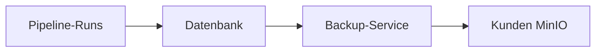

# Compliance & Datensicherheit (MinIO Backup)

Diese Seite erläutert die **MinIO Backup-Strategie** von Fast-Flow für Unternehmenskunden, die Wert auf Compliance, Datenhoheit und nachvollziehbare Archivierung legen.

## Einleitung

Pipeline-Logs und zugehörige Metadaten (Start-/Endzeiten, Status, Exit-Codes, Trigger-Quellen) sind **kritische Unternehmenswerte**: Sie belegen Abläufe, dienen der Fehleranalyse, der Nachverfolgbarkeit und oft regulatorischen oder internen Audit-Anforderungen. Ein kontrollierter Übergang von der **Live-Nutzung** in eine **Langzeit-Archivierung** – ohne Datensilos in Drittanbieter-Clouds – ist für viele Unternehmen unverzichtbar.

Fast-Flow unterstützt dafür ein **Auto-Backup vor Cleanup**: Logs und Metrics werden vor der lokalen Löschung auf einen **S3-kompatiblen Speicher (z.B. MinIO On-Premise)** hochgeladen. Die Entscheidung, ob und wo Sie MinIO betreiben, liegt allein bei Ihnen.

---

## Feature-Übersicht: Auto-Backup vor Cleanup

Das Feature **„Auto-Backup vor Cleanup“** arbeitet wie folgt:

- **Zeitpunkt:** Sobald der Cleanup-Job (geplant oder manuell) Runs bzw. Log-Dateien **löschen** möchte – z.B. wegen `LOG_RETENTION_RUNS`, `LOG_RETENTION_DAYS` oder fehlgeschlagenem Truncate bei `LOG_MAX_SIZE_MB` – wird **zuerst** ein S3-Upload (MinIO) ausgelöst.
- **Inhalt:** Pro Run werden die **Log-Datei** (`run.log`) und, falls vorhanden, die **Metrics-Datei** (`metrics.jsonl`) hochgeladen. Metadaten (Pipeline-Name, Run-ID, Zeitstempel, Status, Trigger) werden als S3-Objekt-Metadaten mitgegeben.
- **Bedingung für Löschung:** Eine **lokale Löschung** (Dateien und ggf. Datenbank-Einträge) erfolgt **nur**, wenn der S3-Upload **erfolgreich** war. Schlägt das Backup fehl, bleiben die Daten lokal erhalten; Sie werden per E-Mail und optional Microsoft Teams informiert.
- **Speicher:** Der Upload nutzt **Streaming** (`upload_fileobj`), sodass große Logs den Arbeitsspeicher nicht vollständig befüllen.

Konfiguration und technische Details: [Log-Backup (S3/MinIO)](/docs/deployment/S3_LOG_BACKUP).

---

## DSGVO-Konformität

### Datenhoheit

:::info Datenhoheit durch On-Premise MinIO
Wer **MinIO in der eigenen Infrastruktur** (On-Premise oder in einer Ihrer gewählten Rechenzentren) betreibt, hält Logs und Metadaten **vollständig im eigenen Rechtsraum**. Die Daten **müssen den Hoheitsbereich Ihres Unternehmens nicht verlassen**; es besteht keine Abhängigkeit von US-Cloud-Anbietern oder Dritten, die Unterauftragsverhältnisse und Datentransfers mit sich bringen.
:::

Damit können Sie Ihre **Auftragsverarbeitung** und **technisch-organisatorischen Maßnahmen** so gestalten, dass die Verarbeitung und Speicherung im von Ihnen kontrollierten Umfeld bleibt. Dies unterstützt die Anforderungen aus **Art. 28 DSGVO** (Auftragsverarbeitung) und **Art. 44 ff. DSGVO** (Übermittlung in Drittländer), da Sie Übermittlungen in Drittländer vermeiden bzw. klar begrenzen können.

---

### Rechenschaftspflicht (Art. 5 Abs. 2, Art. 24 DSGVO)

:::tip Rechenschaftspflicht und Audits
Das Backup schafft einen **Archiv-Pfad**: Logs und Metadaten werden in einem definierten, nachvollziehbaren Schritt vor der Löschung im Live-System in Ihr MinIO überführt. Bei Audits oder behördlichen Nachfragen können Sie den **Datenfluss** (Pipeline → Datenbank → Backup → MinIO) und die **Aufbewahrungsdauer** in Ihrem eigenen Speicher dokumentieren. Die Objekt-Metadaten (u.a. Run-ID, Zeitstempel, Status) unterstützen die **Zuordenbarkeit** und **Nachvollziehbarkeit** von Verarbeitungsschritten.
:::

---

### Speicherbegrenzung (Art. 5 Abs. 1 lit. e DSGVO)

Das Design folgt dem Grundsatz **„Speicherbegrenzung“**:

1. **Live-System:** Durch `LOG_RETENTION_RUNS`, `LOG_RETENTION_DAYS` und `LOG_MAX_SIZE_MB` begrenzen Sie, **wie lange** und **in welchem Umfang** Logs im operativen System gehalten werden.
2. **Sauberer Übergang:** Nur **nach erfolgreichem** Backup im MinIO werden die Daten im Live-System gelöscht. Es gibt **kein „Blindes Löschen“**: Ohne erfolgreiche Archivierung bleibt die lokale Kopie erhalten.
3. **Langzeit-Archivierung:**** Aufbewahrungsfristen und Löschkonzepte für MinIO liegen in **Ihrer Verantwortung** und passen zu Ihrer Dokumentations- und Compliance-Strategie.

:::caution Eigenverantwortung für Aufbewahrung und Löschung
Die **konkreten Aufbewahrungsfristen** und **Löschregeln** in MinIO (Lifecycle-Policies, Retention) müssen Sie **selbst** festlegen und umsetzen. Fast-Flow überträgt die Daten; die Steuerung des Archivs obliegt Ihrer IT oder Ihrem Datenschutz.
:::

---

### Technische Sicherheit

- **TLS-Übertragung:** Die Kommunikation mit MinIO sollte über **HTTPS (TLS)** erfolgen. Setzen Sie `S3_ENDPOINT_URL` z.B. auf `https://minio.ihr-unternehmen.int:443`.
- **S3 Server-Side Encryption (SSE):** MinIO unterstützt **SSE-S3** und **SSE-KMS**. Die Aktivierung und Konfiguration von Verschlüsselung at rest liegt bei Ihrer MinIO-Instanz; Fast-Flow nutzt die standardmäßige S3-API. Prüfen Sie die [MinIO-Dokumentation zu Server-Side Encryption](https://min.io/docs/minio/linux/administration/server-side-encryption.html) (SSE-S3, SSE-KMS, SSE-C).
- **Zugriffskontrolle:** Access Keys (`S3_ACCESS_KEY`, `S3_SECRET_ACCESS_KEY`) sollten mit **minimalen Rechten** (nur Schreibzugriff auf den vorgesehenen Bucket) und über einen sicheren Secret-Manager verwaltet werden.

:::info Empfehlung für produktive Umgebungen
Für Compliance-relevante Deployments: MinIO mit **TLS**, **Verschlüsselung at rest** und **strikter Zugriffskontrolle** betreiben. Die Backup-Fehlermeldungen (E-Mail, Microsoft Teams) sollten an verantwortliche Stellen (z.B. IT, Datenschutz) adressiert werden, damit Störungen des Backups zeitnah erkannt werden.
:::

---

## Datenfluss (Überblick)

Der folgende Ablauf skizziert den Weg der Logdaten vom Pipeline-Run bis in Ihr MinIO:

| Stufe | Beschreibung |
|-------|--------------|
| **Pipeline-Runs** | Logs und Metrics werden während und nach der Ausführung im Live-System (Dateisystem + DB-Referenzen) gehalten. |
| **Datenbank** | Metadaten und Pfade zu Log-/Metrics-Dateien; der Cleanup ermittelt anhand der Retention-Regeln, welche Runs zur Löschung anstehen. |
| **Backup-Service** | Vor der Löschung: stream-basierter Upload von Log und Metrics nach S3 (MinIO) inkl. Metadaten. Nur bei Erfolg wird im Live-System gelöscht. |
| **Kunden MinIO** | On-Premise oder in Ihrer gewählten Infrastruktur. Aufbewahrung, Verschlüsselung und Löschung unter Ihrer Kontrolle. |

---

## Zusammenfassung für IT-Entscheider

| Aspekt | Nutzen |
|--------|--------|
| **Datenhoheit** | MinIO On-Premise: Logs und Metadaten verlassen Ihren Rechtsraum nicht; keine Abhängigkeit von US- oder Dritt-Clouds. |
| **Compliance** | Unterstützung von Speicherbegrenzung, Rechenschaftspflicht und sauberem Übergang von Live zu Archiv. |
| **Risikominimierung** | Keine lokale Löschung ohne erfolgreiches Backup; bei Fehlern Benachrichtigung (E-Mail, optional Teams) und Erhalt der lokalen Daten. |
| **Technische Sicherheit** | TLS für die Übertragung; Verschlüsselung at rest und Zugriffskontrolle über Ihre MinIO- und Betriebskonfiguration. |

Fast-Flow übernimmt den **kontrollierten Transfer** in Ihr S3-kompatibles Archiv; die **rechtliche und organisatorische Steuerung** von Aufbewahrung, Löschung und Zugriff in MinIO bleibt bei Ihnen. Damit eignet sich die MinIO Backup-Strategie für Umgebungen, in denen Compliance, Datenschutz und Kontrolle über betriebskritische Logdaten im Vordergrund stehen.

---

*Technische Konfiguration: [Log-Backup (S3/MinIO)](/docs/deployment/S3_LOG_BACKUP) · [Konfiguration](/docs/deployment/CONFIGURATION)*
