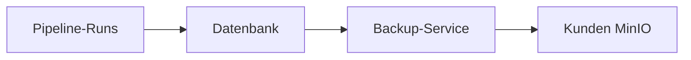

# Compliance & Data Security (MinIO Backup)

This page explains Fast-Flow's **MinIO backup strategy** for enterprise customers who value compliance, data sovereignty, and traceable archiving.

## Introduction

Pipeline logs and associated metadata (start/end times, status, exit codes, trigger sources) are **critical business assets**: They document processes, support error analysis and traceability, and often meet regulatory or internal audit requirements. A controlled transition from **live use** to **long-term archiving** – without data silos in third-party clouds – is essential for many organizations.

Fast-Flow supports this with **auto-backup before cleanup**: Logs and metrics are uploaded to **S3-compatible storage (e.g. MinIO on-premise)** before local deletion. The decision whether and where you operate MinIO is entirely yours.

---

## Feature overview: Auto-backup before cleanup

The **"Auto-backup before cleanup"** feature works as follows:

- **Timing:** As soon as the cleanup job (scheduled or manual) wants to **delete** runs or log files – e.g. due to `LOG_RETENTION_RUNS`, `LOG_RETENTION_DAYS`, or failed truncate at `LOG_MAX_SIZE_MB` – an S3 upload (MinIO) is triggered **first**.
- **Content:** Per run, the **log file** (`run.log`) and, if present, the **metrics file** (`metrics.jsonl`) are uploaded. Metadata (pipeline name, run ID, timestamp, status, trigger) is included as S3 object metadata.
- **Condition for deletion:** **Local deletion** (files and optionally database entries) occurs **only** if the S3 upload was **successful**. If backup fails, data remains locally; you are notified by email and optionally Microsoft Teams.
- **Storage:** The upload uses **streaming** (`upload_fileobj`), so large logs do not fill memory entirely.

Configuration and technical details: [Log Backup (S3/MinIO)](/docs/deployment/S3_LOG_BACKUP).

---

## GDPR compliance

### Data sovereignty

:::info Data sovereignty through on-premise MinIO
If you operate **MinIO in your own infrastructure** (on-premise or in one of your chosen data centers), you keep logs and metadata **entirely within your own legal jurisdiction**. The data **do not need to leave your organization's territory**; there is no dependency on US cloud providers or third parties that bring sub-processor relationships and data transfers.
:::

This allows you to design your **data processing agreements** and **technical and organizational measures** so that processing and storage remain in your controlled environment. This supports requirements from **Art. 28 GDPR** (data processing) and **Art. 44 ff. GDPR** (transfers to third countries), as you can avoid or clearly limit transfers to third countries.

---

### Accountability (Art. 5(2), Art. 24 GDPR)

:::tip Accountability and audits
The backup creates an **archive path**: Logs and metadata are transferred to your MinIO in a defined, traceable step before deletion in the live system. During audits or regulatory inquiries, you can document the **data flow** (pipeline → database → backup → MinIO) and **retention period** in your own storage. Object metadata (including run ID, timestamp, status) support **assignability** and **traceability** of processing steps.
:::

---

### Storage limitation (Art. 5(1)(e) GDPR)

The design follows the principle of **"storage limitation"**:

1. **Live system:** Via `LOG_RETENTION_RUNS`, `LOG_RETENTION_DAYS`, and `LOG_MAX_SIZE_MB` you limit **how long** and **to what extent** logs are kept in the operational system.
2. **Clean transition:** Only **after successful** backup in MinIO are data deleted in the live system. There is **no "blind deletion"**: Without successful archiving, the local copy is retained.
3. **Long-term archiving:** Retention periods and deletion concepts for MinIO are **your responsibility** and align with your documentation and compliance strategy.

:::caution Your responsibility for retention and deletion
The **specific retention periods** and **deletion rules** in MinIO (lifecycle policies, retention) must be **defined and implemented by you**. Fast-Flow transfers the data; control of the archive is your IT or data protection team's responsibility.
:::

---

### Technical security

- **Rate limiting & proxy:** The API uses rate limits (OAuth, refresh, webhooks, etc.). For correct client IP detection behind a reverse proxy, set `PROXY_HEADERS_TRUSTED=true`. Only enable if the proxy is trusted (protection against X-Forwarded-For spoofing). See [Configuration](/docs/deployment/CONFIGURATION).
- **TLS transmission:** Communication with MinIO should use **HTTPS (TLS)**. Set `S3_ENDPOINT_URL` e.g. to `https://minio.your-company.int:443`.
- **S3 Server-Side Encryption (SSE):** MinIO supports **SSE-S3** and **SSE-KMS**. Activation and configuration of encryption at rest is your MinIO instance's responsibility; Fast-Flow uses the standard S3 API. See the [MinIO documentation on Server-Side Encryption](https://min.io/docs/minio/linux/administration/server-side-encryption.html) (SSE-S3, SSE-KMS, SSE-C).
- **Access control:** Access keys (`S3_ACCESS_KEY`, `S3_SECRET_ACCESS_KEY`) should be managed with **minimal privileges** (write access only to the designated bucket) via a secure secret manager.

:::info Recommendation for production environments
For compliance-relevant deployments: Operate MinIO with **TLS**, **encryption at rest**, and **strict access control**. Backup error notifications (email, Microsoft Teams) should be addressed to responsible parties (e.g. IT, data protection) so backup failures are detected promptly.
:::

---

## Data flow (overview)

The following flow outlines the path of log data from the pipeline run to your MinIO:

```mermaid
flowchart LR
  Pipeline[Pipeline-Runs] --> DB[Datenbank]
  DB --> Backup[Backup-Service]
  Backup --> MinIO[Kunden MinIO]
```

| Stage | Description |
|-------|--------------|
| **Pipeline runs** | Logs and metrics are held in the live system (filesystem + DB references) during and after execution. |
| **Database** | Metadata and paths to log/metrics files; cleanup determines which runs are due for deletion based on retention rules. |
| **Backup service** | Before deletion: stream-based upload of log and metrics to S3 (MinIO) including metadata. Deletion in the live system only on success. |
| **Customer MinIO** | On-premise or in your chosen infrastructure. Retention, encryption, and deletion under your control. |

---

## Summary for IT decision-makers

| Aspect | Benefit |
|--------|--------|
| **Data sovereignty** | MinIO on-premise: Logs and metadata do not leave your legal jurisdiction; no dependency on US or third-party clouds. |
| **Compliance** | Support for storage limitation, accountability, and clean transition from live to archive. |
| **Risk minimization** | No local deletion without successful backup; on failure, notification (email, optional Teams) and retention of local data. |
| **Technical security** | TLS for transmission; encryption at rest and access control via your MinIO and operational configuration. |

Fast-Flow handles the **controlled transfer** to your S3-compatible archive; **legal and organizational control** of retention, deletion, and access in MinIO remains with you. This makes the MinIO backup strategy suitable for environments where compliance, data protection, and control over business-critical log data are priorities.

---

*Technical configuration: [Log Backup (S3/MinIO)](/docs/deployment/S3_LOG_BACKUP) · [Configuration](/docs/deployment/CONFIGURATION)*
