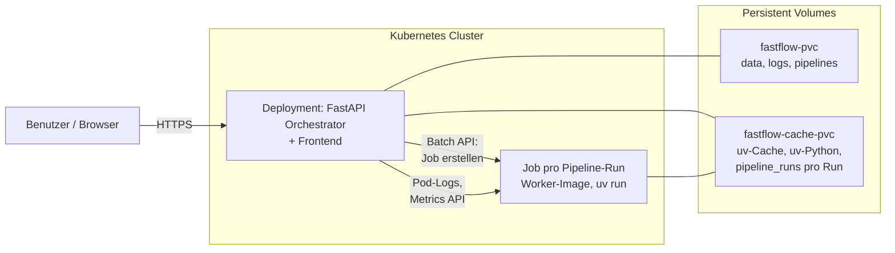

# Kubernetes Deployment

Fast-Flow kann in einem lokalen oder produktiven Kubernetes-Cluster betrieben werden. Die API ist K8s-ready mit Liveness- (`/health`) und Readiness-Probes (`/ready`).

## Voraussetzungen

- **kubectl** installiert
- **Kubernetes-Cluster** (eine der folgenden Optionen):

  | Option | Empfehlung | Hinweis |
  |--------|------------|---------|
  | **kubeadm** | Produktion | Standard-Worker mit containerd (kein Docker für Runs nötig) |
  | **Docker Desktop** | Lokale Entwicklung | Einstellungen → „Enable Kubernetes“ aktivieren |
  | **Kind** (Kubernetes in Docker) | Leichtgewichtig | Projekt-Root: `kind-config.yaml` – nur nötig, wenn du **zusätzlich** Docker-Executor im Cluster nutzt (ungewöhnlich) |
  | **Minikube** | Feature-reich | Beliebiger gangbarer Treiber |

- **Docker** (lokal): nur zum **Bauen und Laden** des Orchestrator-Images (`docker build`, `kind load`, Minikube-Docker-Env). **Pipeline-Runs** laufen mit den Standard-Manifesten als **Kubernetes Jobs** (`PIPELINE_EXECUTOR=kubernetes`) – dafür ist **kein** Docker-Daemon auf den Kubernetes-Nodes erforderlich.

## Kind: optional Docker-Socket für den Host

Die mitgelieferten `k8s/`-Deployments starten Pipeline-Runs als **Jobs** über die Kubernetes-API. Ein **Host-Docker-Socket** in Kind ist nur relevant, wenn du den Orchestrator bewusst mit `PIPELINE_EXECUTOR=docker` betreibst und Worker-Container auf dem Docker des Hosts starten willst (nicht der empfohlene Weg für reine K8s-Umgebungen).

Falls du den Socket dennoch in Kind-Nodes brauchst, kann `kind-config.yaml` im Projekt-Root **extraMounts** für `/var/run/docker.sock` setzen. Cluster erstellen:

```bash
kind create cluster --config kind-config.yaml
```

## Manuelles Deployment

### 1. Secrets

**Standard:** `k8s/secrets.yaml` enthält alle Werte (inkl. Dev-Dummy für OAuth). Einfach `kubectl apply -f k8s/` – kein manuelles Secret nötig.

**Produktion:** Werte in `k8s/secrets.yaml` ersetzen (ENCRYPTION_KEY, JWT_SECRET_KEY, echte OAuth-Credentials). Oder eigenes Secret verwenden und `secrets.yaml` nicht anwenden.

### 2. Image bauen und laden (Kind/Minikube)

```bash
docker build -t fastflow-orchestrator:latest .
```

**Kind:**

```bash
kind load docker-image fastflow-orchestrator:latest
```

**Minikube:**

```bash
eval $(minikube docker-env)
docker build -t fastflow-orchestrator:latest .
```

### 3. Manifests anwenden

```bash
kubectl apply -f k8s/
```

PostgreSQL wird mit deployt (Standard). Der Orchestrator wartet per Init-Container auf die DB, bevor er startet.

### 4. Zugriff

**Option A – NodePort (z. B. Port 30080):**

- Docker Desktop / Minikube: `http://localhost:30080`
- Kind: `kubectl get nodes -o wide` → Node-IP, dann `http://<node-ip>:30080`

**Option B – Port-Forward:**

```bash
kubectl port-forward service/fastflow-orchestrator 8000:80
```

Dann: `http://localhost:8000`

### 5. BASE_URL anpassen

Je nach Zugriffsmethode `BASE_URL` und `FRONTEND_URL` in der ConfigMap setzen:

- NodePort 30080: `http://localhost:30080` (oder Ihre tatsächliche URL)
- Port-Forward: `http://localhost:8000`

```bash
kubectl edit configmap fastflow-config
```

Danach Pod neu starten: `kubectl rollout restart deployment/fastflow-orchestrator`

### 6. Wichtige URLs

| URL | Beschreibung |
|-----|--------------|
| `/` | React-Frontend (Dashboard) |
| `/doku` | Docusaurus-Dokumentation |
| `/docs` | FastAPI Swagger (API-Doku) |
| `/redoc` | FastAPI ReDoc |

### 7. Pipelines: PVC, Executor und DEV vs. PROD

Pipelines liegen im **`fastflow-pvc`** (Unterverzeichnis `pipelines`) – gemeinsam mit `data` und `logs` (20 GiB-Setup in den Beispiel-Manifesten).

- **`PIPELINE_EXECUTOR=kubernetes`** (Standard im `k8s/deployment`): Vor jedem Run kopiert der Orchestrator die Pipeline in ein **gemeinsames Cache-Volume** (`fastflow-cache-pvc`, Mount z. B. `/shared`, Unterverzeichnis `pipeline_runs/<Run-ID>`). Die Jobs mounten dieses Volume und den uv-Cache – **kein** manuelles `PIPELINES_HOST_DIR` für Worker-Bind-Mounts nötig.
- **`PIPELINES_HOST_DIR`**: Wird vor allem für **`PIPELINE_EXECUTOR=docker`** benötigt, wenn der Orchestrator Docker-Worker mit Host-Pfaden startet. In der typischen K8s-Jobs-Konfiguration entfällt das.

- **`ENVIRONMENT`** steuert die Befüllung:
  - **`development`**: Beim Start werden Beispiel-Pipelines aus dem Image nach `/app/pipelines` kopiert, falls das Verzeichnis leer ist.
  - **`production`**: Kein Kopieren. Pipelines kommen ausschließlich über [Git-Sync](./GIT_DEPLOYMENT.md) oder manuelles Befüllen des PVC.

Für Produktion in der ConfigMap setzen:

```yaml
ENVIRONMENT: "production"
```

## Skaffold (Dev-Workflow)

Mit [Skaffold](https://skaffold.dev/) wird bei Codeänderungen automatisch gebaut, deployed und Port-Forward eingerichtet.

```bash
skaffold dev
```

Skaffold übernimmt:

- Image-Build
- Deploy in den Cluster (inkl. `kind load` bei Kind)
- Port-Forward auf `localhost:8000`
- Log-Streaming

## Prüfen

```bash
kubectl get pods
kubectl logs -f deployment/fastflow-orchestrator -c orchestrator
```

Health-Checks:

```bash
curl http://localhost:8000/health
curl http://localhost:8000/ready
```

## Datenbank

**Standard:** PostgreSQL ist enthalten (`k8s/postgres.yaml`). Der Orchestrator verbindet sich automatisch via `DATABASE_URL` aus dem `postgres-secret`.

**SQLite statt PostgreSQL:** Wenn Sie `k8s/postgres.yaml` nicht anwenden, nutzt der Orchestrator SQLite im `fastflow-data-pvc` (kein `postgres-secret` → keine `DATABASE_URL`).

**PostgreSQL-Passwort ändern (Produktion):** In `k8s/postgres.yaml` im Secret `POSTGRES_PASSWORD` und `DATABASE_URL` anpassen.

## Architektur



- **Orchestrator-Deployment**: FastAPI + React-Frontend + Docusaurus-Doku; `PIPELINE_EXECUTOR=kubernetes`; **ServiceAccount** mit RBAC für Jobs/Pods/Logs.
- **PostgreSQL** (optional): Datenbank-Service auf Port 5432.
- **Pipeline-Runs**: Ein **Kubernetes Job** pro Ausführung (kein Docker-Socket auf den Nodes); nach dem Lauf Bereinigung der Kopie unter `pipeline_runs/` auf dem Cache-Volume.
- **Volumes** (typisch):
  - **fastflow-pvc**: am **Orchestrator**: `data`, `logs`, `pipelines` (subPath)
  - **fastflow-cache-pvc**: am **Orchestrator** (Mount z. B. `/shared`) und am **Job-Pod** (ein PVC, mehrere subPaths): **uv_cache**, **uv_python**, **pipeline_runs/&lt;Run-ID&gt;**
  - **postgres-pvc**: bei PostgreSQL

**Hinweis:** Wer Fast-Flow mit **`PIPELINE_EXECUTOR=docker`** in einem Pod betreibt, braucht weiterhin Docker-in-Docker bzw. Socket-Mount – die Standard-`k8s/`-Manifeste sind dafür nicht ausgelegt.

## Hinweis zu `entrypoint.sh`

Im Standard-Manifest `k8s/deployment.yaml` hat der Orchestrator-Container kein eigenes `command`/`args`. Dadurch verwendet Kubernetes den Image-Default aus dem `Dockerfile` (`CMD ["./entrypoint.sh"]`).

Wenn `command` oder `args` im Deployment überschrieben werden, sollte `./entrypoint.sh` weiterhin aufgerufen werden (oder die enthaltenen Init-Schritte explizit übernommen werden), damit Startlogik und Initialisierung konsistent bleiben.

## Siehe auch

- [Production-Checkliste](./PRODUCTION_CHECKLIST.md)
- [Konfiguration](./CONFIGURATION.md)
- [Docker Socket Proxy](./DOCKER_PROXY.md)
