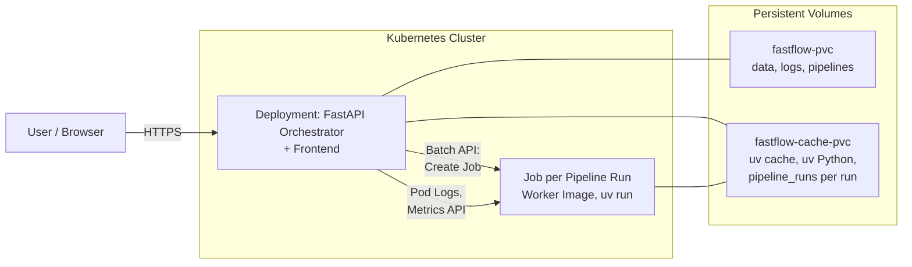

# Kubernetes Deployment

Fast-Flow can be run in a local or production Kubernetes cluster. The API is K8s-ready with liveness (`/health`) and readiness probes (`/ready`).

## Prerequisites

- **kubectl** installed
- **Kubernetes cluster** (one of the following options):

  | Option | Recommendation | Notes |
  |--------|----------------|-------|
  | **kubeadm** | Production | Standard worker with containerd (no Docker needed for runs) |
  | **Docker Desktop** | Local development | Enable Settings → "Enable Kubernetes" |
  | **Kind** (Kubernetes in Docker) | Lightweight | Works out of the box with the default manifests (Jobs executor) |
  | **Minikube** | Feature-rich | Any workable driver |

- **Docker** (local): only for **building and loading** the orchestrator image (`docker build`, `kind load`, Minikube Docker env). **Pipeline runs** use **Kubernetes Jobs** with the default manifests (`PIPELINE_EXECUTOR=kubernetes`) – **no** Docker daemon on Kubernetes nodes is required.

## Kind: optional Docker socket for the host

The included `k8s/` deployments start pipeline runs as **Jobs** via the Kubernetes API. A **host Docker socket** in Kind is only relevant if you deliberately run the orchestrator with `PIPELINE_EXECUTOR=docker` and want to start worker containers on the host's Docker (not the recommended approach for pure K8s environments).

If you still need the socket in Kind nodes, create your own Kind config with **extraMounts** for `/var/run/docker.sock` (not included in the repository) and create the cluster with it:

```bash
kind create cluster --config <your-kind-config>.yaml
```

## Manual Deployment

### 1. Secrets

**Default:** `k8s/secrets.yaml` contains all values (including dev dummy for OAuth). Simply `kubectl apply -f k8s/` – no manual secret needed.

**Production:** Replace values in `k8s/secrets.yaml` (ENCRYPTION_KEY, JWT_SECRET_KEY, real OAuth credentials). Or use your own secret and do not apply `secrets.yaml`.

### 2. Build and load image (Kind/Minikube)

```bash
docker build -t fastflow-orchestrator:latest .
```

**Kind:**

```bash
kind load docker-image fastflow-orchestrator:latest
```

**Minikube:**

```bash
eval $(minikube docker-env)
docker build -t fastflow-orchestrator:latest .
```

### 3. Apply manifests

```bash
kubectl apply -f k8s/
```

PostgreSQL is deployed by default. The orchestrator waits for the DB via an init container before starting.

### 4. Access

**Option A – NodePort (e.g. port 30080):**

- Docker Desktop / Minikube: `http://localhost:30080`
- Kind: `kubectl get nodes -o wide` → node IP, then `http://<node-ip>:30080`

**Option B – Port forward:**

```bash
kubectl port-forward service/fastflow-orchestrator 8000:80
```

Then: `http://localhost:8000`

### 5. Adjust BASE_URL

Depending on access method, set `BASE_URL` and `FRONTEND_URL` in the ConfigMap:

- NodePort 30080: `http://localhost:30080` (or your actual URL)
- Port forward: `http://localhost:8000`

```bash
kubectl edit configmap fastflow-config
```

Then restart the pod: `kubectl rollout restart deployment/fastflow-orchestrator`

### 6. Important URLs

| URL | Description |
|-----|-------------|
| `/` | React frontend (dashboard) |
| `/doku` | Docusaurus documentation |
| `/docs` | FastAPI Swagger (API docs; disabled when `ENVIRONMENT=production`) |
| `/redoc` | FastAPI ReDoc (disabled when `ENVIRONMENT=production`) |

### 7. Pipelines: PVC, executor, and DEV vs. PROD

Pipelines live in **`fastflow-pvc`** (subdirectory `pipelines`) – together with `data` and `logs` (20 GiB setup in the example manifests).

- **`PIPELINE_EXECUTOR=kubernetes`** (default in `k8s/deployment`): Before each run, the orchestrator copies the pipeline to a **shared cache volume** (`fastflow-cache-pvc`, mount e.g. `/shared`, subdirectory `pipeline_runs/<Run-ID>`). Jobs mount this volume and the uv cache – **no** manual `PIPELINES_HOST_DIR` for worker bind mounts needed.
- **UV cache / Python installs**: Orchestrator env **`UV_CACHE_DIR=/shared/uv_cache`** and **`UV_PYTHON_INSTALL_DIR=/shared/uv_python`** use the same PVC subdirectories as job pods (`/cache/uv`, `/cache/uv_python`), so pre-heating is shared with pipeline runs.
- **`PIPELINES_HOST_DIR`**: Mainly needed for **`PIPELINE_EXECUTOR=docker`** when the orchestrator starts Docker workers with host paths. Not required in the typical K8s Jobs configuration.

- **`ENVIRONMENT`** controls population:
  - **`development`**: On startup, example pipelines from the image are copied to `/app/pipelines` if the directory is empty.
  - **`production`**: No copying. Pipelines come exclusively via [Git Sync](./GIT_DEPLOYMENT.md) or manual population of the PVC.

For production, set in the ConfigMap:

```yaml
ENVIRONMENT: "production"
```

## Skaffold (dev workflow)

With [Skaffold](https://skaffold.dev/), code changes automatically trigger build, deploy, and port-forward.

```bash
skaffold dev
```

Skaffold handles:

- Image build
- Deploy to the cluster (including `kind load` with Kind)
- Port-forward to `localhost:8000`
- Log streaming

## Verification

```bash
kubectl get pods
kubectl logs -f deployment/fastflow-orchestrator -c orchestrator
```

Health checks:

```bash
curl http://localhost:8000/health
curl http://localhost:8000/ready
```

## Database

**Default:** PostgreSQL is included (`k8s/postgres.yaml`). The orchestrator connects automatically via `DATABASE_URL` from `postgres-secret`.

**SQLite instead of PostgreSQL:** If you do not apply `k8s/postgres.yaml`, the orchestrator uses SQLite on `fastflow-data-pvc` (no `postgres-secret` → no `DATABASE_URL`).

**Change PostgreSQL password (production):** Adjust `POSTGRES_PASSWORD` and `DATABASE_URL` in the secret in `k8s/postgres.yaml`.

## Architecture



- **Orchestrator deployment**: FastAPI + React frontend + Docusaurus docs; `PIPELINE_EXECUTOR=kubernetes`; **ServiceAccount** with RBAC for Jobs/Pods/Logs.
- **PostgreSQL** (optional): Database service on port 5432.
- **Pipeline runs**: One **Kubernetes Job** per execution (no Docker socket on nodes); after the run, cleanup of the copy under `pipeline_runs/` on the cache volume.
- **Volumes** (typical):
  - **fastflow-pvc**: on **orchestrator**: `data`, `logs`, `pipelines` (subPath)
  - **fastflow-cache-pvc**: on **orchestrator** (mount e.g. `/shared`) and on **job pod** (one PVC, multiple subPaths): **uv_cache**, **uv_python**, **pipeline_runs/&lt;Run-ID&gt;**
  - **postgres-pvc**: with PostgreSQL

**Note:** If you run Fast-Flow with **`PIPELINE_EXECUTOR=docker`** in a pod, you still need Docker-in-Docker or a socket mount – the default `k8s/` manifests are not designed for that.

## Note on `entrypoint.sh`

In the default manifest `k8s/deployment.yaml`, the orchestrator container has no custom `command`/`args`. Kubernetes therefore uses the image default from the `Dockerfile` (`CMD ["./entrypoint.sh"]`).

If `command` or `args` are overridden in the deployment, `./entrypoint.sh` should still be invoked (or its init steps explicitly replicated) so startup logic and initialization remain consistent.

## See Also

- [Production Checklist](./PRODUCTION_CHECKLIST.md)
- [Configuration](./CONFIGURATION.md)
- [Docker Socket Proxy](./DOCKER_PROXY.md)
