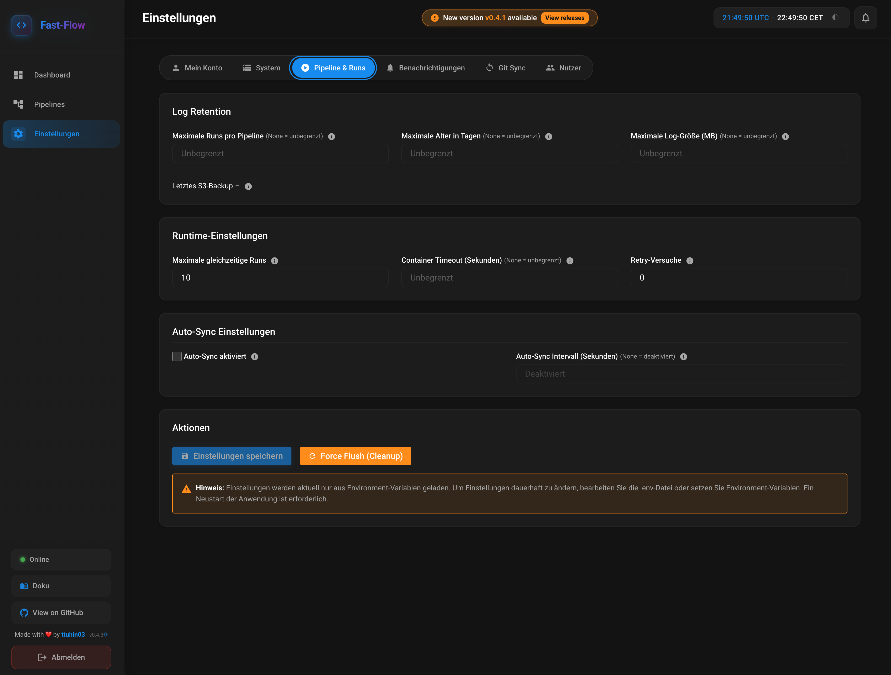

# Frontend Documentation

This documentation describes the frontend structure, components, and pages of the Fast-Flow orchestrator.

## Technology Stack

- **React 18**: UI framework
- **TypeScript**: Type safety
- **Vite**: Build tool and dev server
- **React Router**: Routing
- **Axios**: HTTP client for API communication
- **CSS Modules**: Styling

## Project Structure

```
frontend/
├── src/
│   ├── api/
│   │   └── client.ts          # Axios client with auth interceptors
│   ├── components/            # Reusable components
│   │   ├── CalendarHeatmap.tsx
│   │   ├── Layout.tsx
│   │   ├── ProgressBar.tsx
│   │   ├── RunStatusCircles.tsx
│   │   ├── Skeleton.tsx
│   │   ├── StorageStats.tsx
│   │   ├── SystemMetrics.tsx
│   │   └── Tooltip.tsx
│   ├── contexts/
│   │   └── AuthContext.tsx     # Authentication context
│   ├── pages/                 # Page components
│   │   ├── AuthCallback.tsx
│   │   ├── Dashboard.tsx
│   │   ├── Invite.tsx
│   │   ├── Login.tsx
│   │   ├── PipelineDetail.tsx
│   │   ├── Pipelines.tsx
│   │   ├── RunDetail.tsx
│   │   ├── Runs.tsx
│   │   ├── Scheduler.tsx
│   │   ├── Secrets.tsx
│   │   ├── Settings.tsx
│   │   ├── Sync.tsx
│   │   └── Users.tsx
│   ├── styles/
│   │   ├── design-system.css  # Design system (colors, typography)
│   │   └── variables.css      # CSS variables
│   ├── App.tsx                # Main app component
│   └── main.tsx               # Entry point
```

## API Client

### `src/api/client.ts`

The API client is a configured Axios instance with automatic authentication.

**Features:**
- Automatically adds Authorization header from sessionStorage
- Automatic redirect to login on 401 errors
- Base URL configurable via `VITE_API_URL` (default: `http://localhost:8000/api`)

**Usage:**
```typescript
import apiClient from '@/api/client'

// GET request
const response = await apiClient.get('/pipelines')

// POST request
const response = await apiClient.post('/pipelines/pipeline_a/run', {
  env_vars: { API_KEY: 'secret' }
})
```

## Components

### Layout

#### `Layout.tsx`

Main layout component with navigation and sidebar.

**Features:**
- Responsive sidebar with navigation
- Logout functionality
- Active route highlighting

**Props:** None (uses React Router for navigation)

### RunStatusCircles

#### `RunStatusCircles.tsx`

Visualizes run status with colored circles.

**Props:**
```typescript
interface RunStatusCirclesProps {
  runs: Array<{
    status: 'PENDING' | 'RUNNING' | 'SUCCESS' | 'FAILED' | 'CANCELLED'
  }>
}
```

**Status colors:**
- `PENDING`: Gray
- `RUNNING`: Blue
- `SUCCESS`: Green
- `FAILED`: Red
- `CANCELLED`: Orange

### ProgressBar

#### `ProgressBar.tsx`

Progress bar component.

**Props:**
```typescript
interface ProgressBarProps {
  value: number        // 0-100
  max?: number         // Default: 100
  label?: string       // Optional label
  color?: string       // Optional: CSS color
}
```

### CalendarHeatmap

#### `CalendarHeatmap.tsx`

Calendar heatmap for visualizing run activity over time.

**Props:**
```typescript
interface CalendarHeatmapProps {
  data: Array<{
    date: string        // ISO format: YYYY-MM-DD
    value: number       // Number of runs
  }>
  startDate?: string   // Optional: start date
  endDate?: string     // Optional: end date
}
```

**Features:**
- Color coding based on activity
- Tooltip with details on hover
- Responsive design

### SystemMetrics

#### `SystemMetrics.tsx`

Displays system metrics (CPU, RAM, containers).

**Props:**
```typescript
interface SystemMetricsProps {
  metrics: {
    active_containers: number
    containers_ram_mb: number
    containers_cpu_percent: number
    api_ram_mb: number
    api_cpu_percent: number
    system_ram_total_mb: number
    system_ram_used_mb: number
    system_ram_percent: number
    system_cpu_percent: number
    container_details: Array<{
      run_id: string
      pipeline_name: string
      ram_mb: number
      cpu_percent: number
    }>
  }
}
```

**Features:**
- Real-time updates (polling)
- Graphical CPU/RAM display
- Container details table

### StorageStats

#### `StorageStats.tsx`

Displays storage statistics.

**Props:**
```typescript
interface StorageStatsProps {
  stats: {
    log_files_count: number
    log_files_size_mb: number
    total_disk_space_gb: number
    used_disk_space_gb: number
    free_disk_space_gb: number
    log_files_percentage: number
    database_size_mb?: number
  }
}
```

### Skeleton

#### `Skeleton.tsx`

Loading skeleton component for better UX while loading.

**Props:**
```typescript
interface SkeletonProps {
  width?: string       // CSS width (e.g. "100%", "200px")
  height?: string      // CSS height
  className?: string   // Additional CSS classes
}
```

### Tooltip

#### `Tooltip.tsx`

Tooltip component for additional information.

**Props:**
```typescript
interface TooltipProps {
  content: string | React.ReactNode
  children: React.ReactNode
  position?: 'top' | 'bottom' | 'left' | 'right'
}
```

## Pages

### Dashboard

#### `pages/Dashboard.tsx`

Main dashboard with overview of all pipelines and system status.


**Features:**
- Pipeline overview with statistics
- System metrics (CPU, RAM, containers)
- Storage statistics
- Calendar heatmap for run activity
- Quick actions (start pipeline, run sync)

**API endpoints:**
- `GET /api/pipelines` - Pipeline list
- `GET /api/pipelines/daily-stats/all` - Daily statistics
- `GET /api/settings/system-metrics` - System metrics
- `GET /api/settings/storage` - Storage statistics

### Pipelines

#### `pages/Pipelines.tsx`

Overview of all pipelines with filters and actions.

**Features:**
- Pipeline list with statistics
- Filter by tags
- Start pipeline
- Open pipeline details
- Show statistics

**API endpoints:**
- `GET /api/pipelines` - Pipeline list
- `POST /api/pipelines/{name}/run` - Start pipeline

### Pipeline Detail

#### `pages/PipelineDetail.tsx`

Detailed view of a single pipeline.

**Features:**
- Pipeline information and metadata
- Run history
- Daily statistics (chart)
- Start pipeline with environment variables
- Reset statistics

**API endpoints:**
- `GET /api/pipelines/{name}` - Pipeline details
- `GET /api/pipelines/{name}/runs` - Run history
- `GET /api/pipelines/{name}/stats` - Statistics
- `GET /api/pipelines/{name}/daily-stats` - Daily statistics
- `POST /api/pipelines/{name}/run` - Start pipeline
- `POST /api/pipelines/{name}/stats/reset` - Reset statistics

### Runs

#### `pages/Runs.tsx`

Overview of all runs with filters and pagination.

**Features:**
- Run list with status
- Filter by pipeline, status, date
- Pagination
- Open run details
- Cancel run (for running runs)

**API endpoints:**
- `GET /api/runs` - Run list (with filters)
- `POST /api/runs/{run_id}/cancel` - Cancel run

### Run Detail

#### `pages/RunDetail.tsx`

Detailed view of a single run.

**Features:**
- Run information (status, exit code, duration)
- Live logs (Server-Sent Events)
- Live metrics (CPU, RAM)
- Log download
- Cancel run (for running runs)

**API endpoints:**
- `GET /api/runs/{run_id}` - Run details
- `GET /api/runs/{run_id}/logs` - Logs from file
- `GET /api/runs/{run_id}/logs/stream` - Live logs (SSE)
- `GET /api/runs/{run_id}/metrics` - Metrics from file
- `GET /api/runs/{run_id}/metrics/stream` - Live metrics (SSE)
- `POST /api/runs/{run_id}/cancel` - Cancel run

**Live updates:**
- Logs streamed via Server-Sent Events (SSE)
- Metrics updated every 2 seconds
- Status polled regularly

### Scheduler

#### `pages/Scheduler.tsx`

Management of scheduled jobs.

**Features:**
- Job list with next execution time
- Create job (CRON or interval)
- Edit job
- Delete job
- Enable/disable job
- Run history per job

**API endpoints:**
- `GET /api/scheduler/jobs` - Job list
- `POST /api/scheduler/jobs` - Create job
- `PUT /api/scheduler/jobs/{job_id}` - Update job
- `DELETE /api/scheduler/jobs/{job_id}` - Delete job
- `GET /api/scheduler/jobs/{job_id}/runs` - Run history

**Trigger types:**
- **CRON**: Cron expression (e.g. `"0 0 * * *"` for daily at midnight)
- **INTERVAL**: Interval in seconds (e.g. `"3600"` for hourly)

### Secrets

#### `pages/Secrets.tsx`

Management of secrets and parameters.

**Features:**
- Secret list
- Create/edit/delete secret
- Distinction between secrets (encrypted) and parameters (unencrypted)
- Show/hide secret values

**API endpoints:**
- `GET /api/secrets` - Secret list
- `POST /api/secrets` - Create secret
- `PUT /api/secrets/{key}` - Update secret
- `DELETE /api/secrets/{key}` - Delete secret

**Notes:**
- Secrets are stored encrypted
- Parameters are stored unencrypted
- Secret values can be shown/hidden in the UI

### Settings

#### `pages/Settings.tsx`

System settings and configuration.

**Settings – Pipelines & log retention:**



**Settings – Notifications (email, Teams):**


**Features:**
- Display settings (log retention, timeouts, etc.)
- Email configuration
- Teams webhook configuration
- Send test emails/Teams messages
- Storage statistics
- System metrics
- Manual cleanup

**API endpoints:**
- `GET /api/settings` - Get settings
- `PUT /api/settings` - Update settings (warning only)
- `GET /api/settings/storage` - Storage statistics
- `GET /api/settings/system-metrics` - System metrics
- `POST /api/settings/test-email` - Send test email
- `POST /api/settings/test-teams` - Send test Teams message
- `POST /api/settings/cleanup/force` - Manual cleanup

**Note:** Settings are currently loaded only from environment variables. For persistent changes, edit the `.env` file.

### Sync

#### `pages/Sync.tsx`

Git synchronization and repository management.

**Features:**
- Show Git status
- Manual Git pull
- Show sync logs
- Auto-sync settings
- GitHub Apps configuration
- GitHub App manifest flow

**API endpoints:**
- `GET /api/sync/status` - Git status
- `POST /api/sync` - Run Git pull
- `GET /api/sync/logs` - Sync logs
- `GET /api/sync/settings` - Sync settings
- `PUT /api/sync/settings` - Update sync settings
- `GET /api/sync/github-config` - Get GitHub config
- `POST /api/sync/github-config` - Save GitHub config
- `POST /api/sync/github-config/test` - Test GitHub config
- `DELETE /api/sync/github-config` - Delete GitHub config

**GitHub Apps:**
- Support for GitHub Apps authentication
- Manifest flow for easy app creation
- Installation flow for repository access

### Login

#### `pages/Login.tsx`

Login page. Sign in via configured OAuth providers (GitHub, Google, Microsoft, Custom).

**Features:**
- Login buttons per active provider (`/api/auth/providers`)
- Error handling
- After authorization: redirect to `/auth/callback#token=...`, then to `/`

**Other pages:**
- `pages/AuthCallback.tsx` – processes `#token=...` after OAuth, stores token in sessionStorage, redirects to `/`
- `pages/Invite.tsx` – invitation landing (`/invite?token=...`), registration via OAuth with token in `state`

**API endpoints:**
- `GET /api/auth/providers` – available OAuth providers
- `GET /api/auth/{provider}/authorize` – login (redirect to provider)

## Authentication Context

### `contexts/AuthContext.tsx`

Manages the application's authentication state.

**Features:**
- Token management in sessionStorage (auth_token)
- Automatic token validation
- Logout functionality
- Protected routes

**Usage:**
```typescript
import { useAuth } from '@/contexts/AuthContext'

function MyComponent() {
  const { user, isAuthenticated, logout } = useAuth()
  
  if (!isAuthenticated) {
    return <div>Please log in</div>
  }
  
  return <div>Welcome, {user?.username}</div>
}
```

## Routing

Routing configuration is in `App.tsx`:

- `/` - Dashboard
- `/login` - Login (OAuth)
- `/auth/callback` - OAuth callback (processes `#token=...`)
- `/invite` - Invitation page (`?token=...`)
- `/pipelines` - Pipeline overview
- `/pipelines/:name` - Pipeline details
- `/runs` - Run overview
- `/runs/:id` - Run details
- `/scheduler` - Scheduler
- `/secrets` - Secrets
- `/settings` - Settings
- `/sync` - Git sync
- `/users` - User management (admins only, OAuth invitations)

**Protected routes:**
All routes except `/login`, `/auth/callback`, and `/invite` are protected and require authentication.

## Styling

### Design System

The design system is defined in `styles/design-system.css` and includes:
- Color palette (primary, secondary, success, error, warning)
- Typography (fonts, sizes)
- Spacing
- Border radius
- Shadows

### CSS Variables

CSS variables are defined in `styles/variables.css` and can be used for theming.

### CSS Modules

Each component has an associated `.css` file for component-specific styles.

## Development

### Local development

```bash
cd frontend
npm install
npm run dev
```

The application then runs at `http://localhost:3000`.

### Build

```bash
npm run build
```

The build is created in the `static/` directory and can be served by the backend.

### Environment variables

- `VITE_API_URL`: API base URL (default: `http://localhost:8000/api`)

## Best Practices

1. **API calls**: Always via `apiClient` from `src/api/client.ts`
2. **Error handling**: Errors should be displayed in a user-friendly way
3. **Loading states**: Use the `Skeleton` component while loading
4. **TypeScript**: Use TypeScript for type safety
5. **Responsive design**: All components should be responsive
