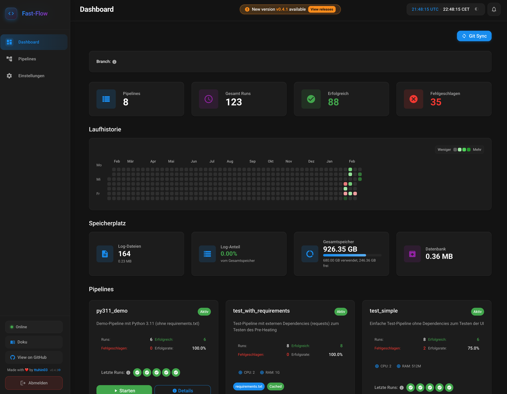

# Fast-Flow – Overview

**The lean, Docker-native, Python-centric task orchestrator.**

Fast-Flow is the answer to the complexity of Airflow and the heaviness of traditional CI/CD tools. It was built for developers who want real isolation without giving up the speed of local scripts. **Fast-Flow runs with Docker (Compose or socket proxy) or on Kubernetes** – in addition to Docker, native K8s operation is also possible (pipeline runs as Kubernetes Jobs). Details: [Kubernetes Deployment](/docs/deployment/K8S).

:::tip In 30 seconds
**One Python script per pipeline.** No DAG, no image build. `git push` → sync → run. Each pipeline runs in an isolated container (Docker or K8s Job) with **uv** (JIT dependencies). One FastAPI container + Docker socket proxy or K8s – done.
:::

:::tip
Read the [Anti-Overhead Manifesto](/docs/manifesto) to understand why Fast-Flow is the alternative to Airflow, Dagster & co.
:::

:::info
Use the **[fastflow-pipeline-template](https://github.com/ttuhin03/fastflow-pipeline-template)** for a quick start and a clear pipeline structure.
:::

## What is Fast-Flow?

- **Code First:** Your Python script runs as-is – no DAG decorators, operators, or IO managers.
- **uv + Docker:** Each pipeline runs in an isolated container; dependencies arrive via the uv cache in milliseconds. The Python version is freely configurable per pipeline (e.g. 3.10, 3.11, 3.12).
- **Git as source:** Push to deploy – no image build, no manual upload. The orchestrator pulls changes via webhook or sync.
- **Docker or Kubernetes:** One FastAPI container plus Docker socket proxy (Docker mode) or deployment on Kubernetes with pipeline runs as K8s Jobs. See [Kubernetes Deployment](/docs/deployment/K8S).

## Next steps

| Goal | Page | Duration (approx.) |
|------|--------|-------------|
| Get started immediately | [**Quick Start**](/docs/schnellstart) | ~5 min. |
| Full setup | [**Setup Guide**](/docs/setup) | ~15 min. |
| Write your first pipeline | [**First Pipeline**](/docs/pipelines/erste-pipeline) | ~10 min. |
| Understand the philosophy | [**Manifesto**](/docs/manifesto) | ~5 min. |
| Understand the architecture | [**Architecture**](/docs/architektur) | ~5 min. |
| Pipelines in detail | [**Pipelines – Overview**](/docs/pipelines/uebersicht) | — |
| Troubleshooting | [**Troubleshooting**](/docs/troubleshooting) | — |
| Legal | [**Disclaimer**](/docs/disclaimer) | — |

**Dashboard overview:**

