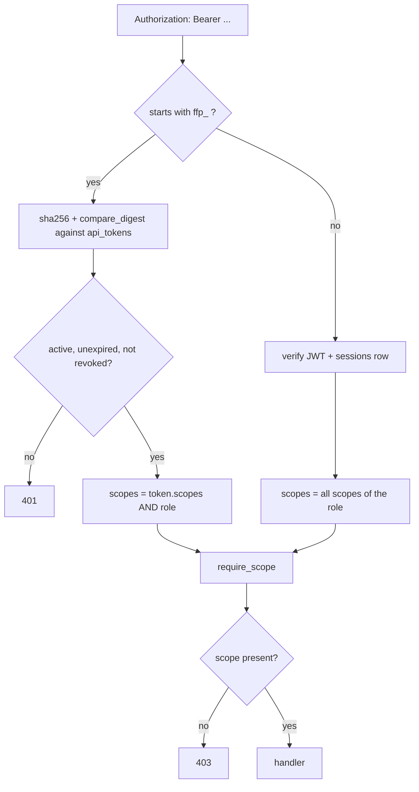

# MCP Integration (Design Proposal)

:::caution[Partly implemented – read the phase plan]
**Phase 1 (API tokens) is implemented**: the `ApiToken` model, migration `041`,
`get_principal` / `require_scope`, the `/api/tokens` endpoints and the Settings UI all exist.
**Everything MCP-specific is still a proposal** – the `fastflow-mcp` package, the tool
surface and the resources below describe planned work, not shipped API. See
[Phased plan](#part-5-phased-plan) for what is done and what is not.
:::

An MCP server would let an agent answer questions like *"why did the nightly ETL fail?"*
against a running Fast-Flow instance: read pipelines, runs, stats and log tails without a
browser session, without pasting an OpenAPI dump into the model's context, and without
handing the agent a credential it can echo back.

The proposal has one prerequisite that is worth building regardless of MCP, and three
design decisions that keep the orchestrator itself untouched.

## Starting point

The REST surface under `app/api/` is already shaped well for this: runs with filters and
pagination, run detail including cells and container health, logs with a `tail` parameter,
pipeline stats, dependency audit, dependency graph. Almost no new orchestrator
functionality is required — the work is in access, scoping and response bounds.

Three findings drive the rest of this document.

### There is no machine identity

Every protected endpoint depends on `get_current_user` (`app/auth/auth.py`), which expects
a bearer JWT **and** a matching, unexpired row in `sessions`. Those tokens only come out of
an OAuth flow. An MCP server can neither follow a browser redirect nor hold a credential
that expires after `JWT_EXPIRATION_HOURS`.

### A usable precedent already exists

`NotificationApiKey` (`app/models.py`) stores SHA-256 hashes, returns the cleartext exactly
once, and compares in constant time (`app/api/notifications.py`). The helper lives in
`app/core/notification_api_key_hash.py`. That pattern extends cleanly to real,
user-bound tokens — including a UI precedent in the notification key section of Settings.

### Logs are not masked

`app/api/logs.py` enforces a byte ceiling and supports `tail`, but performs no redaction.
Whatever a pipeline process writes to stdout is returned verbatim. That is defensible today,
because only authenticated humans read it in a browser. Once an agent reads it, it becomes a
deliberate decision rather than a side effect.

:::important[Not the goal]
A second control plane. Anything the MCP server can do must pass through the same
dependencies, the same RBAC and the same audit log as the UI. Where that is not possible,
the capability does not belong in the MCP server.
:::

## Part 1: API tokens

This is the foundation, and it is useful on its own — for CI, scripts and Terraform —
before a single MCP tool exists.

### Data model

A new table, deliberately kept close to `NotificationApiKey` and `EphemeralToken` so it fits
the existing codebase rather than sitting beside it:

```python
# app/models.py
class ApiToken(SQLModel, table=True):
    __tablename__ = "api_tokens"

    id:           UUID       # default_factory=uuid4, primary_key
    token_hash:   str        # sha256 hex, unique, indexed
    prefix:       str        # first 8 visible characters, for UI and logs
    label:        str        # "Claude Code – laptop", "CI nightly"
    user_id:      UUID       # FK users.id, indexed
    scopes:       list[str]  # JSON column, see below
    expires_at:   datetime   # required. default 90 days, max 365
    last_used_at: datetime | None
    revoked_at:   datetime | None
    created_at:   datetime
```

Migration: `alembic/versions/041_add_api_tokens.py` — the series currently ends at
`040_add_user_last_login.py`.

### Token format

```
ffp_<prefix8>_<secrets.token_urlsafe(32)>
```

The fixed prefix is not decoration: it makes tokens findable by secret scanners. Since the
repository already runs Gitleaks and maintains a `.gitleaksignore`, a dedicated rule matching
`ffp_` belongs in the same phase. Otherwise the first leaked token is the one nobody detects.

### Scopes

Four scopes, cut along **risk class** rather than along endpoints. Effective permission is
always the intersection of token scopes and `User.role`, so a `READONLY` user cannot mint a
token carrying `run`, and revoking a role immediately devalues existing tokens.

| Scope | Risk | Grants | Requires |
|---|---|---|---|
| `read` | low | Pipelines, runs, stats, dependencies, graph. Metadata without payload. Default for every new token. | `READONLY` |
| `logs` | medium | Log contents and cell stdout/stderr. Separate scope because real payload — and potentially credentials — flows through here. | `READONLY` |
| `source` | medium | Pipeline source files and `pipeline.json`. Split from `read` because source code may follow its own disclosure rules. | `READONLY` |
| `run` | high | Start, cancel, retry. Not preselected in the UI. | `WRITE` |

There is deliberately **no `admin` scope**. Settings, user management, secrets and deploy keys
remain reachable only through a browser session, so a stolen token cannot reconfigure the
instance.

### Verification in the request path

Rather than rewriting `get_current_user`, a principal concept sits above it. Existing
endpoints stay untouched; only those that should accept tokens swap their dependency.

```python
# app/auth/principal.py
@dataclass(frozen=True)
class Principal:
    user:      User
    scopes:    frozenset[str]
    auth_kind: Literal["session", "token"]
    token_id:  UUID | None

async def get_principal(credentials, db) -> Principal:
    raw = credentials.credentials
    if raw.startswith("ffp_"):             # separate branch, no JWT decode
        return _principal_from_api_token(db, raw)
    return _principal_from_session(db, raw)  # existing path, all scopes of the role

def require_scope(*needed: str) -> Callable:
    """403 when the principal lacks the scope."""
```



Four details matter here:

- The branch happens on the prefix **before** anything is interpreted as a JWT. An API token
  must never reach `get_session_by_token`, and vice versa.
- Comparison uses `hashlib.sha256(...)` plus `secrets.compare_digest`, mirroring
  `digest_notification_api_token` in its own module.
- `last_used_at` is written, but throttled to at most once per minute per token — otherwise
  every read produces a write against SQLite.
- Rate limiting keys on `token_id` instead of the client IP for token auth. An MCP client
  otherwise shares one address with everyone else behind the same egress.

### Endpoints and UI

| Endpoint | Who | Behaviour |
|---|---|---|
| `POST /api/tokens` | any active user | Self-service. Cleartext returned exactly once. |
| `GET /api/tokens` | own tokens; admins see all | Metadata only, never the value. |
| `DELETE /api/tokens/:id` | owner or admin | Sets `revoked_at`; no hard delete, so audit entries stay attributable. |

Audit actions `api_token_create` and `api_token_revoke` on `resource_type="api_token"` via the
existing `log_audit`. The UI becomes its own Settings section, following the notification key
pattern in `app/api/settings.py`, including the "shown only once" dialog.

## Part 2: Tool surface

The tempting mistake is generating tools from the OpenAPI schema. Roughly forty endpoints
produce forty tool definitions that fill the context before the first question is asked — and
an agent guessing between `/pipelines/{name}/stats` and `/pipelines/summary-stats`. The cut
below follows questions that actually get asked.

### Read tools

Source paths are relative to `/api`.

| Tool | Scope | Source | Bound |
|---|---|---|---|
| `list_pipelines` | `read` | `/pipelines` | all |
| `get_pipeline` | `read` | 3 endpoints, bundled | — |
| `list_runs` | `read` | `/runs` | 100 (API: 1000) |
| `get_run` | `read` | `/runs/:id` (+cells, +health) | 40 lines/cell |
| `get_run_logs` | `logs` | `/runs/:id/logs` | 200 lines / 64 KB |
| `get_pipeline_stats` | `read` | `/stats`, `/daily-stats` | 90 days |
| `get_dependency_report` | `read` | `/pipelines/dependencies` | — |
| `summarize_failures` | `logs` | derived | 20 groups |

- `get_pipeline` folds metadata, schedules, downstream triggers and the dependency summary
  into one response.
- `list_runs` filters by pipeline, status and time window, and returns `exit_code`,
  `error_type` and `git_sha` — the fields that actually start a diagnosis.
- `get_run_logs` returns the last N lines with an optional regex filter, and reports how much
  was truncated. It never returns a whole file.
- `summarize_failures` has no 1:1 endpoint. It groups failed runs in a window by pipeline,
  `error_type` and first error line. *"What broke last night?"* otherwise costs twenty calls;
  this way it costs one, and the answer fits in a few hundred tokens.

### Write tools

| Tool | Scope | Source | Note |
|---|---|---|---|
| `trigger_pipeline` | `run` | `POST /pipelines/{name}/run` | no `env_vars` |
| `cancel_run` | `run` | `POST /runs/:id/cancel` | — |
| `retry_run` | `run` | `POST /runs/:id/retry` | — |

`env_vars` is deliberately not exposed even though `RunPipelineRequest` accepts it. Free-form
environment variables are the most direct way to rewrite a pipeline's behaviour from outside;
`parameters` and `run_config_id` cover every legitimate agent use case. All three tools carry
`readOnlyHint: false` and `idempotentHint: false` so clients can treat them as
confirmation-worthy.

### Resources and prompts

Large addressable content belongs in the server as an MCP resource, not as a tool result that
floods the context:

- `fastflow://pipeline/{name}/source/{file}` — source files, scope `source`
- `fastflow://run/:id/log` — full log, scope `logs`, same byte ceiling
- `fastflow://graph` — dependency graph as JSON

Plus two prompts, because triage runs the same way every time: `diagnose_run` (run id → status,
cells, log tail, last successful version, `git_sha` delta) and `triage_window` (time window →
`summarize_failures`, then targeted follow-up).

### Denylist

:::danger[Explicitly blocked, not merely omitted]
Secrets (`/api/secrets`), user management, settings writes, Git sync triggers, deploy key
generation and notification keys. The MCP server keeps these paths in an explicit denylist and
refuses to start if a tool violates it, so a later refactor cannot quietly open a door.
:::

`GET /pipelines/{name}/encrypted-env` returns key names only and can therefore stay under
`read` — useful for *"which variable does this pipeline expect?"* without exposing values.

## Part 3: Deployment

| Option | Verdict | For | Against |
|---|---|---|---|
| **stdio on the user's machine**<br/>`uvx fastflow-mcp` | **chosen for v1** | No new port, no new service, production image unchanged. The credential lives in the user's MCP client config and never in the agent's context. Versioned independently of the orchestrator. | Each user installs it. No access for hosted or web-based agents. |
| **HTTP sidecar**<br/>own container, streamable HTTP | later, if asked for | Centrally hosted, one place to update, its own resource and network boundary. Orchestrator image stays clean. | One more service to operate. Needs its own auth story — bearer pass-through or real OAuth 2.1 per MCP spec. |
| **In-process** under `/mcp` in `app/main.py` | rejected | No duplication: `get_session`, `log_audit` and `limiter` directly available. | Pulls the MCP SDK into the production image — a permanent maintenance cost in a repository that takes Trivy and pip-audit seriously. Couples protocol churn to orchestrator releases, and a bug in the MCP layer is a bug in the orchestrator process. |

The rejection is recorded so the question is not reopened in six months. If the sidecar ever
wins, it shares tool code with the stdio package — transport choice is one line in the MCP
SDKs, not the architecture.

### Client configuration (proposed)

```json
{
  "mcpServers": {
    "fastflow": {
      "command": "uvx",
      "args": ["fastflow-mcp"],
      "env": {
        "FASTFLOW_URL": "https://fastflow.example.com",
        "FASTFLOW_TOKEN": "ffp_..."
      }
    }
  }
}
```

## Part 4: Security

### Prompt injection from pipeline output

Once an agent reads logs and source, it reads content Fast-Flow does not control. A pipeline
querying a third-party API can write a line that looks like an instruction. This only becomes
dangerous combined with write access in the same token.

- `logs` and `run` are not preselected together in the UI. Wanting both requires ticking both.
- Log and source results are marked as foreign content in the tool result, not as instruction.
- Triggering is not a new capability class — the webhook keys in `app/api/webhooks.py` have
  been able to do it without a session for a long time. What is new is that it can happen
  autonomously in a loop.

### Credentials in logs

The honest state: there is no masking today. A regex-based redactor in the MCP layer — matching
`ffp_`, `ghp_`, `AKIA...`, `xox[baprs]-`, JWT shape, `-----BEGIN ... KEY-----` — catches the
common forms. It is a mitigation, not a guarantee: a password inside an error message looks
like ordinary text. That belongs in the documentation, not in the fine print.

### Traceability

Every token-authenticated request adds `auth_kind="token"`, `token_id` and `label` to `details`
on the existing `AuditLogEntry`. `run_start` already writes an entry; it simply has to show that
it came from "CI nightly" rather than a human in a browser. Without that, the audit log loses
its value as automation grows.

### Limits

- Rate limiting stays **per IP** for now. Keying the global limiter on the token would be a
  DoS bypass: `get_client_identifier` runs *before* authentication, so an attacker varying the
  token on every request would get a fresh bucket each time and escape the IP cap entirely.
  A correct per-token budget needs an *authenticated* token id, i.e. a limiter that runs after
  auth — the pattern `app/api/notifications.py` already hand-rolls. Deferred to phase 2, where
  MCP traffic makes it matter. `POST /api/tokens` carries its own `10/min` limit.
- `expires_at` is mandatory. Default 90 days, maximum 365. A token without expiry is a password
  without rotation.
- The byte ceiling is enforced again inside the MCP server. It must not rely on the API already
  bounding the response.

## Part 5: Phased plan

The order is binding: each phase is usable on its own and sensible without the next.

| Phase | Scope | Estimate |
|---|---|---|
| **1. API tokens** ✅ *done* | Model, migration 041, `get_principal` / `require_scope`, the three `/api/tokens` endpoints, Settings UI, Gitleaks rule, tests. No MCP yet — the value stands alone for CI and scripts. | 2–3 days |
| **2. MCP, read-only** | `fastflow-mcp` package over stdio, the eight read tools, three resources, two prompts, log redactor. Documentation page with client configuration. | 1–2 days |
| **3. MCP, write** | The three `run` tools behind their own scope, off by default. Injection note in the docs, audit attribution verified. | 0.5 days |
| **4. Sidecar** | HTTP transport, Compose and K8s manifests. Only once someone actually needs hosted access — not on suspicion. | open |

The estimate is an estimate. What is reliable is the ratio: phase 1 is the bulk of the work,
the MCP server itself is small.

## Part 6: Open decisions

| Question | Options | Leaning |
|---|---|---|
| Own repository or subdirectory? | A `mcp/` subdirectory keeps tool definitions and API changes in sync. A separate repository matches the `fastflow-pipeline-template` pattern and allows independent releases. | Subdirectory — for a client this thin, drift weighs more than separate release cycles. |
| Log redaction: build or document? | The regex redactor costs a few hours and catches common token shapes, but creates false confidence if mistaken for complete. | Build it, and mark it explicitly incomplete in the docs. |
| Four scopes or just read/write? | Four map the risk classes cleanly but cost UI and explanation. Two would be faster but force a token for run statistics to also read logs. | Four — the effort sits almost entirely in the table and the dependency, not in their number. |
| Who may create tokens? | Self-service for all active users is convenient and fits the existing role logic. Admin approval would be stricter, but `UserRole` already bounds a token's reach. | Self-service, with full visibility for admins in `GET /api/tokens`. |
