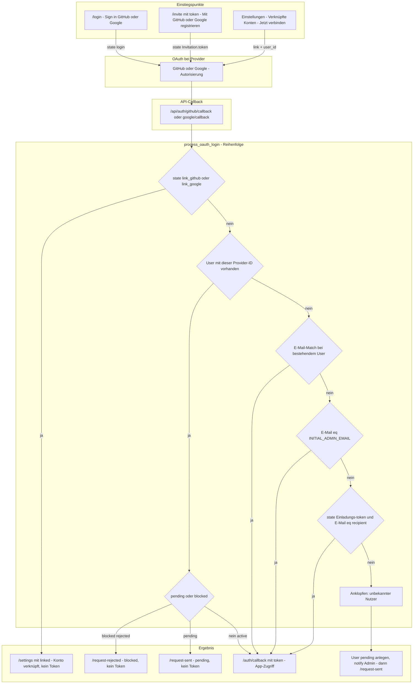

# OAuth (GitHub & Google)

Fast-Flow unterstützt **GitHub OAuth** und **Google OAuth** für Login. Beide können pro User verknüpft werden („Link-Konto“ in den Einstellungen).

## Übersicht

- **Login:** `/login` → „Sign in with GitHub“ oder „Sign in with Google“
- **Einladung:** `/invite?token=…` → „Mit GitHub registrieren“ oder „Mit Google registrieren“ (E-Mail muss der Einladung entsprechen)
- **Erster Admin:** `INITIAL_ADMIN_EMAIL` in `.env` – User mit dieser E-Mail (von GitHub oder Google) wird beim ersten Login Admin
- **Konto verknüpfen:** Einstellungen → Verknüpfte Konten → „Jetzt verbinden“ bei GitHub bzw. Google. Ermöglicht Login mit beiden Accounts; nötig, wenn E-Mails bei GitHub und Google unterschiedlich sind.
- **Beitrittsanfragen (Anklopfen):** Unbekannte Nutzer (ohne Einladung, ohne E-Mail-Match, ohne INITIAL_ADMIN) können sich per OAuth anmelden. Statt 403 wird eine Anfrage angelegt (Status `pending`). Sie erhalten **keine Session, keinen Token** und werden auf `/request-sent` umgeleitet. Admins sehen sie unter **Users → Beitrittsanfragen** und können **Freigeben** (Rolle wählen) oder **Ablehnen**. Bei Freigabe: `status=active`, Nutzer kann sich danach normal einloggen. Abgelehnte (`status=rejected`, `blocked=true`) bzw. noch wartende Nutzer landen bei erneutem OAuth-Login auf `/request-rejected` bzw. `/request-sent` – ebenfalls ohne Session. Optional: E-Mail an Admins bei neuer Anfrage (`EMAIL_ENABLED`, `EMAIL_RECIPIENTS`), E-Mail an Nutzer bei Freigabe.

---

## OAuth-Flow (Diagramm)

### Kurz erklärt

| Schritt | Bedingung | Ergebnis |
|--------|-----------|----------|
| **1. Link-Flow** | `state` enthält `link_github` oder `link_google` (von Einstellungen), Provider passt | Konto wird an bestehenden User gehängt → Redirect zu `/settings?linked=…` **ohne** neues Token. |
| **2. Direkt-Match** | User hat bereits diese GitHub/Google-ID | **blocked/rejected** → `/request-rejected` (kein Token). **pending** → `/request-sent` (kein Token). **active** → Token + `/auth/callback#token=…`. |
| **3. E-Mail-Match** | Anderer User mit gleicher E-Mail (Provider wird verknüpft) | Token + Session → App. |
| **4. INITIAL_ADMIN_EMAIL** | E-Mail von OAuth = `INITIAL_ADMIN_EMAIL` | Erster Admin: User anlegen/verknüpfen → Token + App. |
| **5. Einladung** | `state` = gültiger Einladungs‑Token **und** OAuth-E-Mail = `recipient_email` | User anlegen (Rolle aus Einladung) → Token + App. |
| **6. Anklopfen** | Keine der obigen | User mit `status=pending` anlegen, Admins benachrichtigen → Redirect zu `/request-sent` **ohne** Token. |

*Die Prüfungen in `process_oauth_login` laufen in dieser Reihenfolge; der erste Treffer bestimmt das Ergebnis.*

---

## Dokumentation

- **[GitHub OAuth](GITHUB.md)** – OAuth-App, Scopes, Callback, Einladung, Link-Konto, Fehler
- **[Google OAuth](GOOGLE.md)** – OAuth-Client, Scopes, Callback, Einladung, Link-Konto

## Konfiguration

Siehe [CONFIGURATION.md](../deployment/CONFIGURATION.md): `GITHUB_CLIENT_ID`, `GITHUB_CLIENT_SECRET`, `GOOGLE_CLIENT_ID`, `GOOGLE_CLIENT_SECRET`, `INITIAL_ADMIN_EMAIL`, `FRONTEND_URL`, `BASE_URL`.
