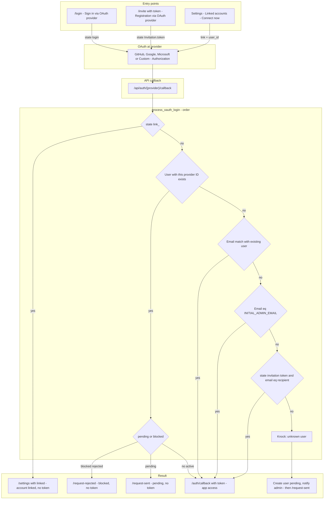

# OAuth (GitHub, Google, Microsoft, Custom)

Fast-Flow supports **GitHub OAuth**, **Google OAuth**, **Microsoft OAuth (Entra ID)**, and **Custom OAuth** for login. Providers can be linked per user ("Link account" in Settings).

## Overview

- **Login:** `/login` → Sign in with GitHub, Google, Microsoft, or Custom
- **Invitation:** `/invite?token=…` → Registration via OAuth provider (email must match the invitation)
- **First admin:** `INITIAL_ADMIN_EMAIL` in `.env` – the user with this email (from the respective OAuth provider) becomes admin on first login
- **Link account:** Settings → Linked accounts → "Connect now" for GitHub/Google/Microsoft/Custom.
- **Join requests (knock):** Unknown users (without invitation, without email match, without INITIAL_ADMIN) can sign in via OAuth. Instead of 403, a request is created (status `pending`). They receive **no session, no token** and are redirected to `/request-sent`. Admins see them under **Users → Join requests** and can **Approve** (choose role) or **Reject**. On approval: `status=active`, user can log in normally afterward. Rejected users (`status=rejected`, `blocked=true`) or still pending users land on `/request-rejected` or `/request-sent` respectively on repeated OAuth login – also without a session. Optional: email to admins on new request (`EMAIL_ENABLED`, `EMAIL_RECIPIENTS`), email to user on approval.

---

## OAuth Flow (Diagram)

```mermaid
flowchart TB
    subgraph Entry[Entry points]
        L["/login - Sign in via OAuth provider"]
        I["/invite with token - Registration via OAuth provider"]
        S["Settings - Linked accounts - Connect now"]
    end

    subgraph OAuth[OAuth at provider]
        G["GitHub, Google, Microsoft or Custom - Authorization"]
    end

    subgraph Callback[API callback]
        C["/api/auth/{provider}/callback"]
    end

    subgraph Evaluation[process_oauth_login - order]
        P1{"state link_<provider>"}
        P2{"User with this provider ID exists"}
        P3{"pending or blocked"}
        P4{"Email match with existing user"}
        P5{"Email eq INITIAL_ADMIN_EMAIL"}
        P6{"state invitation token and email eq recipient"}
        P7["Knock: unknown user"]
    end

    subgraph Result[Result]
        R1["/settings with linked - account linked, no token"]
        R2["/request-rejected - blocked, no token"]
        R3["/request-sent - pending, no token"]
        R4["/auth/callback with token - app access"]
        R5["Create user pending, notify admin - then /request-sent"]
    end

    L -->|state login| G
    I -->|state Invitation.token| G
    S -->|link + user_id| G

    G --> C
    C --> P1

    P1 -->|yes| R1
    P1 -->|no| P2

    P2 -->|yes| P3
    P2 -->|no| P4

    P3 -->|blocked rejected| R2
    P3 -->|pending| R3
    P3 -->|no active| R4

    P4 -->|yes| R4
    P4 -->|no| P5

    P5 -->|yes| R4
    P5 -->|no| P6

    P6 -->|yes| R4
    P6 -->|no| P7

    P7 --> R5
```

### Brief explanation

| Step | Condition | Result |
|--------|-----------|----------|
| **1. Link flow** | `state` contains `link_<provider>` (from Settings), provider matches | Account is attached to existing user → redirect to `/settings?linked=…` **without** a new token. |
| **2. Direct match** | User already has this provider ID | **blocked/rejected** → `/request-rejected` (no token). **pending** → `/request-sent` (no token). **active** → token + `/auth/callback#token=…`. |
| **3. Email match** | Another user with the same email (provider is linked) | Token + session → app. |
| **4. INITIAL_ADMIN_EMAIL** | OAuth email = `INITIAL_ADMIN_EMAIL` | First admin: create/link user → token + app. |
| **5. Invitation** | `state` = valid invitation token **and** OAuth email = `recipient_email` | Create user (role from invitation) → token + app. |
| **6. Knock** | None of the above | Create user with `status=pending`, notify admins → redirect to `/request-sent` **without** token. |

*The checks in `process_oauth_login` run in this order; the first match determines the result.*

---

## Documentation

- **[GitHub OAuth](GITHUB.md)** – OAuth app, scopes, callback, invitation, link account, errors
- **[Google OAuth](GOOGLE.md)** – OAuth client, scopes, callback, invitation, link account
- **Microsoft OAuth** – Callback: `{BASE_URL}/api/auth/microsoft/callback`
- **Custom OAuth** – Callback: `{BASE_URL}/api/auth/custom/callback`

## Configuration

See [CONFIGURATION.md](../deployment/CONFIGURATION.md): `GITHUB_*`, `GOOGLE_*`, `MICROSOFT_*`, `CUSTOM_OAUTH_*`, `INITIAL_ADMIN_EMAIL`, `FRONTEND_URL`, `BASE_URL`.
