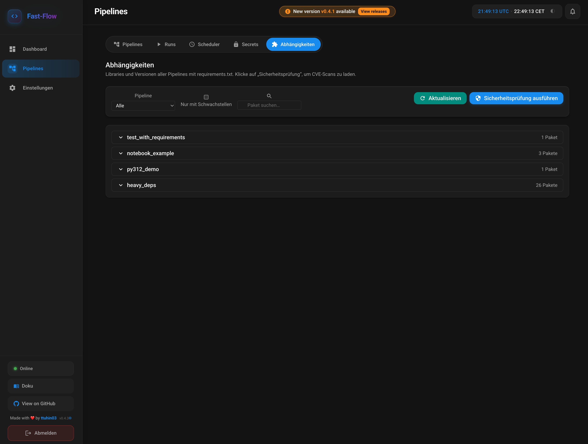

# Dependencies and Security Scanning

Fast-Flow shows all **libraries and versions** per pipeline (from `requirements.txt` and optionally `requirements.txt.lock`) and can **automatically check for known vulnerabilities (CVEs)**. When findings are detected: **email and/or Teams notification**.

## Dependencies page in the frontend

Under **Dependencies** in the navigation you see:

- **All pipelines with requirements.txt** – per pipeline the list of packages including version (from lock file, if present).
- **Security scan (pip-audit)** – button **"Run security scan"** starts a scan with [pip-audit](https://github.com/pypa/pip-audit) per pipeline. Found CVEs are displayed; links lead to NVD (National Vulnerability Database).

Filters:

- **Pipeline** – show only a specific pipeline.
- **With vulnerabilities only** – show only pipelines with found CVEs.
- **Search package** – filter by package name.

:::tip
The security scan uses **pip-audit** and must be installed in the backend (`pip install pip-audit` or in `requirements.txt`). If pip-audit is missing, a notice is shown; the package list is still displayed.
:::

## Automatic security scan (daily)

You can set up a **daily check** that runs at night and sends email and/or Teams notifications **only when findings are detected**.

### Settings (admins only)

Under **Settings** → section **"Dependencies – automatic security scan"**:

| Setting | Description |
|-------------|--------------|
| **Automatic security scan (daily at night)** | Enables/disables the scheduled job. |
| **Time (cron)** | Cron expression with 5 fields: **minute hour day month weekday**. Default: `0 3 * * *` = daily at 3:00 AM. |

Values are stored in the database (SystemSettings) and applied to the scheduler on app startup and after saving settings.

### Process

1. At the configured time, the scheduler runs **pip-audit** for each pipeline with `requirements.txt`.
2. If **vulnerabilities are found**: **Email** (to recipients configured under Settings) and/or **Microsoft Teams** (to the configured webhook) are sent – the same channels as for pipeline failures and S3 backup failures.
3. If **no** vulnerabilities are found: **no** notification is sent.

:::important
**Notifications** use the existing configuration under Settings (email: SMTP, recipients; Teams: webhook URL). These must be set up correctly so you are informed about vulnerabilities.
:::

### Cron examples

| Cron | Meaning |
|------|-----------|
| `0 3 * * *` | Daily at 3:00 AM (default) |
| `0 2 * * *` | Daily at 2:00 AM |
| `30 4 * * *` | Daily at 4:30 AM |
| `0 0 * * 0` | Sundays at midnight |

Format: minute (0–59), hour (0–23), day of month (1–31), month (1–12), weekday (0–6, 0 = Sunday). `*` = every.

## Backend details

- **Parsing:** `requirements.txt` and optionally `requirements.txt.lock` (uv format) are read; package names and resolved versions are displayed.
- **Scan:** [pip-audit](https://github.com/pypa/pip-audit) is run per pipeline with `-r requirements.txt -f json`; the result is evaluated for the API and notification.
- **Job:** The scheduled job is registered in APScheduler with fixed ID (`dependency_audit_job`); when activation or cron changes, it is rescheduled (after saving system settings or on app startup).
- **When does the scan run?** Once at API startup, after each successful Git pull (sync), and – if enabled – at the configured cron time; the latest results are visible under **Pipelines → Dependencies**.

Further details on email and Teams configuration: [Configuration (Deployment)](/docs/deployment/CONFIGURATION).
