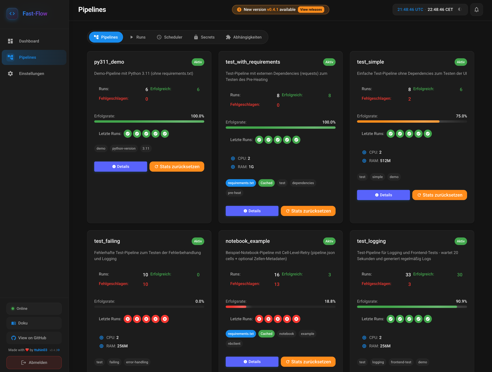

# Pipelines – Overview

The pipeline repository is mounted as a volume in the orchestrator container (or provided via Git sync). Pipelines are **discovered automatically** – **Zero-Config Discovery**: no registration in the database or UI; pushing code is enough.

:::tip
Use the **[fastflow-pipeline-template](https://github.com/ttuhin03/fastflow-pipeline-template)** for a quick start, ready-made examples, and a clean structure.
:::

## Adding a pipeline (Zero-Config Discovery)

You do **not** need to create pipelines in a database or the UI. Four steps:

1. **Create a folder:** New directory under `pipelines/` (e.g. `pipelines/data_sync/`). The **folder name** = **pipeline name** in the UI.
2. **Entry point:** Either **`main.py`** (script pipeline) or **`main.ipynb`** (notebook pipeline, with `"type": "notebook"` in `pipeline.json`). Fast-Flow runs scripts or the notebook cell by cell.
3. **`requirements.txt` (optional):** External packages. For notebook pipelines, at minimum `nbclient`, `nbformat`, `ipykernel`. [Notebook Pipelines](/docs/pipelines/notebook-pipelines).
4. **`pipeline.json` (optional):** Limits, retries, timeout, description, tags, `python_version`, `webhook_key`; for notebooks additionally **`cells`** for cell retries. [Reference](/docs/pipelines/referenz).

After sync or restart, the pipeline appears in the UI. No `docker build`, no manual upload.

**What the pipeline list looks like in the UI:**



**Dependencies & security:** Which libraries each pipeline uses and whether known vulnerabilities (CVEs) exist is shown under **Dependencies** in the UI. Optional: [automatic daily checks and email/Teams notification when findings are detected](/docs/pipelines/abhaengigkeiten-sicherheit).

---

## Directory structure

```
pipelines/
├── pipeline_a/              # Standard: main.py + requirements.txt + pipeline.json
│   ├── main.py
│   ├── requirements.txt
│   └── pipeline.json
├── pipeline_b/              # Custom JSON: {pipeline_name}.json instead of pipeline.json
│   ├── main.py
│   └── data_processor.json
├── pipeline_c/              # Minimal: main.py only
│   └── main.py
├── notebook_example/        # Notebook pipeline: main.ipynb, type: "notebook", cells for cell retries
│   ├── main.ipynb
│   ├── pipeline.json
│   └── requirements.txt
└── failing_pipeline/        # Example: intentionally failing (for UI/retry tests)
    ├── main.py
    └── pipeline.json
```

More typical scenarios (e.g. with delay, OOM test, retry demo) are available in the [Pipeline Template](https://github.com/ttuhin03/fastflow-pipeline-template).

---

## Local testing: "If it runs, it runs"

A common problem with orchestrators: **everything works locally, but not in production** – because images, Python versions, or paths differ.

Fast-Flow uses **uv** and a unified runtime environment. **Local is identical to the orchestrator.**

Test in seconds:

```bash
cd pipelines/pipeline_a
uv pip install -r requirements.txt   # or: pip install -r requirements.txt
python main.py
```

:::important
**If the script completes successfully here, it will also run in the Fast-Flow orchestrator.** No separate Docker image for your pipeline required.
:::

Equivalent command as in the container: `uv run --with-requirements requirements.txt main.py` (without prior `pip install`).

---

## JIT effect (Just-In-Time)

Fast-Flow does **not** use its own Docker images per pipeline, but JIT containerization:

| Aspect | Description |
|--------|-------------|
| **Live immediately** | No 5-minute `docker build` and `docker push`. After `git push` and sync, the code is runnable. |
| **uv** | Dependencies are installed at runtime with `uv`. |
| **Python version** | Any per pipeline (e.g. 3.10, 3.11, 3.12) via `python_version` in pipeline.json. |
| **Caching** | Project-wide, shared uv cache → installation often **&lt; 500 ms** for cached packages. |
| **Isolation** | Each run executes in a **clean, isolated** Docker container (security, resource limits). |

---

## Example gallery (typical scenarios)

| Scenario | Description | Typical files |
|----------|-------------|-----------------|
| **Standard** | Env vars, dependencies, limits | `main.py`, `requirements.txt`, `pipeline.json` |
| **Minimal** | Python only, no deps | `main.py` |
| **Custom JSON** | Metadata under a different name | `main.py`, `{pipeline_name}.json` |
| **Failure test** | Intentionally `FAILED` (e.g. for UI/retry) | `main.py` with `sys.exit(1)` or exception, optional `pipeline.json` |
| **Runtime test** | Delay (e.g. `time.sleep(20)`) to verify status/logs | `main.py`, optionally `pipeline.json` (timeout) |
| **Retry demo** | Random success/failure to test `retry_attempts`/`retry_strategy` | `main.py`, `pipeline.json` |
| **Resource limits** | OOM or CPU test with `mem_hard_limit`/`cpu_hard_limit` | `main.py` (e.g. allocate memory), `pipeline.json` |
| **Timeout demo** | Test timeout per pipeline: run is terminated with INTERRUPTED after X seconds. See [pipeline.json reference – timeout](/docs/pipelines/referenz#pipeline-konfiguration). | `main.py`, `pipeline.json` with `timeout` (in template: **`timeout_example`**) |
| **Different Python versions** | Each pipeline with its own version (e.g. A with 3.11, B with 3.12) | `main.py`, `pipeline.json` with `python_version` |
| **Notebook pipeline** | Jupyter notebook cell by cell, cell retries, logs per cell. See [Notebook Pipelines](/docs/pipelines/notebook-pipelines). | `main.ipynb`, `pipeline.json` (`type: "notebook"`, optional `cells`) |

Many of these are preconfigured in the [fastflow-pipeline-template](https://github.com/ttuhin03/fastflow-pipeline-template).

## Entry point: `main.py` or `main.ipynb`

**Script pipeline:** The folder must contain **`main.py`**. Fast-Flow runs it with `uv run`.

**Notebook pipeline:** The folder must contain **`main.ipynb`** and **`pipeline.json`** must include **`"type": "notebook"`**. The notebook is executed cell by cell; retries and logs can be configured per code cell. Details: [Notebook Pipelines](/docs/pipelines/notebook-pipelines).

### `main.py` (script pipeline)

Every **script** pipeline needs a `main.py` in its own directory.

**Execution:** `uv run --python {version} --with-requirements {requirements.txt} {main.py}` – `{version}` comes from `python_version` in pipeline.json (any per pipeline: 3.10, 3.11, 3.12, …) or `DEFAULT_PYTHON_VERSION` (e.g. 3.11).

- Code can run top to bottom (no `main()` required).
- Optional: `main()` with `if __name__ == "__main__"`.

**Simple script:**

```python
# main.py
import os
print("Pipeline started")
data = os.getenv("MY_SECRET")
print(f"Processing data: {data}")
```

**With `main()` (optional):**

```python
# main.py
def main():
    print("Pipeline started")
    # ... logic ...

if __name__ == "__main__":
    main()
```

**Errors:** Unhandled exceptions → exit code ≠ 0 → run is marked as `FAILED`.

## `requirements.txt` (optional)

Standard Python format. Dependencies are installed by `uv` at startup.

```
requests==2.31.0
pandas==2.1.0
numpy==1.24.3
```

- Shared uv cache: often < 1 second for cached packages.
- During Git sync, dependencies can be preloaded (`UV_PRE_HEAT`).

## `pipeline.json` (optional)

Metadata for limits, timeout, retries, description, tags, `python_version` (configurable per pipeline) and `default_env`.

- **Filenames:** `pipeline.json` (preferred) or `{pipeline_name}.json` (e.g. `data_processor.json`).

Full field reference: [pipeline.json reference](/docs/pipelines/referenz).

## Pipeline discovery

- **Discovery:** Automatically during Git sync (or at startup when the directory is mounted).
- **Name:** Directory name = pipeline name (e.g. `pipeline_a/` → `pipeline_a`).
- **Required:** Folder must contain **either** `main.py` (script) **or** `main.ipynb` with `"type": "notebook"` in `pipeline.json`; otherwise it is ignored.
- **No manual registration** required.

## Complete example

```
pipelines/
└── data_processor/
    ├── main.py
    ├── requirements.txt
    └── data_processor.json
```

**`main.py`:**

```python
import os
import requests
import json

def process_data():
    api_key = os.getenv("API_KEY")
    data = fetch_data(api_key)
    result = transform_data(data)
    save_result(result)

def fetch_data(api_key):
    response = requests.get("https://api.example.com/data", headers={"Authorization": f"Bearer {api_key}"})
    return response.json()

def transform_data(data):
    return data  # ...

def save_result(result):
    with open("/tmp/result.json", "w") as f:
        json.dump(result, f)

if __name__ == "__main__":
    process_data()
```

**`requirements.txt`:**

```
requests==2.31.0
```

**`data_processor.json`:** See [Reference](/docs/pipelines/referenz).

## Next steps

- [**First Pipeline**](/docs/pipelines/erste-pipeline) – Tutorial: From zero to your first running pipeline
- [**Advanced Pipelines**](/docs/pipelines/erweiterte-pipelines) – Retries, timeout, scheduling, webhooks, structure
- [**Notebook Pipelines**](/docs/pipelines/notebook-pipelines) – Jupyter notebooks, cell retries, logs per cell
- [**pipeline.json reference**](/docs/pipelines/referenz) – All fields including `type`, `cells`, limits
- [**Configuration**](/docs/deployment/CONFIGURATION) – `PIPELINES_DIR`, `UV_CACHE_DIR`, Git sync
